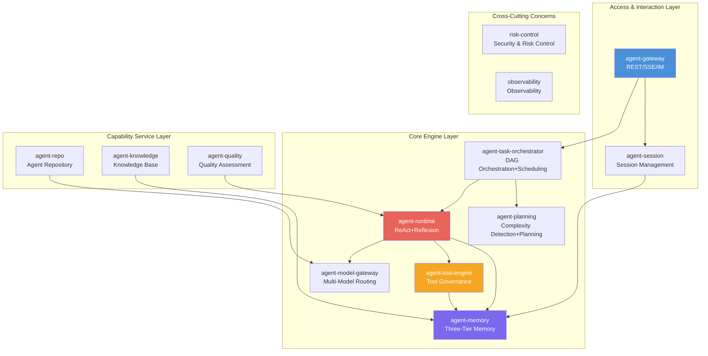
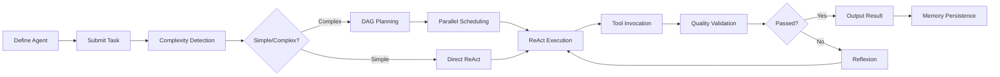

[English](./README.md) | [中文](./README.zh-CN.md)

<p align="center">
  
</p>

<h1 align="center">AgentForge</h1>

<p align="center">
  <strong>Enterprise-grade Multi-Agent Orchestration & Governance Platform</strong>
</p>

<p align="center">
  <a href="./LICENSE"></a>
  
  
  
  
  
</p>

<p align="center">
  DAG Task Orchestration · Three-Tier Memory · Tool Invocation Governance · Six-Layer Hallucination Defense · Full-Chain Observability
</p>

---

## ✨ Core Capabilities

<table>
<tr>
<td width="50%">

### 🔄 DAG Task Orchestration
Auto complexity detection → Template/Intelligent planning → 5-dimension DAG self-check → Parallel batch scheduling → Dynamic replanning (incremental/full)

</td>
<td width="50%">

### 🧠 Three-Tier Memory System
Short-term (Redis) / Long-term (Milvus + MySQL) / Distilled memory; Multi-path recall (vector/keyword/time/tag) + fused reranking

</td>
</tr>
<tr>
<td width="50%">

### 🔧 Tool Invocation Governance
R1/R2/R3 three-tier risk classification + RBAC/ABAC permissions + quota circuit-breaking + Docker sandbox execution + result sanitization & desensitization

</td>
<td width="50%">

### 🤖 ReAct + Reflexion Runtime
Think → Act → Observe → Reflect; Self-check triple questions; Token four-level water-mark compression; Checkpoint resume

</td>
</tr>
<tr>
<td width="50%">

### 🛡️ Six-Layer Hallucination Governance
L1 Model selection → L2 Reasoning self-verification → L3 Knowledge-tool anchoring → L4 Three-tier output validation → L5 Agent-specific governance → L6 Long-term closed loop

</td>
<td width="50%">

### 📊 Four-Layer Drift Control
Metric collection → Baseline comparison → 4-type drift classification → Auto stop-loss / Root-cause identification / Canary rollback

</td>
</tr>
<tr>
<td width="50%" colspan="2">

### 🔍 Full-Chain Observability
SkyWalking trace + Prometheus metrics + Loki log aggregation + ClickHouse metric persistence + Grafana visualization

</td>
</tr>
</table>

---

## 🏗️ System Architecture



### Microservice Inventory

| Port | Service | Responsibility | Key APIs |
|---|---|---|---|
| 8080 | agent-gateway | Multi-channel access + Auth + Rate limiting | `POST /api/v1/tasks`, `GET /api/v1/sessions/{id}/stream` |
| 8082 | agent-session | Session management + Multi-turn messages | gRPC: CreateSession, SendMessage |
| 8084 | agent-task-orchestrator | DAG engine + Parallel scheduling | gRPC: SubmitTask, GetTaskStatus, CancelTask |
| 8086 | agent-planning | Complexity detection + DAG planning | gRPC: AssessComplexity, Plan, Replan |
| 8088 | agent-memory | Three-tier memory + Multi-path recall | gRPC: WriteLongTerm, Recall, TriggerDistill |
| 8090 | agent-tool-engine | Tool registration + Risk-tiered execution | gRPC: Invoke, RegisterTool, ListTools |
| 8092 | agent-runtime | ReAct loop + Token compression | gRPC: StartAgent, Step, Pause, Resume |
| 8094 | agent-model-gateway | Multi-model adaptation + Routing + Metering | gRPC: Chat, StreamChat, ListModels |
| 8096 | agent-repo | Agent repository + Version management | gRPC: CreateAgent, GetAgent, ListAgents |
| 8098 | agent-knowledge | Knowledge base + Document chunking | gRPC: Ingest, Retrieve, SearchChunks |
| 8100 | agent-quality | Three-tier validation + Badcase tracking | gRPC: ValidateTask, ReportBadcase |
| — | risk-control | Risk interception + RBAC/ABAC | gRPC: CheckContent, CheckPermission, AuditLog |
| — | observability | Metrics + Tracing + Logging | gRPC: GetTraces, GetMetrics, GetHealth |

---

## 🚀 Quick Start

### Prerequisites

| Dependency | Version | Notes |
|---|---|---|
| JDK | 17+ | Eclipse Temurin 17 recommended |
| Maven | 3.9+ | protoc auto-downloaded by plugin |
| Docker | 20+ | Run MySQL/Redis/Milvus and other dependencies |
| K8s | 1.28+ | Production deployment (optional) |

### 1. Build

```bash
# Compile base layers
mvn clean install -pl agent-proto,agent-common -am -DskipTests

# Compile and run all unit tests
mvn clean test

# Package
mvn clean package -DskipTests
```

### 2. Initialize Database

```powershell
cd infra/sql
# Initialize all MySQL databases (9 databases, 32 tables + seed data)
./init-all.ps1 -DbType mysql -TenantId default
```

### 3. Start Local Dependencies (Docker Compose)

```bash
cd infra/docker-compose
cp .env.example .env   # Edit database passwords and other config
docker compose up -d    # MySQL + Redis + Milvus + Neo4j + RocketMQ + Nacos
```

### 4. Create an Agent

```bash
# Create a new Agent via the Agent repository service
curl -X POST http://localhost:8096/grpc \
  -H "Content-Type: application/json" \
  -d '{
    "name": "code-review-assistant",
    "description": "Code review assistant powered by multi-model analysis",
    "scene_tags": ["CODE_REVIEW", "QUALITY"],
    "model_tier": "PREMIUM",
    "system_prompt": "You are a senior code reviewer. Analyze code for bugs, security issues, and style problems.",
    "tools": ["file_reader", "git_diff", "linter"],
    "max_tokens_per_turn": 4096,
    "max_total_tokens": 32768
  }'
```

### 5. Submit a Task

```bash
# Submit a task via the gateway
curl -X POST http://localhost:8080/api/v1/tasks \
  -H "Content-Type: application/json" \
  -H "X-Tenant-Id: default" \
  -H "X-User-Id: user-001" \
  -d '{
    "agent_id": "code-review-assistant",
    "input": "Review the following pull request: https://github.com/org/repo/pull/42",
    "priority": "NORMAL"
  }'

# Response:
# {
#   "code": "OK",
#   "data": { "task_id": "tk_a1b2c3", "status": "PENDING" }
# }
```

### 6. Streaming Conversation (SSE)

```bash
# Create a session and get streaming responses
curl -N http://localhost:8080/api/v1/sessions/sess_x1y2z3/stream \
  -H "X-Tenant-Id: default" \
  -H "X-User-Id: user-001"

# Server-Sent Events stream:
# data: {"type":"think","content":"Analyzing code structure..."}
# data: {"type":"act","content":"Calling tool: git_diff"}
# data: {"type":"observe","content":"Found 3 potential issues"}
# data: {"type":"result","content":"Review complete: 2 medium, 1 low severity issues found"}
```

### 7. Register a Tool

```bash
# Register a custom tool with the tool engine
curl -X POST http://localhost:8090/grpc \
  -H "Content-Type: application/json" \
  -d '{
    "tool_name": "web_scraper",
    "description": "Scrape web pages and extract structured data",
    "tool_type": "HTTP_API",
    "risk_level": "R2",
    "endpoint": "https://api.example.com/scrape",
    "params_schema": {
      "url": { "type": "string", "required": true },
      "format": { "type": "string", "enum": ["html", "markdown", "json"] }
    }
  }'
```

### 8. Write & Recall Memory

```bash
# Write long-term memory
curl -X POST http://localhost:8088/grpc \
  -H "Content-Type: application/json" \
  -d '{
    "agent_id": "code-review-assistant",
    "content": "Project uses Spring Boot 3.2 with JPA entities. All IDs are BIGINT with unique constraints.",
    "importance": 0.8,
    "tags": ["architecture", "convention"],
    "memory_type": "REFLECTIVE"
  }'

# Recall relevant memories
curl -X POST http://localhost:8088/grpc \
  -H "Content-Type: application/json" \
  -d '{
    "agent_id": "code-review-assistant",
    "query": "What are the coding conventions for this project?",
    "top_k": 5,
    "min_importance": 0.4
  }'
```

---

## 📋 End-to-End Workflow



### Workflow Description

1. **Define Agent**: Create an Agent definition via the Agent repository, configuring system prompt, available tools, and model tier
2. **Submit Task**: Submit a task via the gateway REST API, auto-routed to the orchestrator
3. **Complexity Detection**: The planning engine evaluates task complexity and decides between single-step execution or DAG decomposition
4. **DAG Orchestration**: Complex tasks are automatically decomposed into sub-task DAGs, with 5-dimension self-check followed by parallel scheduling
5. **ReAct Execution**: The runtime engine executes the Think→Act→Observe loop
6. **Tool Invocation**: Invokes R1/R2/R3 risk-tiered tools via the tool gateway, with Docker sandbox isolation
7. **Quality Validation**: Three-tier output validation + hallucination detection + drift comparison
8. **Reflexion**: Failed validations trigger reflection, with automatic correction and re-execution
9. **Result Output**: Streamed back via SSE, with memory persistence to storage

---

## 🖥️ Frontend Console (Design)

The platform plans 5 major frontend modules, built with React 18 + TypeScript + Ant Design + ReactFlow + ECharts:

| Module | Target Role | Core Pages | Key Capabilities |
|---|---|---|---|
| **Operations Backend** | Platform ops | Tenant/Approval/Quota/Audit/Reports | Agent lifecycle management, quota control |
| **Agent Configuration Workbench** | Agent developers | Low-code editor/Preview/Versioning | 9 config components + Prompt editor + Version management |
| **Debug Sandbox** | Agent developers | DAG visualization/Replay/Logs | Breakpoint debugging + Step replay + Token water-mark |
| **End-User Chat** | End users | Session list/Message flow/Task details | Streaming chat + File upload + Feedback |
| **Monitoring Dashboard** | Ops/Dev | KPIs/Trace/Alerts/Cost | ECharts dashboards + Real-time alerts |

> See [docs/12-frontend/frontend-console-design.md](./docs/12-frontend/frontend-console-design.md)

---

## 📁 Repository Structure

```
agentforge/
├── pom.xml                          # Parent POM (15 modules)
├── agent-proto/                     # Protobuf contract layer (14 .proto)
├── agent-common/                    # Common utilities (DTO/exceptions/util classes)
├── agent-gateway/                   # API Gateway (8080)
├── agent-session/                   # Session service (8082)
├── agent-task-orchestrator/         # Task orchestration (8084)
├── agent-planning/                  # Planning service (8086)
├── agent-memory/                    # Memory service (8088)
├── agent-tool-engine/               # Tool engine (8090)
├── agent-runtime/                   # Agent runtime (8092)
├── agent-model-gateway/             # Model gateway (8094)
├── agent-repo/                      # Agent repository (8096)
├── agent-knowledge/                  # Knowledge service (8098)
├── agent-quality/                   # Quality service (8100)
├── agent-risk-control/              # Risk control service
├── agent-observability/             # Observability service
├── agent-test-infra/                # Test infrastructure
├── infra/
│   ├── sql/                         # DDL (9 MySQL databases 32 tables + Milvus + Neo4j + Redis)
│   ├── k8s/                         # K8s deployment configs (12 Deployment + 12 Service + 6 HPA)
│   ├── docker/                      # Dockerfile + docker-compose
│   ├── nacos/                       # Nacos configs (5 shared + 2 service-level)
│   ├── vault/                       # Vault policies (12 HCL)
│   ├── observability/               # Prometheus + Grafana + Loki + SkyWalking
│   └── scripts/                     # Deploy/build/stress-test scripts
├── docs/                            # Design docs (19 docs + User guide + Ops guide)
├── PRD.md                           # Product Requirements Document
└── LICENSE                          # Apache 2.0
```

---

## 🛡️ Security Hardening

The project has completed systematic security hardening (all 21 red-blue team audit findings resolved):

| Attack Chain | Path | Status |
|---|---|---|
| **Chain A** | API Key → tool-engine R1 bypass → Sandbox RCE → K8s secrets | ✅ End-to-end blocked |
| **Chain B** | JWT forgery → Privilege escalation | ✅ End-to-end blocked |
| **Chain C** | K8s RBAC → Lateral movement | ✅ End-to-end blocked |

Key fixes: gRPC mTLS, JWT env injection, R2/R3 approval workflow, Docker cap-drop ALL + nobody, K8s securityContext, CI gitleaks+trivy+CodeQL, all passwords migrated to env vars.

See [docs/audits/red-blue-team-report-2026-07-07.md](./docs/audits/red-blue-team-report-2026-07-07.md)

---

## 📚 Documentation

| Document | Description |
|---|---|
| [User Guide](./docs/user-guide.md) | REST/gRPC API usage guide, end-to-end examples |
| [Ops Guide](./docs/ops-guide.md) | Deployment, configuration, monitoring, troubleshooting |
| [Design Docs Index](./docs/README.md) | 19 design documents + test documentation |
| [Product Requirements](./PRD.md) | PRD product requirements document |
| [Development Log](./project_memory.md) | Project development history and experience |

---

## 📊 Project Status

| Dimension | Status |
|---|---|
| Design documents | ✅ 19 docs (covering all PRD deliverables) |
| DDL scripts | ✅ 16 files / 9 MySQL databases 32 tables + Milvus + Neo4j + Redis |
| Coding plans | ✅ Plan 01~10 all complete (10/10 closed-loop) |
| Core implementation | ✅ 15 modules fully implemented (1580+ test cases, 0 failures) |
| Security hardening | ✅ All 21 red-blue team findings resolved |
| Deployment configs | ✅ 90+ files (Docker / K8s / Nacos / Vault / Observability) |
| K8s cluster deployment | ⏸ Pending CI environment Docker configuration |
| Performance testing | ⏸ Pending K8s deployment for Gatling simulation |

---

## 🤝 Tech Stack

| Dimension | Selection |
|---|---|
| Language / JVM | Java 17 (LTS) |
| Framework | Spring Boot 3.2.12 / Spring Cloud 2023.0.1 / Spring Cloud Alibaba 2023.0.1.0 |
| RPC | gRPC 1.62.2 + Protobuf 3.25.5 |
| AI | Spring AI 0.8.1 (adapts OpenAI / Anthropic / Gemini / Tongyi / Wenxin / DeepSeek) |
| Relational DB | MySQL 8.0.36 + MyBatis-Plus 3.5.5 |
| Vector DB | Milvus 2.4 (HNSW COSINE) |
| Graph DB | Neo4j 5.18 (Code knowledge graph) |
| Cache | Redis 7.2 + Redisson 3.27.2 |
| Metrics | ClickHouse (MergeTree) |
| Search | Elasticsearch 8.13.4 |
| Messaging | RocketMQ 5.x + rocketmq-spring 2.3.0 |
| Registry & Config | Nacos 2.3 |
| Deployment | Docker / K8s + HPA |
| Observability | SkyWalking 9.7 + Prometheus + Loki + Grafana |
| Security | Vault + gRPC mTLS + OPA |

---

## License

[Apache License 2.0](./LICENSE) © 2026 ZedeX
