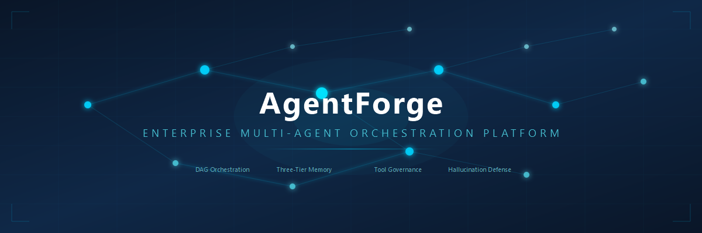
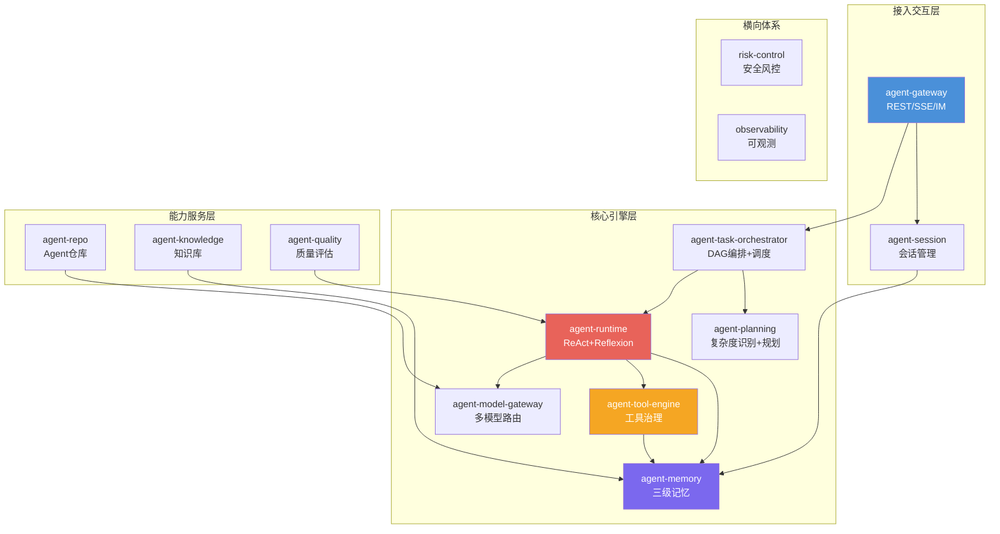
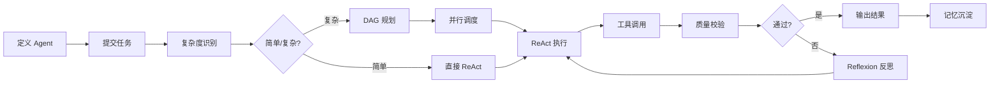

[English](./README.md) | [中文](./README.zh-CN.md)

<p align="center">
  
</p>

<h1 align="center">AgentForge</h1>

<p align="center">
  <strong>Enterprise-grade Multi-Agent Orchestration & Governance Platform</strong>
</p>

<p align="center">
  <a href="./LICENSE"></a>
  
  
  
  
  
</p>

<p align="center">
  基于 DAG 任务编排 · 三级记忆 · 工具调用治理 · 幻觉六层防护 · 全链路可观测
</p>

---

## ✨ 核心能力

<table>
<tr>
<td width="50%">

### 🔄 DAG 任务编排
自动复杂度识别 → 模板/智能规划 → 5 维度 DAG 自检 → 并行批次调度 → 动态重规划（增量/全量）

</td>
<td width="50%">

### 🧠 三级记忆系统
短期（Redis）/ 长期（Milvus + MySQL）/ 蒸馏记忆；多路召回（向量/关键词/时间/标签）+ 融合重排

</td>
</tr>
<tr>
<td width="50%">

### 🔧 工具调用治理
R1/R2/R3 三级风险分级 + RBAC/ABAC 权限 + 配额熔断 + Docker 沙箱执行 + 结果清洗脱敏

</td>
<td width="50%">

### 🤖 ReAct + Reflexion 运行时
Think → Act → Observe → Reflect；自检三问；Token 四级水位压缩；断点续跑

</td>
</tr>
<tr>
<td width="50%">

### 🛡️ 幻觉六层治理
L1 模型选型 → L2 推理自校验 → L3 知识工具锚定 → L4 三级输出校验 → L5 Agent 专项治理 → L6 长效闭环

</td>
<td width="50%">

### 📊 漂移四层管控
指标采集 → 基准比对 → 4 类漂移分类 → 自动止损 / 根因定位 / 灰度回滚

</td>
</tr>
<tr>
<td width="50%" colspan="2">

### 🔍 全链路可观测
SkyWalking 链路追踪 + Prometheus 指标 + Loki 日志聚合 + ClickHouse 指标沉淀 + Grafana 可视化

</td>
</tr>
</table>

---

## 🏗️ 系统架构



### 微服务清单

| 端口 | 服务 | 职责 | 关键 API |
|---|---|---|---|
| 8080 | agent-gateway | 多端接入 + 鉴权 + 限流 | `POST /api/v1/tasks`, `GET /api/v1/sessions/{id}/stream` |
| 8082 | agent-session | 会话管理 + 多轮消息 | gRPC: CreateSession, SendMessage |
| 8084 | agent-task-orchestrator | DAG 引擎 + 并行调度 | gRPC: SubmitTask, GetTaskStatus, CancelTask |
| 8086 | agent-planning | 复杂度识别 + DAG 规划 | gRPC: AssessComplexity, Plan, Replan |
| 8088 | agent-memory | 三级记忆 + 多路召回 | gRPC: WriteLongTerm, Recall, TriggerDistill |
| 8090 | agent-tool-engine | 工具注册 + 风险分级执行 | gRPC: Invoke, RegisterTool, ListTools |
| 8092 | agent-runtime | ReAct 循环 + Token 压缩 | gRPC: StartAgent, Step, Pause, Resume |
| 8094 | agent-model-gateway | 多模型适配 + 路由 + 计量 | gRPC: Chat, StreamChat, ListModels |
| 8096 | agent-repo | Agent 仓库 + 版本管理 | gRPC: CreateAgent, GetAgent, ListAgents |
| 8098 | agent-knowledge | 知识库 + 文档切片 | gRPC: Ingest, Retrieve, SearchChunks |
| 8100 | agent-quality | 三级校验 + Badcase | gRPC: ValidateTask, ReportBadcase |
| — | risk-control | 风控拦截 + RBAC/ABAC | gRPC: CheckContent, CheckPermission, AuditLog |
| — | observability | 指标 + 链路 + 日志 | gRPC: GetTraces, GetMetrics, GetHealth |

---

## 🚀 快速开始

### 环境要求

| 依赖 | 版本 | 说明 |
|---|---|---|
| JDK | 17+ | 推荐 Eclipse Temurin 17 |
| Maven | 3.9+ | protoc 由 plugin 自动下载 |
| Docker | 20+ | 运行 MySQL/Redis/Milvus 等依赖 |
| K8s | 1.28+ | 生产部署（可选） |

### 1. 构建

```bash
# 编译基础层
mvn clean install -pl agent-proto,agent-common -am -DskipTests

# 编译并运行所有单元测试
mvn clean test

# 打包
mvn clean package -DskipTests
```

### 2. 初始化数据库

```powershell
cd infra/sql
# 初始化全部 MySQL 库（9 库 32 表 + 种子数据）
./init-all.ps1 -DbType mysql -TenantId default
```

### 3. 启动本地依赖（Docker Compose）

```bash
cd infra/docker-compose
cp .env.example .env   # 编辑数据库密码等配置
docker compose up -d    # MySQL + Redis + Milvus + Neo4j + RocketMQ + Nacos
```

### 4. 创建 Agent

```bash
# 通过 Agent 仓库服务创建一个新 Agent
curl -X POST http://localhost:8096/grpc \
  -H "Content-Type: application/json" \
  -d '{
    "name": "code-review-assistant",
    "description": "Code review assistant powered by multi-model analysis",
    "scene_tags": ["CODE_REVIEW", "QUALITY"],
    "model_tier": "PREMIUM",
    "system_prompt": "You are a senior code reviewer. Analyze code for bugs, security issues, and style problems.",
    "tools": ["file_reader", "git_diff", "linter"],
    "max_tokens_per_turn": 4096,
    "max_total_tokens": 32768
  }'
```

### 5. 提交任务

```bash
# 通过网关提交任务
curl -X POST http://localhost:8080/api/v1/tasks \
  -H "Content-Type: application/json" \
  -H "X-Tenant-Id: default" \
  -H "X-User-Id: user-001" \
  -d '{
    "agent_id": "code-review-assistant",
    "input": "Review the following pull request: https://github.com/org/repo/pull/42",
    "priority": "NORMAL"
  }'

# Response:
# {
#   "code": "OK",
#   "data": { "task_id": "tk_a1b2c3", "status": "PENDING" }
# }
```

### 6. 流式对话（SSE）

```bash
# 创建会话并获取流式响应
curl -N http://localhost:8080/api/v1/sessions/sess_x1y2z3/stream \
  -H "X-Tenant-Id: default" \
  -H "X-User-Id: user-001"

# Server-Sent Events stream:
# data: {"type":"think","content":"Analyzing code structure..."}
# data: {"type":"act","content":"Calling tool: git_diff"}
# data: {"type":"observe","content":"Found 3 potential issues"}
# data: {"type":"result","content":"Review complete: 2 medium, 1 low severity issues found"}
```

### 7. 注册工具

```bash
# 向工具引擎注册自定义工具
curl -X POST http://localhost:8090/grpc \
  -H "Content-Type: application/json" \
  -d '{
    "tool_name": "web_scraper",
    "description": "Scrape web pages and extract structured data",
    "tool_type": "HTTP_API",
    "risk_level": "R2",
    "endpoint": "https://api.example.com/scrape",
    "params_schema": {
      "url": { "type": "string", "required": true },
      "format": { "type": "string", "enum": ["html", "markdown", "json"] }
    }
  }'
```

### 8. 写入与召回记忆

```bash
# 写入长期记忆
curl -X POST http://localhost:8088/grpc \
  -H "Content-Type: application/json" \
  -d '{
    "agent_id": "code-review-assistant",
    "content": "Project uses Spring Boot 3.2 with JPA entities. All IDs are BIGINT with unique constraints.",
    "importance": 0.8,
    "tags": ["architecture", "convention"],
    "memory_type": "REFLECTIVE"
  }'

# 召回相关记忆
curl -X POST http://localhost:8088/grpc \
  -H "Content-Type: application/json" \
  -d '{
    "agent_id": "code-review-assistant",
    "query": "What are the coding conventions for this project?",
    "top_k": 5,
    "min_importance": 0.4
  }'
```

---

## 📋 完整使用流程



### 端到端流程说明

1. **定义 Agent**：通过 Agent 仓库创建 Agent 定义，配置 system prompt、可用工具、模型层级
2. **提交任务**：通过网关 REST API 提交任务，自动路由到编排器
3. **复杂度识别**：规划引擎评估任务复杂度，决定单步执行或 DAG 拆分
4. **DAG 编排**：复杂任务自动拆分为子任务 DAG，5 维度自检后并行调度
5. **ReAct 执行**：运行时引擎执行 Think→Act→Observe 循环
6. **工具调用**：通过工具网关调用 R1/R2/R3 分级工具，Docker 沙箱隔离执行
7. **质量校验**：三级输出校验 + 幻觉检测 + 漂移比对
8. **Reflexion**：未通过校验时触发反思，自动修正后重新执行
9. **结果输出**：通过 SSE 流式返回，记忆沉淀入库

---

## 🖥️ 前端控制台（设计）

平台规划了 5 大前端模块，技术栈 React 18 + TypeScript + Ant Design + ReactFlow + ECharts：

| 模块 | 面向角色 | 核心页面 | 关键能力 |
|---|---|---|---|
| **运营后台** | 平台运营 | 租户/审批/配额/审计/报表 | Agent 生命周期管理、配额管控 |
| **Agent 配置工作台** | Agent 开发 | 低代码编辑器/预览/版本 | 9 大配置组件 + Prompt 编辑 + 版本管理 |
| **调试沙箱** | Agent 开发 | DAG 可视化/回放/日志 | 断点调试 + 步骤回放 + Token 水位 |
| **终端对话** | 终端用户 | 会话列表/消息流/任务详情 | 流式对话 + 文件上传 + 反馈 |
| **监控大屏** | 运营/开发 | KPI/链路追踪/告警/成本 | ECharts 仪表盘 + 实时告警 |

> 详见 [docs/12-frontend/frontend-console-design.md](./docs/12-frontend/frontend-console-design.md)

---

## 📁 仓库结构

```
agentforge/
├── pom.xml                          # Parent POM（15 模块）
├── agent-proto/                     # Protobuf 契约层（14 .proto）
├── agent-common/                    # 公共工具层（DTO/异常/工具类）
├── agent-gateway/                   # 接入网关（8080）
├── agent-session/                   # 会话服务（8082）
├── agent-task-orchestrator/         # 任务编排（8084）
├── agent-planning/                  # 规划服务（8086）
├── agent-memory/                    # 记忆服务（8088）
├── agent-tool-engine/               # 工具引擎（8090）
├── agent-runtime/                   # Agent 运行时（8092）
├── agent-model-gateway/             # 模型网关（8094）
├── agent-repo/                      # Agent 仓库（8096）
├── agent-knowledge/                  # 知识服务（8098）
├── agent-quality/                   # 质量服务（8100）
├── agent-risk-control/              # 风控服务
├── agent-observability/             # 可观测服务
├── agent-test-infra/                # 测试基础设施
├── infra/
│   ├── sql/                         # DDL（9 MySQL 库 32 表 + Milvus + Neo4j + Redis）
│   ├── k8s/                         # K8s 部署配置（12 Deployment + 12 Service + 6 HPA）
│   ├── docker/                      # Dockerfile + docker-compose
│   ├── nacos/                       # Nacos 配置（5 shared + 2 service-level）
│   ├── vault/                       # Vault 策略（12 HCL）
│   ├── observability/               # Prometheus + Grafana + Loki + SkyWalking
│   └── scripts/                     # 部署/构建/压测脚本
├── docs/                            # 设计文档（19 份 + 使用手册 + 运维手册）
├── PRD.md                           # 产品需求文档
└── LICENSE                          # Apache 2.0
```

---

## 🛡️ 安全加固

项目已完成系统性安全加固（红蓝对抗审计 21 条全部修复）：

| 攻击链 | 路径 | 状态 |
|---|---|---|
| **链 A** | API Key → tool-engine R1 绕过 → 沙箱 RCE → K8s secrets | ✅ 端到端阻断 |
| **链 B** | JWT 伪造 → 越权操作 | ✅ 端到端阻断 |
| **链 C** | K8s RBAC → 横向移动 | ✅ 端到端阻断 |

核心修复：gRPC mTLS、JWT env 注入、R2/R3 审批流、Docker cap-drop ALL + nobody、K8s securityContext、CI gitleaks+trivy+CodeQL、密码全部 env 化。

详见 [docs/audits/red-blue-team-report-2026-07-07.md](./docs/audits/red-blue-team-report-2026-07-07.md)

---

## 📚 文档导航

| 文档 | 说明 |
|---|---|
| [使用手册](./docs/user-guide.md) | REST/gRPC API 使用指南、端到端示例 |
| [运维手册](./docs/ops-guide.md) | 部署、配置、监控、故障排查 |
| [设计文档索引](./docs/README.md) | 19 份设计文档 + 测试文档 |
| [产品需求](./PRD.md) | PRD 产品需求文档 |
| [开发记录](./project_memory.md) | 项目开发历史与经验 |

---

## 📊 项目状态

| 维度 | 状态 |
|---|---|
| 设计文档 | ✅ 19 份（覆盖 PRD 全部交付物） |
| DDL 脚本 | ✅ 16 文件 / 9 MySQL 库 32 表 + Milvus + Neo4j + Redis |
| 编码计划 | ✅ Plan 01~10 全部完成（10/10 闭环） |
| 核心编码 | ✅ 15 模块完整实现（1580+ 测试用例，0 Failures） |
| 安全加固 | ✅ 红蓝对抗 21 条全部修复 |
| 部署配置 | ✅ 90+ 文件（Docker / K8s / Nacos / Vault / 可观测） |
| K8s 集群部署 | ⏸ 待 CI 环境配置 Docker |
| 性能压测 | ⏸ 待 K8s 部署后运行 Gatling 模拟 |

---

## 🤝 技术栈

| 维度 | 选型 |
|---|---|
| 语言 / JVM | Java 17（LTS） |
| 框架 | Spring Boot 3.2.12 / Spring Cloud 2023.0.1 / Spring Cloud Alibaba 2023.0.1.0 |
| RPC | gRPC 1.62.2 + Protobuf 3.25.5 |
| AI | Spring AI 0.8.1（适配 OpenAI / Anthropic / Gemini / 通义 / 文心 / DeepSeek） |
| 关系库 | MySQL 8.0.36 + MyBatis-Plus 3.5.5 |
| 向量库 | Milvus 2.4（HNSW COSINE） |
| 图库 | Neo4j 5.18（代码知识图谱） |
| 缓存 | Redis 7.2 + Redisson 3.27.2 |
| 指标 | ClickHouse（MergeTree） |
| 搜索 | Elasticsearch 8.13.4 |
| 消息 | RocketMQ 5.x + rocketmq-spring 2.3.0 |
| 注册配置 | Nacos 2.3 |
| 部署 | Docker / K8s + HPA |
| 可观测 | SkyWalking 9.7 + Prometheus + Loki + Grafana |
| 安全 | Vault + gRPC mTLS + OPA |

---

## License

[Apache License 2.0](./LICENSE) © 2026 ZedeX
