# 关键流程状态机与时序设计

> 文档版本：v1.0  |  更新日期：2026-06-26  |  对应 PRD：第一节(三)/第三节

## 0. 文档定位与依赖

本文档用 Mermaid 图统一绘制 Agent 平台**关键流程的状态机与端到端时序**，作为编码与联调时的"行为契约"。状态名严格遵循 [03-task-engine/task-orchestration-and-planning.md](../03-task-engine/task-orchestration-and-planning.md) 第 6 节定义的 10 个状态；时序图参与者严格对齐 [00-overview/tech-stack-and-architecture.md](../00-overview/tech-stack-and-architecture.md) §3.1 的微服务清单与 §3.3 通信矩阵。

**依赖文档**：
- [PRD.md](../../PRD.md) — 第一节(三) 完整执行全链路 7 步、第三节 异常容错与质量保障
- [03-task-engine/task-orchestration-and-planning.md](../03-task-engine/task-orchestration-and-planning.md) — §6 任务状态机、§5 重规划、§7 子任务分发
- [05-tool-engine/tool-and-invocation-system.md](../05-tool-engine/tool-and-invocation-system.md) — 工具调用 9 步全链路、R3 审批
- [06-agent-runtime/agent-runtime-engine.md](../06-agent-runtime/agent-runtime-engine.md) — ReAct 循环、Reflexion、断点续跑、人工介入
- [04-memory/memory-system-design.md](../04-memory/memory-system-design.md) — 记忆写入与召回
- [09-governance-and-deployment/governance-and-middleware.md](../09-governance-and-deployment/governance-and-middleware.md) — 异常分级、熔断、成本管控

**参与者别名约定**（贯穿本文所有时序图）：

| 别名 | 含义 |
|---|---|
| `U` | User（终端用户） |
| `GW` | agent-gateway（8080） |
| `SESS` | session-service（8082） |
| `TO` | task-orchestrator（8084） |
| `PL` | planning-service（8086） |
| `MEM` | memory-service（8088） |
| `TE` | tool-engine（8090） |
| `AR` | agent-runtime（8092） |
| `MG` | model-gateway（8094） |
| `QS` | quality-service（8100） |
| `RC` | risk-control（8102） |

---

## 1. 任务状态机图

任务实例 `task_instance.status` 的合法流转矩阵定义于 [task-orchestration-and-planning.md §6.2](../03-task-engine/task-orchestration-and-planning.md#62-合法状态流转矩阵)。状态机唯一归属方为 `task-orchestrator`，所有流转写 `task_state_change` 审计表。终态共 4 个：`SUCCESS / FAILED / CANCELLED / TIMEOUT`；`FAILED / TIMEOUT` 在 R3 高风险任务中允许经用户申诉回到 `WAITING_HUMAN`。

```mermaid
stateDiagram-v2
    direction TB
    [*] --> PENDING : SubmitTask

    PENDING --> PLANNING : L2/L3 触发 AssessComplexity\n动作: 调 PL.AssessComplexity\n回写 task_instance.complexity
    PENDING --> RUNNING : L1 跳规划\n动作: dag_id=NULL\n单 Agent 直跑
    PENDING --> FAILED : 校验失败/Schema 非法\n动作: error_code=VALIDATION_FAILED
    PENDING --> CANCELLED : 用户取消\n动作: CancelTask(trigger=manual)
    PENDING --> TIMEOUT : deadline 到期\n动作: TaskTimeoutScanner 扫描

    PLANNING --> RUNNING : Plan 完成\n动作: 落 task_dag(v1)\n回写 dag_id
    PLANNING --> WAITING_HUMAN : Plan 自检 2 轮未过\n动作: error_code=PLAN_VALIDATION_FAILED
    PLANNING --> FAILED : PLAN_FORMALIZE_FAILED\n动作: 模型非法 JSON 重试 2 次仍失败
    PLANNING --> CANCELLED : 用户取消
    PLANNING --> TIMEOUT : 规划超 60s

    RUNNING --> SUBTASK_RUNNING : 首批节点投递完成\n动作: MQ task.subtask.execute
    RUNNING --> WAITING_HUMAN : R3 节点 requireHumanReview\n动作: 等待人工 ack
    RUNNING --> REPLANNING : 成本/复杂度升级触发\n动作: Replanner.triggerIncremental
    RUNNING --> FAILED : DAG 校验失败
    RUNNING --> CANCELLED : 用户取消
    RUNNING --> TIMEOUT : cost_limit 或 deadline 触发

    SUBTASK_RUNNING --> SUBTASK_RUNNING : 同批次多节点运行
    SUBTASK_RUNNING --> SUCCESS : 所有节点 success\n动作: 结果聚合 + 记忆沉淀
    SUBTASK_RUNNING --> REPLANNING : 节点 failed 且 retryCount≥maxRetries\n动作: Replanner.triggerIncremental
    SUBTASK_RUNNING --> WAITING_HUMAN : 重规划熔断 / R3 终审\n动作: notifyUser
    SUBTASK_RUNNING --> FAILED : 重规划耗尽 + 不允许人工兜底
    SUBTASK_RUNNING --> CANCELLED : 用户取消\n动作: 发 task.subtask.cancel
    SUBTASK_RUNNING --> TIMEOUT : 整体超时

    WAITING_HUMAN --> RUNNING : 人工修正结果后恢复\n动作: trigger=manual, operator=userId
    WAITING_HUMAN --> REPLANNING : 人工指定重规划路径\n动作: RequestReplan(mode=full)
    WAITING_HUMAN --> SUCCESS : 人工确认结果通过\n动作: 写审计
    WAITING_HUMAN --> FAILED : 人工终止 / 超时未响应
    WAITING_HUMAN --> CANCELLED : 人工终止

    REPLANNING --> RUNNING : 全量重规划完成\n动作: 新版本 DAG 落库
    REPLANNING --> SUBTASK_RUNNING : 增量重规划完成\n动作: 从失败批次重新推进
    REPLANNING --> WAITING_HUMAN : 熔断\n动作: 增量≥3次 / 全量≥1次 / 成本超 30%
    REPLANNING --> FAILED : 累计重规划≥4次 / 耗时>60s
    REPLANNING --> CANCELLED : 用户取消
    REPLANNING --> TIMEOUT : 整体超时

    SUCCESS --> [*]
    FAILED --> WAITING_HUMAN : 用户申诉(R3 任务)\n动作: trigger=manual
    TIMEOUT --> WAITING_HUMAN : 用户申诉(R3 任务)
    CANCELLED --> [*]

    note right of PENDING : 唯一入口态
    note right of SUCCESS : 终态: 全部成功+聚合完成
    note right of FAILED : 终态: 不可恢复失败
    note right of CANCELLED : 终态: 用户主动终止
    note right of TIMEOUT : 终态: 成本/时间熔断
    note right of WAITING_HUMAN : 唯一可被人工操作的非终态
    note right of REPLANNING : 由 Replanner 主导, 不允许跨子任务并发
```

**关键约束**：
1. 任何终态 → 非终态 仅允许 `FAILED / TIMEOUT → WAITING_HUMAN` 的申诉路径（且仅 R3 任务允许）。
2. `SUCCESS` 不可流转到任何状态。
3. 除 L1 跳规划外，禁止跳过 `PLANNING` 直接进入 `SUBTASK_RUNNING`。

---

## 2. 工具审批状态机（R3 高危工具）

R3 高危工具调用前必须先有有效的 `tool_approval` 记录，详见 [tool-and-invocation-system.md §4.4](../05-tool-engine/tool-and-invocation-system.md#44-r3-高危工具审批流程)。审批状态落地于 `tool_approval` 表，限时授权（默认 1 小时），双人复核强制。

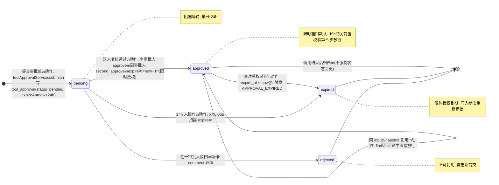

**审批通过后的执行流程**（接网关前置校验）：

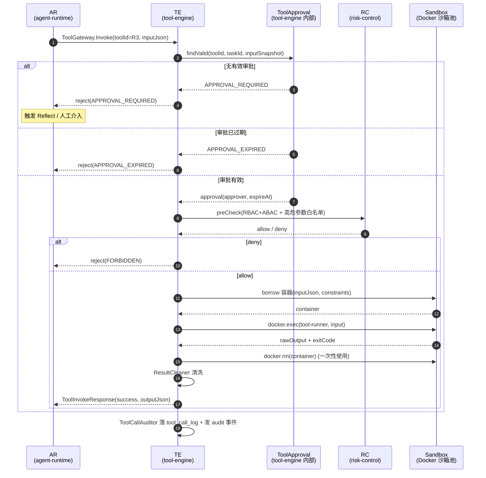

**关键约束**：
- R3 强制 `executor_type=sandbox`，禁止 `general/proxy`（见 [tool-and-invocation-system.md §4.1](../05-tool-engine/tool-and-invocation-system.md#41-工具风险三级分级)）。
- 双人复核：主审批人 approve 后仍需副审批人 second_approve，任一驳回即整体 rejected。
- 同 `inputSnapshot` 在 `expire_at` 内可复用，避免重复审批。

---

## 3. 完整执行全链路时序图（核心）

对应 [PRD 第一节(三)](../../PRD.md#三完整执行全链路从用户输入到任务完成) 7 步全链路。本图覆盖一次 L3 复杂任务从接入到记忆沉淀的完整路径；L1/L2 任务可视为本图的简化子集（跳过 PL.Plan、单 Agent 直跑）。

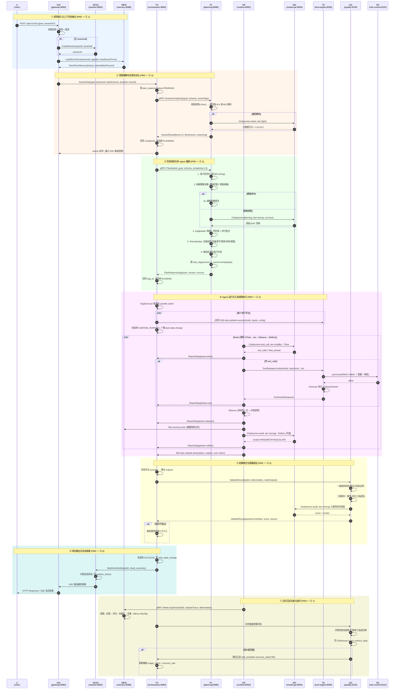

**典型耗时**：L1 < 3s，L2 3~15s，L3 > 15s；具体 SLA 基线见 [tech-stack-and-architecture.md §1.2](../00-overview/tech-stack-and-architecture.md#12-非功能性指标基线)。

---

## 4. ReAct 循环时序图

对应 [agent-runtime-engine.md §2](../06-agent-runtime/agent-runtime-engine.md#2-react-推理循环核心) 的 Think→Act→Observe→Reflect 四阶段循环。退出条件含 7 类（任务完成/最大步数/Token 上限/成本上限/工具连续失败/不可恢复异常/人工介入）。

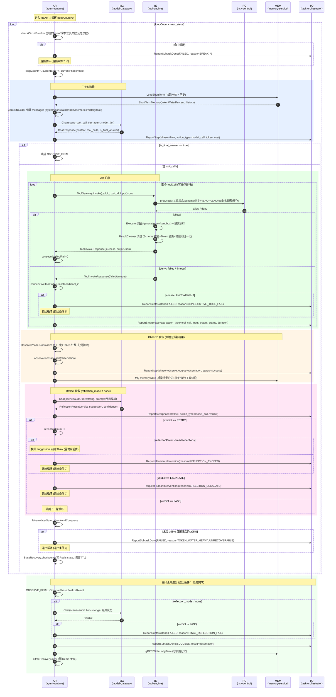

**循环退出条件标注**（对应 [agent-runtime-engine.md §2.2](../06-agent-runtime/agent-runtime-engine.md#22-循环退出条件)）：

| # | 退出条件 | 触发判断 | 上报动作 |
|---|---|---|---|
| 1 | 任务完成 | Think 产出 `final_answer` 且 Reflect PASS | `ReportSubtaskDone(SUCCESS)` |
| 2 | 最大步数熔断 | `loopCount ≥ max_steps`（L1=10 / L2=20 / L3=40） | `ReportSubtaskDone(FAILED, MAX_STEPS_EXCEED)` |
| 3 | Token 上限熔断 | `tokenUsed ≥ max_token`（默认 60K）或水位 ≥95% 不可恢复 | `ReportSubtaskDone(FAILED, TOKEN_EXCEED)` |
| 4 | 成本上限熔断 | `costUsedCent ≥ cost_limit_cent` | `ReportSubtaskDone(FAILED, COST_EXCEED)` |
| 5 | 工具连续失败熔断 | `consecutiveToolFail ≥ 3` | `ReportSubtaskDone(FAILED, CONSECUTIVE_TOOL_FAIL)` |
| 6 | 不可恢复异常 | 业务/致命异常 | `ReportSubtaskDone(FAILED, reason=*)` |
| 7 | 人工介入请求 | Reflect verdict=ESCALATE / 反思超限 / 依赖熔断 | `RequestHumanIntervention` |

---

## 5. 动态重规划时序图

对应 [task-orchestration-and-planning.md §5](../03-task-engine/task-orchestration-and-planning.md#5-动态重规划机制) 与 §9.2 重规划子流程。触发源包括：子任务连续失败、校验不通过、核心依赖失效、用户需求变更、复杂度动态升级、成本超限、Agent 跨域能力不足。

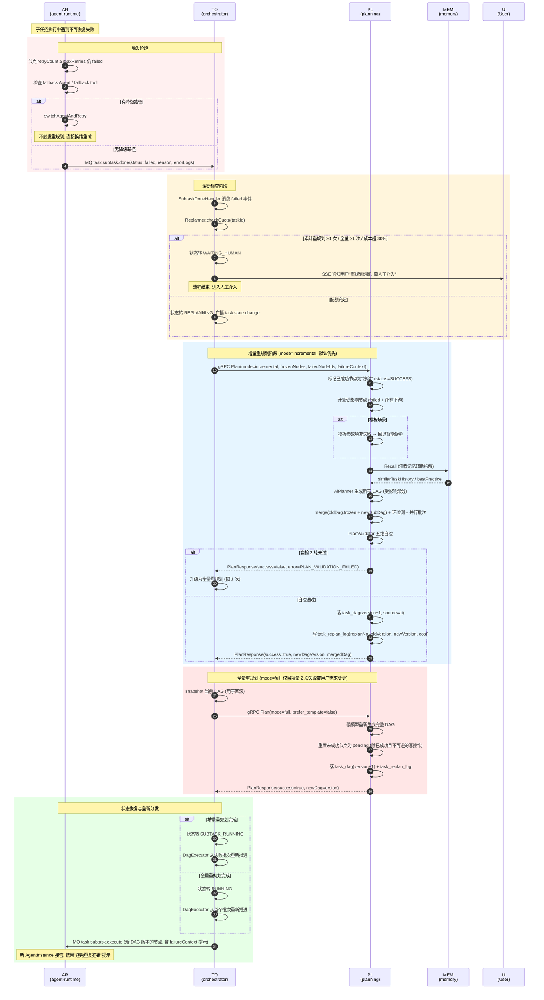

**关键约束**：
- 增量重规划保留 `frozenNodes`（已 success 节点不重跑），降低成本。
- 全量重规划上限 1 次，累计重规划上限 4 次（见 [task-orchestration-and-planning.md §5.3](../03-task-engine/task-orchestration-and-planning.md#53-重规划熔断)）。
- 单次重规划耗时 > 60s 直接转 `FAILED`。

---

## 6. 人工介入时序图

对应 [agent-runtime-engine.md §7](../06-agent-runtime/agent-runtime-engine.md#7-人工介入请求) 与 [task-orchestration-and-planning.md §9.3](../03-task-engine/task-orchestration-and-planning.md#93-人工介入子流程waiting_human)。触发场景：自动机制全部失效、R3 高风险终审、用户申诉、系统故障、Reflect verdict=ESCALATE。

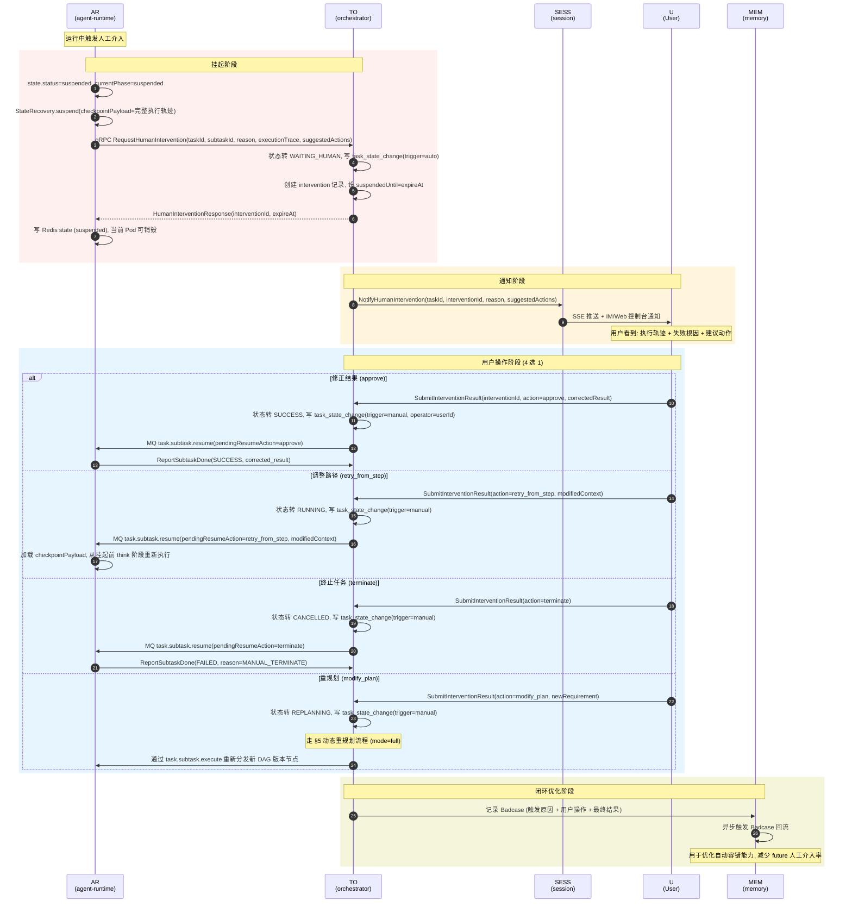

**关键约束**：
- 挂起状态完整保存到 Redis（不进 MySQL，避免污染 `task_step_log`），TTL 30min 续期。
- 所有人工操作写 `task_state_change`，`trigger=manual, operator=userId` 留痕。
- 4 类操作均通过 `task.subtask.resume` 消息唤醒新 Pod 接管，原 Pod 已销毁。

---

## 7. 工具调用全链路时序图

对应 [tool-and-invocation-system.md §3](../05-tool-engine/tool-and-invocation-system.md#3-工具调用全链路标准流程) 9 步标准流程：召回 → 指令 → 网关 → 前置校验 → 路由 → 隔离执行 → 清洗 → 返回 → 审计。

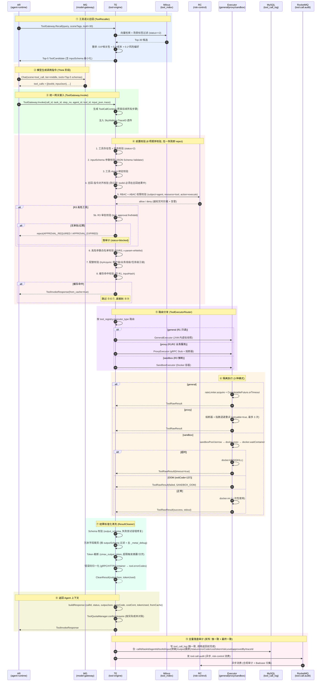

**关键约束**（[tool-and-invocation-system.md §11.3](../05-tool-engine/tool-and-invocation-system.md#113-关键约束清单)）：
- C-001: 所有工具调用必经 `ToolGateway`，禁止 Agent 直连（ADR-005）。
- C-002: R3 强制 `executor_type=sandbox`。
- C-007: 沙箱容器一次性使用，不复用。
- C-008: 调用全量落 `tool_call_log` + `audit_log`。

---

## 8. Token 水位压缩流程图

对应 [agent-runtime-engine.md §4.3](../06-agent-runtime/agent-runtime-engine.md#43-分级压缩触发) 与 [PRD 第一节(一)3](../../PRD.md) 四级水位线。每个阶段（think/act/observe/reflect）执行后由 `TokenWaterGuard` 检查并触发分级压缩。

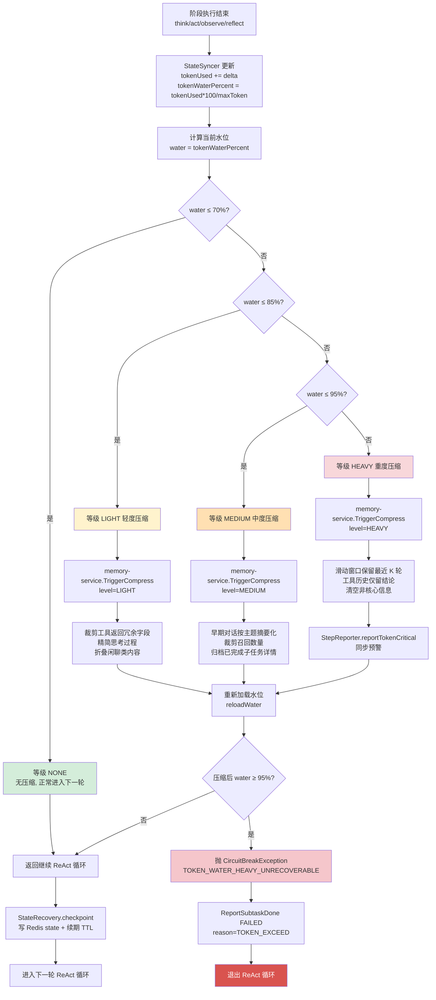

**压缩等级触发动作矩阵**（[agent-runtime-engine.md §4.3](../06-agent-runtime/agent-runtime-engine.md#43-分级压缩触发)）：

| 水位区间 | 等级 | 触发动作 | 调用方 |
|---|---|---|---|
| < 70% | NONE | 无压缩 | - |
| 70%~85% | LIGHT | 裁剪冗余字段、精简思考、折叠闲聊 | memory-service（轻压缩通道） |
| 85%~95% | MEDIUM | 主题摘要、裁剪召回、归档子任务 | memory-service（中压缩通道） |
| ≥95% | HEAVY | 滑动窗口、仅留结论、清空非核心 + 预警 | memory-service（重压缩）+ 熔断预警 |

---

## 9. 异常处理流程图

对应 [PRD 第三节(二)](../../PRD.md#二分级容错机制) 异常分级与三级重试层次。

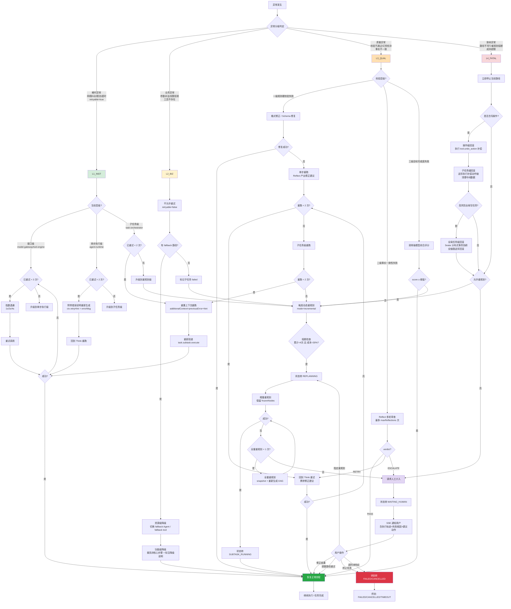

**异常分级与处理策略汇总表**（[PRD 第三节(二)1](../../PRD.md#1-失败重试机制) + [task-orchestration-and-planning.md §10.2](../03-task-engine/task-orchestration-and-planning.md#102-三级重试层次)）：

| 分级 | 典型场景 | 准入规则 | 重试层次 | 兜底动作 |
|---|---|---|---|---|
| 瞬时异常 | 模型超时、工具网关抖动、DB 死锁 | 仅 retryable=true 允许 | 接口级 3 次 + 单步级 2 次 + 子任务级 2 次 | 重规划 |
| 业务异常 | 参数非法、权限拒绝、工具不存在 | 禁止重试 | - | 降级换路 / 重规划 |
| 质量异常 | 校验不通过、幻觉命中、事实不一致 | 单步重跑带修正 | 单步级 2 次 + 子任务级 2 次 | 重规划 / 人工介入 |
| 致命异常 | 路径不可行、重规划熔断、成本超限 | 禁止重试 | - | 回滚 + 重规划 / 人工介入 |

**配套保障**：所有写操作幂等性（`task_id + step_no` 唯一索引 + 乐观锁）、失败率过高自动熔断（Sentinel）、重试时附带错误说明避免重复犯错。

---

## 10. 记忆写入与召回时序图

对应 [PRD 第一节(一)2/3](../../PRD.md#1-三级记忆架构) 与 [memory-system-design.md](../04-memory/memory-system-design.md)。写入流程包含信息提取→标签分类→重要性评分→向量化→去重校验→入库；召回流程四路并行（向量/关键词/时间/标签）+ 综合重排序 + Top-N 返回。

### 10.1 记忆写入时序图

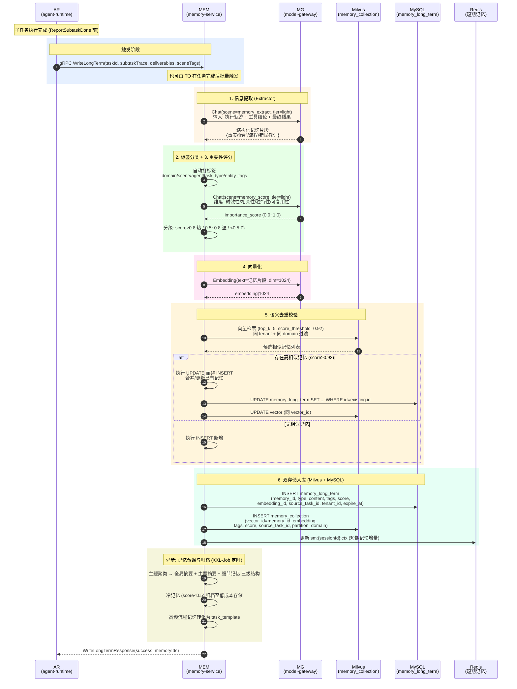

### 10.2 记忆召回时序图

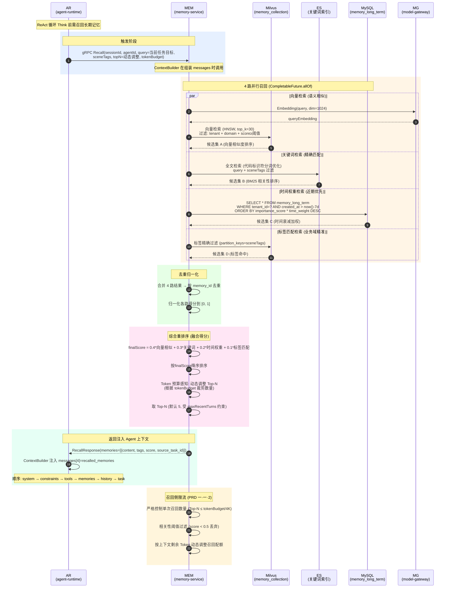

**关键约束**（[PRD 第一节(一)2/3](../../PRD.md)）：
- 写入必须经过"提取→标签→评分→向量化→去重→入库"完整链路，不允许裸 INSERT。
- 召回必须四路并行 + 综合重排，禁止单路召回。
- 召回数量受 Token 预算动态调整，避免上下文膨胀。
- 高相似记忆（score≥0.92）执行 UPDATE 而非 INSERT，避免记忆膨胀。

---

## 11. 交叉引用与关联

| 本文档章节 | 关联文档 | 关联内容 |
|---|---|---|
| §1 任务状态机 | [03-task-engine §6](../03-task-engine/task-orchestration-and-planning.md#6-任务状态机) | 10 个状态定义 + 流转矩阵 |
| §1 任务状态机 | [01-database §2.6](../01-database/database-schema-design.md#26-task_state_change-状态流转审计表) | task_state_change 审计表 |
| §2 R3 审批状态机 | [05-tool-engine §4.4](../05-tool-engine/tool-and-invocation-system.md#44-r3-高危工具审批流程) | tool_approval 表与审批流程 |
| §3 完整执行全链路 | [PRD 第一节(三)](../../PRD.md#三完整执行全链路从用户输入到任务完成) | 7 步全链路定义 |
| §3 完整执行全链路 | [02-api §6](../02-api/api-specification.md) | TaskOrchestrator gRPC 契约 |
| §4 ReAct 循环 | [06-agent-runtime §2](../06-agent-runtime/agent-runtime-engine.md#2-react-推理循环核心) | 四阶段循环 + 退出条件 |
| §4 ReAct 循环 | [06-agent-runtime §6](../06-agent-runtime/agent-runtime-engine.md#6-循环熔断机制) | 7 类熔断维度 |
| §5 动态重规划 | [03-task-engine §5](../03-task-engine/task-orchestration-and-planning.md#5-动态重规划机制) | 增量 vs 全量 + 熔断 |
| §6 人工介入 | [06-agent-runtime §7](../06-agent-runtime/agent-runtime-engine.md#7-人工介入请求) | RequestHumanIntervention 流程 |
| §7 工具调用全链路 | [05-tool-engine §3](../05-tool-engine/tool-and-invocation-system.md#3-工具调用全链路标准流程) | 9 步标准流程 |
| §8 Token 水位压缩 | [PRD 第一节(一)3](../../PRD.md#3-上下文-token-阈值与压缩规则) | 四级水位线 |
| §8 Token 水位压缩 | [06-agent-runtime §4.3](../06-agent-runtime/agent-runtime-engine.md#43-分级压缩触发) | TokenWaterGuard 实现 |
| §9 异常处理 | [PRD 第三节(二)](../../PRD.md#二分级容错机制) | 异常分级 + 三级重试 |
| §9 异常处理 | [03-task-engine §10](../03-task-engine/task-orchestration-and-planning.md#10-异常处理) | 错误码清单 |
| §10 记忆写入与召回 | [PRD 第一节(一)2/3](../../PRD.md#1-三级记忆架构) | 三级记忆 + 写入/召回机制 |
| §10 记忆写入与召回 | [04-memory/memory-system-design.md](../04-memory/memory-system-design.md) | 记忆系统详设 |

---

## 12. 设计决策记录（ADR 摘要）

### ADR-F1: 时序图采用"参与者别名 + 阶段着色"而非全称

**背景**：时序图参与者众多（11 个微服务），全称导致图宽过宽难以阅读。
**决策**：采用 `U/GW/SESS/TO/PL/MEM/TE/AR/MG/QS/RC` 简短别名，配合 `rect` 阶段着色块区分 7 步全链路。
**代价**：阅读者需对照别名表，但通过统一约定降低认知负担。

### ADR-F2: 任务状态机用 `stateDiagram-v2` 而非 `flowchart`

**背景**：状态机有 10 个状态、20+ 流转，需要明确表达"状态"语义而非"流程"语义。
**决策**：使用 `stateDiagram-v2`，配合 `note right of` 标注终态与约束。
**代价**：`stateDiagram-v2` 对复合状态支持有限，但本场景 10 个扁平状态足够。

### ADR-F3: 异常处理流程图采用"分级分支 + 公共兜底"结构

**背景**：PRD 第三节异常分 4 级，但每级处理路径有交叉（如最终都可能触发重规划/人工介入）。
**决策**：按 4 级异常分支展开，公共路径（重规划 `REPLAN` / 人工介入 `HUMAN`）作为汇聚节点。
**代价**：图较复杂，但完整覆盖了所有路径。

### ADR-F4: 工具调用全链路时序图覆盖 9 步完整流程

**背景**：[tool-and-invocation-system.md §3](../05-tool-engine/tool-and-invocation-system.md#3-工具调用全链路标准流程) 定义了 9 步标准流程，需一张图完整呈现。
**决策**：使用 `rect` 着色块区分 9 个步骤，每步含简短说明。
**代价**：图较长，但便于按步骤定位问题。

---

**文档结束**。本文档定义的状态机与时序图为编码与联调的"行为契约"，所有模块实现须严格遵循本文档定义的状态流转、参与者调用关系与异常处理路径。后续若状态机或时序有变更，须同步更新本文档版本号与交叉引用。
