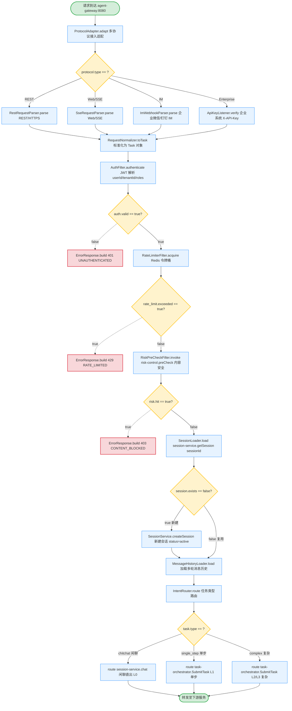
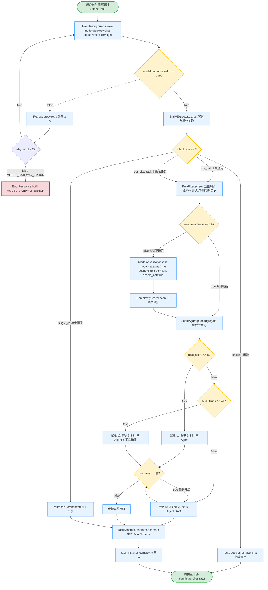
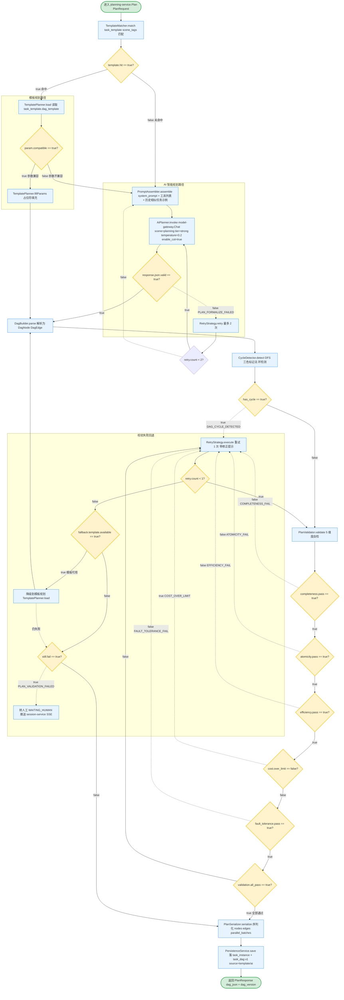
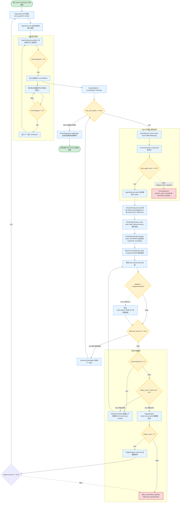

# 接入与规划详细逻辑流程图

> 文档版本：v1.0  |  更新日期：2026-06-27  |  对应模块：agent-gateway(8080) / agent-session(8082) / task-orchestrator(8084) / planning-service(8086)
> 文档定位：**决策逻辑层级**流程图，补充 [08-flow 行为契约级时序图](../08-flow/state-machines-and-sequences.md)，聚焦"判断节点 + 条件分支 + 决策树"
> 依赖文档：
> - [00-overview/tech-stack-and-architecture.md](../00-overview/tech-stack-and-architecture.md) — 微服务清单、通信矩阵、§6.1 风控拦截器
> - [01-database/database-schema-design.md](../01-database/database-schema-design.md) — §1 会话域、§2 任务域、§6 Agent 仓库域（agent_definition/agent_score）
> - [02-api/api-specification.md](../02-api/api-specification.md) — §0.5 错误码规范、§1 接入 API、§6 TaskOrchestrator/PlanningService gRPC 契约、§11 RocketMQ Topic
> - [03-task-engine/task-orchestration-and-planning.md](../03-task-engine/task-orchestration-and-planning.md) — §2 复杂度识别、§3 两种规划模式、§4 DAG 引擎、§7 子任务分发
> - [08-flow/state-machines-and-sequences.md](../08-flow/state-machines-and-sequences.md) — 行为契约级时序图（本文不重复其时序，仅深化到决策层）

## 0. 文档导览

### 0.1 图索引

| 编号 | 名称 | 层级 | 决策节点数 | 对应模块 | 与 doc 08 的关系 |
|---|---|---|---|---|---|
| F1 | 接入网关请求处理流程 | 决策逻辑 | 6 | agent-gateway / agent-session / risk-control | 深化 doc 08 §3 时序图「第 1~3 步：接入→会话→提交」的分支判断 |
| F2 | 意图识别与复杂度判定决策树 | 决策逻辑 | 7 | model-gateway / planning-service / task-orchestrator | 深化 doc 08 §3 时序图「第 4 步：复杂度评估」的判级条件 |
| F3 | 任务规划与 DAG 生成流程 | 决策逻辑 | 9 | planning-service / model-gateway | 深化 doc 08 §3 时序图「第 5 步：规划」的模板/智能分支与自检 |
| F4 | 子任务分发与并行调度流程 | 决策逻辑 | 8 | task-orchestrator / agent-repo / agent-runtime | 深化 doc 08 §3 时序图「第 6~7 步：执行→聚合」的批次与失败处理 |

### 0.2 与 doc 08 的层次差异

- **doc 08（行为契约级）**：回答"什么状态、什么时序、谁调用谁"，用 `sequenceDiagram` / `stateDiagram-v2`。
- **本文（决策逻辑级）**：回答"什么条件、走哪个分支、为什么、失败如何回退"，用 `flowchart TD` + 菱形判断节点 + 条件表达式 + 错误码。

### 0.3 Mermaid 约定

| 元素 | 语法 | 含义 |
|---|---|---|
| 起止 | `([开始])` / `([结束])` | 流程起止，stadium 样式 |
| 动作 | `[类.方法() 描述]` | 动作节点，标注归属类与方法 |
| 判断 | `{表达式 == true?}` | 菱形判断，条件须为可计算表达式 |
| 异常 | `-.->|错误码|` | 红色虚线 + 错误码，错误码对齐 doc 02 §0.5 |

---

## 1. F1 接入网关请求处理流程

覆盖多端接入 → 协议标准化为 Task 对象 → 身份鉴权（JWT/API-Key）→ 限流检查（令牌桶）→ 输入内容安全检测（risk-control.preCheck）→ 会话历史加载（session-service）→ 任务路由分发（task-orchestrator）。

### 1.1 流程图



### 1.2 关键决策节点说明

| 节点 ID | 判断条件 | 真分支 | 假分支 | 关联类方法 | 错误码 |
|---|---|---|---|---|---|
| D1 | `protocol.type == ?` | REST/Web/IM/Enterprise 四分支适配 | — | `gateway.ProtocolAdapter.adapt()` | — |
| D2 | `auth.valid == true?` | 进入限流检查 | 鉴权失败 | `gateway.AuthFilter.authenticate()` | `UNAUTHENTICATED` (401) |
| D3 | `rate_limit.exceeded == true?` | 限流触发 | 进入风控 | `gateway.RateLimiterFilter.acquire()` | `RATE_LIMITED` (429) |
| D4 | `risk.hit == true?` | 内容/权限违规 | 进入会话加载 | `risk-control.preCheck()` | `CONTENT_BLOCKED` / `FORBIDDEN` (403) |
| D5 | `session.exists == false?` | 新建会话 | 复用已有会话 | `session-service.createSession()` | — |
| D6 | `task.type == ?` | 闲聊/单步/复杂三分支路由 | — | `gateway.IntentRouter.route()` | — |

### 1.3 异常分支与错误码

| 错误码 | 触发条件 | HTTP 状态 | 处理动作 | 关联 ADR |
|---|---|---|---|---|
| `UNAUTHENTICATED` | JWT 签名非法/过期、API-Key 无效 | 401 | 返回错误响应，记录 `agent_risk.audit_log` | doc 02 §0.6 |
| `RATE_LIMITED` | 令牌桶余额 < 0（按 tenant+api 维度） | 429 | 返回 `Retry-After` 头，提示降级 | — |
| `CONTENT_BLOCKED` | 命中内容安全策略（敏感词/注入/Prompt 注入） | 403 | 拦截并上报 `risk-control` 审计 | doc 00 §6.1 |
| `FORBIDDEN` | RBAC+ABAC 权限校验不通过（越权写操作） | 403 | 拦截，记录越权日志 | doc 00 §6.1 |
| `VALIDATION_FAILED` | Task 对象字段非法（goal 为空等） | 400 | 返回字段级错误明细 | doc 02 §0.5 |

---

## 2. F2 意图识别与复杂度判定决策树

覆盖调用意图识别模型 → 实体抽取 → 任务类型分类 → 复杂度初筛（规则）→ 6 维度精判评分 → L1/L2/L3 定级 → 生成 Task Schema。

### 2.1 流程图



### 2.2 6 维度评分规则表

> **说明**：本文采用「可执行 6 维度」评分模型（步数/工具数/跨域数/输出复杂度/时效约束/风险等级），与 [doc 03 §2.2](../03-task-engine/task-orchestration-and-planning.md#22-六维度打分模型) 的「能力 6 维度」（目标/执行/领域/知识/风险/上下文）为同一判级体系的两种表述。映射关系见 §5 交叉引用。

| 维度 | 1 分（L1 区间） | 2 分（L2 区间） | 3 分（L3 区间） | 权重 | 对应 doc 03 维度 |
|---|---|---|---|---|---|
| **步数** (steps) | 1-3 步 | 3-8 步 | 8+ 步（上限 20） | 1.0 | 执行 (Execution) |
| **工具数** (tools) | 0-1 个 | 2-4 个 | 5+ 个 | 1.0 | 执行 (Execution) |
| **跨域数** (domains) | 0 个（单域） | 1 个（跨 1 域） | 2+ 个（多域协同） | 0.8 | 领域 (Domain) |
| **输出复杂度** (output) | 单值（一句话） | 结构化（JSON/表格） | 多段文档（报告/PDF） | 0.8 | 目标 (Goal) |
| **时效约束** (timing) | 无约束 | 秒级（< 3s） | 分钟级（实时交互） | 0.6 | 上下文 (Context) |
| **风险等级** (risk) | 低（只读/无副作用） | 中（R2 写操作） | 高（R3 不可逆/高危写） | 1.2 | 风险 (Risk) |

**总分计算**：`total_score = Σ(维度得分 × 权重)`，取值范围 6.0 ~ 18.0。

### 2.3 复杂度阈值与路由分支

| 判断条件 | 定级 | 路由目标 | 编排方式 | 模型档位 |
|---|---|---|---|---|
| `total_score <= 8` | L1 简单 | task-orchestrator → 单 Agent 直跑 | 无 DAG，`dag_id=NULL` | light |
| `8 < total_score <= 14` | L2 中等 | task-orchestrator → 单 Agent + 工具循环 | 单节点 DAG（v1，1 节点） | middle |
| `total_score > 14` | L3 复杂 | planning-service → 多节点 DAG 编排 | 显式 DAG，多节点并行/串行 | strong |
| `risk_level == 高` | 强制 ≥ L2 | 即使总分低也走 L2+（写操作必须有兜底） | — | — |
| `steps >= 8 AND risk_level == 高` | 强制 L3 | 双高强制多 Agent 协同 | — | strong |

**强制升级规则**（依据 doc 03 §2.4 动态升级）：
- L2 任务工具调用 ≥ 4 次 → 升级 L3，触发增量重规划
- L2 单步重试 ≥ 2 次仍失败 → 升级 L3，触发重规划
- **降级不允许**：复杂度只能升不能降，避免质量回退

---

## 3. F3 任务规划与 DAG 生成流程

覆盖进入 planning-service.Plan() → 模板匹配 → 模板/AI 双分支 → DAG 解析 → 5 维度校验 + 环检测 → 校验失败回退策略 → 持久化 task_instance + task_dag。

### 3.1 流程图



### 3.2 5 维度 DAG 校验规则表

| 维度 | 校验项（判断条件） | 失败动作 | 错误码 | 关联方法 |
|---|---|---|---|---|
| **完备性** (Completeness) | `所有 deliverables 都有对应产出节点` 且 `所有子任务输出可追溯到目标交付物` | 补节点或抛错 | `COMPLETENESS_FAIL` | `validator.CompletenessChecker.check()` |
| **原子性** (Atomicity) | `单节点职责单一` 且 `无混合多个目标` | 拆分该节点（递归调 AiPlanner） | `ATOMICITY_FAIL` | `validator.AtomicityChecker.check()` |
| **效率** (Efficiency) | `无串行化的可并行节点对` 且 `depType 标记正确` | 调整 depType 为 none | `EFFICIENCY_FAIL` | `validator.EfficiencyChecker.check()` |
| **成本** (Cost) | `预估总 Token <= cost_limit_cent * 0.8` 且 `无节点成本超预算` | 削减非核心节点 | `COST_OVER_LIMIT` / `PLAN_TOO_EXPENSIVE` | `validator.CostChecker.check()` |
| **容错** (Fault Tolerance) | `R3 写操作节点配置 maxRetries` 且 `配置 undoAction 补偿动作` | 强制注入补偿配置 | `FAULT_TOLERANCE_FAIL` | `validator.FaultToleranceChecker.check()` |
| **环检测** (Cycle) | `DFS 三色标记法未发现环` 且 `起始/终止可达性通过` | 拒绝落库 | `DAG_CYCLE_DETECTED` / `DAG_VALIDATION_FAILED` | `validator.CycleDetector.detect()` |

### 3.3 校验失败回退策略

依据 doc 03 §3.3 Step 5「自检不通过 → 修正后重试（最多 2 轮）→ 仍失败 → 抛 PLAN_VALIDATION_FAILED → orchestrator 转 WAITING_HUMAN」：

| 回退阶段 | 触发条件 | 动作 | 上限 | 失败后果 |
|---|---|---|---|---|
| **阶段 1：自检重试** | 单维度校验失败 | 带修正提示重新调用 AiPlanner | 重试 1 次（自检内部最多 2 轮） | 进入阶段 2 |
| **阶段 2：模板降级** | AI 规划重试用尽 | 降级到模板化规划（若模板可用） | 1 次 | 进入阶段 3 |
| **阶段 3：转人工** | 模板降级仍失败 / 无可用模板 | 任务转 `WAITING_HUMAN`，推送 SSE 通知用户 | — | 用户手动干预或取消 |

**AI 规划 Prompt 组装结构**（`PromptAssembler.assemble()`）：
```
[system_prompt]
你是任务规划引擎。输出必须为标准 DAG JSON（nodes + edges），每个子任务原子化、
标注 abilityTags、区分 data/logic 依赖、子任务数上限 15。

[可用工具列表]
{tool_registry WHERE status=enabled AND tenant_id=current}

[历史相似任务示例]
{task_template WHERE scene_tags ∩ task.scene_tags != ∅ ORDER BY success_rate DESC LIMIT 3}

[任务目标与约束]
goal: {task.goal}
deliverables: {task_schema.deliverables}
constraints: {task_schema.constraints}
```

---

## 4. F4 子任务分发与并行调度流程

覆盖 DAG 拓扑排序 → 批次划分 → Agent 匹配 → RocketMQ 发送 `task.subtask.execute` → 等待批次完成 → 成功/失败/超时分级处理 → 结果聚合。

### 4.1 流程图



### 4.2 Agent 匹配 4 维度加权评分

依据 doc 03 §7.3「Agent 匹配（若节点未绑定 agentId）调用 agent-repo.RecallByAbility」，从 `agent_definition` + `agent_score` 两表召回后按 4 维度加权排序：

| 维度 | 数据来源 | 计算方式 | 权重 | 说明 |
|---|---|---|---|---|
| **能力标签匹配度** (abilityTags match) | `agent_definition.ability_tags` ∩ `node.abilityTags` | `匹配数 / 节点标签数`，归一化 0~1 | 0.40 | 主导因素，确保能力对齐 |
| **历史成功率** (success_rate) | `agent_score` WHERE dimension=success_rate | `最近周期 score`，0~1 | 0.30 | 质量优先，反映稳定度 |
| **响应耗时** (latency) | `agent_score` WHERE dimension=latency | `1 / (latency_ms / 1000)`，归一化 0~1 | 0.15 | 时效保障，低延迟优先 |
| **调用成本** (cost) | `agent_definition.model_tier` 映射单价 | `1 - (cost / max_cost)`，归一化 0~1 | 0.15 | 成本控制，避免过度选强模型 |

**综合评分公式**：
```
agent_score = 0.40 × tag_match + 0.30 × success_rate + 0.15 × latency_score + 0.15 × cost_score
```

**选择规则**：
- `agent_score >= 0.6` → 选中该 Agent
- 所有候选 `agent_score < 0.6` → 抛 `AGENT_NOT_FOUND`，转 `WAITING_HUMAN`
- 同分时按 `usage_count` 降序（负载均衡）

### 4.3 批次失败分级处理矩阵

依据 doc 03 §7.5「失败节点处理决策」与 §4.2「并行批次执行规则」：

| 失败场景 | 判断条件 | 处理动作 | 上限 | 失败后果 | 错误码 |
|---|---|---|---|---|---|
| **单子任务失败** | `node.status == FAILED` 且 `node.retryCount < 2` | 重置上下文重跑，注入 `hint=avoid repeating same mistake` | 重试 ≤ 2 次 | 进入失败过半判断 | `SUBTASK_FAILED` |
| **批次失败过半** | `failed_count > batch.size * 0.5` | 触发增量重规划（仅重规划失败子路径） | — | 进入全量重规划 | `BATCH_FAILURE_OVER_HALF` |
| **增量重规划** | `RequestReplan(mode=incremental)` | planning-service 生成新 DAG 版本（version+1），仅替换失败节点 | 增量 ≤ 2 次 | 进入全量重规划 | — |
| **全量重规划** | 增量重规划失败 | planning-service 全量重新生成 DAG（version+1，旧版本保留审计） | 全量 ≤ 2 次 | 转人工 | `REPLAN_EXHAUSTED` |
| **批次超时** | `elapsed > config.timeoutMs`（默认 30000ms） | 标记 `node.status=TIMEOUT`，状态机推进，触发重试或重规划 | — | 同失败处理 | `TIMEOUT` (504) |
| **成本超限** | `task.cost_used_cent > task.cost_limit_cent` | 触发成本熔断 `triggerCostCircuitBreaker`，停止后续批次 | — | 任务转 `FAILED` | `COST_BUDGET_EXCEEDED` (429) |
| **人工审核节点** | `node.config.requireHumanReview == true` | 批次执行完转 `WAITING_HUMAN`，等用户 ack 后推进 | — | — | — |

**批次推进规则**（doc 03 §4.2）：
- 同批次节点**同时**投递到 `task.subtask.execute` Topic
- 当前批次**全部 success** 后才推进下一批次
- 任一节点 failed → 触发同批次其他节点 cancel（已发出的通过 RocketMQ 死信处理）

---

## 5. 交叉引用

### 5.1 与 doc 02 / 03 / 08 章节锚点对应

| 本文章节 | 对应 doc 02 章节 | 对应 doc 03 章节 | 对应 doc 08 章节 | 关系说明 |
|---|---|---|---|---|
| F1 §1 接入网关 | §1 会话与任务接入 API、§0.5 错误码、§0.6 鉴权 | — | §3 第 1~3 步 | 深化接入→会话→提交的分支判断 |
| F2 §2 意图识别 | §6 PlanningService.AssessComplexity | §2 任务复杂度识别 | §3 第 4 步 | 深化判级条件与阈值 |
| F2 §2.2 6 维度 | — | §2.2 六维度打分模型 | — | 维度映射见 §5.2 |
| F3 §3 DAG 生成 | §6 PlanningService.Plan | §3 两种规划模式、§4 DAG 引擎 | §3 第 5 步 | 深化模板/AI 分支与 5 维自检 |
| F3 §3.2 5 维校验 | — | §3.3 Step 5 规划自检 | — | 展开校验条件与错误码 |
| F4 §4 子任务分发 | §7 Agent Runtime、§11 RocketMQ Topic | §7 子任务分发调度、§4.2 批次划分 | §3 第 6~7 步 | 深化批次与失败分级处理 |
| F4 §4.2 Agent 匹配 | — | §7.3 Agent 匹配 | — | 展开 4 维度加权公式 |
| F4 §4.3 失败处理 | — | §7.5 失败节点处理、§5 重规划 | §5 重规划时序 | 深化失败分级矩阵 |

### 5.2 6 维度评分模型映射

本文 F2 采用「可执行 6 维度」（步数/工具数/跨域数/输出复杂度/时效约束/风险等级），与 doc 03 §2.2「能力 6 维度」（目标/执行/领域/知识/风险/上下文）的映射关系：

| 本文维度（可执行） | doc 03 维度（能力） | 映射依据 |
|---|---|---|
| 步数 | 执行 (Execution) | 步数反映执行复杂度 |
| 工具数 | 执行 (Execution) | 工具数反映执行复杂度（同维度细化） |
| 跨域数 | 领域 (Domain) | 跨域数直接量化领域跨度 |
| 输出复杂度 | 目标 (Goal) | 输出形态反映目标交付复杂度 |
| 时效约束 | 上下文 (Context) | 时效反映交互上下文约束 |
| 风险等级 | 风险 (Risk) | 一一对应 |
| （隐含） | 知识 (Knowledge) | 通过工具数/跨域数间接体现（RAG 召回需求映射到工具数） |

> **注意**：两套维度为同一判级体系的两种表述，判级结果一致。编码实现时以 doc 03 §2.2 的能力维度为数据库存储字段，本文的可执行维度用于评分计算与阈值判断。建议在后续迭代中统一为单一维度模型，消除二义性。

### 5.3 错误码一致性核对

| 本文错误码 | doc 02 §0.5 定义 | HTTP 状态 | 一致性 |
|---|---|---|---|
| `UNAUTHENTICATED` | ✓ | 401 | ✓ |
| `RATE_LIMITED` | ✓ | 429 | ✓ |
| `CONTENT_BLOCKED` / `FORBIDDEN` | ✓ | 403 | ✓ |
| `MODEL_GATEWAY_ERROR` | ✓ | 500 | ✓ |
| `DAG_CYCLE_DETECTED` / `DAG_VALIDATION_FAILED` | ✓ | 409 (CONFLICT) | ✓ |
| `COMPLETENESS_FAIL` / `PLAN_VALIDATION_FAILED` | ✓（VALIDATION_* 域） | 400 | ✓ |
| `COST_OVER_LIMIT` / `PLAN_TOO_EXPENSIVE` | ✓（RATE_LIMITED 域） | 429 | ✓ |
| `TIMEOUT` | ✓ | 504 | ✓ |
| `AGENT_NOT_FOUND` | ✓ | 404 | ✓ |
| `REPLAN_EXHAUSTED` | 新增（建议归入 UNAVAILABLE 域） | 503 | ⚠ 待对齐 |

---

> **文档变更记录**
> - v1.0 (2026-06-27)：首次创建，包含 F1-F4 四张决策逻辑级流程图，补充 doc 08 行为契约级时序图的判断分支细节。
