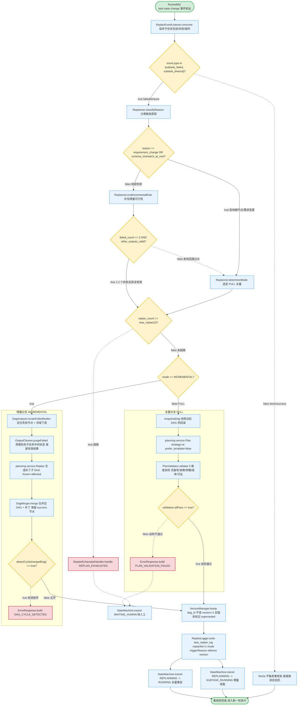
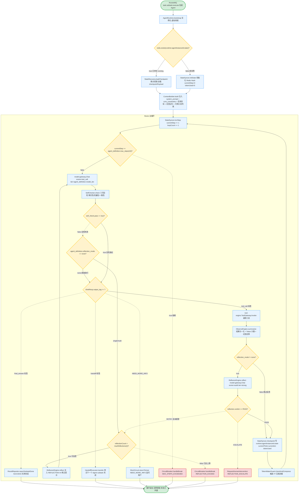
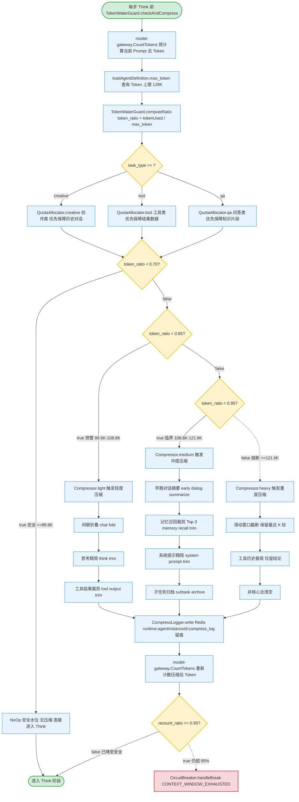
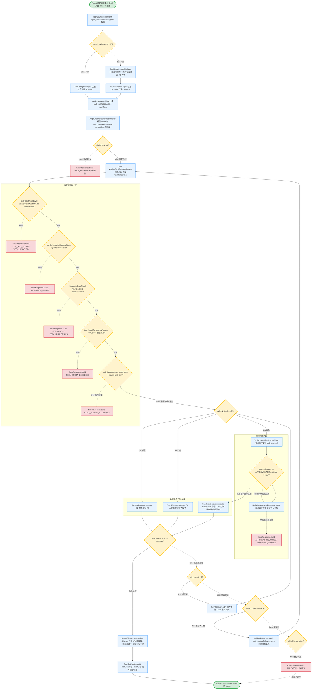

# 运行时与重规划详细逻辑流程图

> 文档版本：v1.0 | 更新日期：2026-06-27 | 对应模块：agent-runtime(8092) / planning-service(8086) / tool-engine(8090) / model-gateway(8094)
> 文档定位：**决策逻辑层级**流程图，补充 [08-flow 行为契约级时序图](../08-flow/state-machines-and-sequences.md)，聚焦"判断节点 + 条件分支 + 决策树"
> 依赖文档：
> - [00-overview/tech-stack-and-architecture.md](../00-overview/tech-stack-and-architecture.md) — 微服务清单、ADR-002/005、§6.1 风控拦截器
> - [01-database/database-schema-design.md](../01-database/database-schema-design.md) — §2 任务域、§3.4 Redis Key、§4 工具域、§6.1 agent_definition、§10 Milvus tool_index
> - [02-api/api-specification.md](../02-api/api-specification.md) — §0.5 错误码规范、§4 记忆、§5 模型、§6 任务、§7 Agent Runtime、§11 RocketMQ Topic
> - [03-task-engine/task-orchestration-and-planning.md](../03-task-engine/task-orchestration-and-planning.md) — §4 DAG 引擎、§5 动态重规划、§6 状态机
> - [05-tool-engine/tool-and-invocation-system.md](../05-tool-engine/tool-and-invocation-system.md) — §3 工具调用 9 步、§4.4 R3 审批、§5 配额与成本、§7 语义召回
> - [06-agent-runtime/agent-runtime-engine.md](../06-agent-runtime/agent-runtime-engine.md) — §2 ReAct 循环、§3 Reflexion、§4 Token 水位
> - [08-flow/state-machines-and-sequences.md](../08-flow/state-machines-and-sequences.md) — 行为契约级时序图（本文不重复其时序，仅深化到决策层）

## 0. 文档导览

### 0.1 图索引

| 编号 | 名称 | 层级 | 决策节点数 | 对应模块 | 与 doc 08 的关系 |
|---|---|---|---|---|---|
| F5 | 动态重规划决策流程 | 决策逻辑 | 7 | task-orchestrator / planning-service | 深化 doc 08 §4 重规划时序图「触发→模式判定→版本推进」的分支条件 |
| F6 | ReAct 循环详细决策流程 | 决策逻辑 | 8 | agent-runtime / model-gateway / tool-engine | 深化 doc 08 §5 ReAct 时序图「Think→Act→Observe→Reflect」的标签判定与熔断条件 |
| F7 | Token 水位压缩决策流程 | 决策逻辑 | 5 | agent-runtime / model-gateway / memory-service | 深化 doc 08 §6 Token 压缩时序图的四级水位分支与压缩优先级 |
| F8 | 工具选择与调用决策流程 | 决策逻辑 | 13 | agent-runtime / tool-engine / risk-control | 深化 doc 08 §7 工具调用时序图「召回→校验→执行→容错」的前置校验链与降级分支 |

### 0.2 与 doc 08 的层次差异

- **doc 08（行为契约级）**：回答"什么状态、什么时序、谁调用谁"，用 `sequenceDiagram` / `stateDiagram-v2`。
- **本文（决策逻辑级）**：回答"什么条件、走哪个分支、为什么、失败如何回退"，用 `flowchart TD` + 菱形判断节点 + 条件表达式 + 错误码。

### 0.3 Mermaid 约定

| 元素 | 语法 | 含义 |
|---|---|---|
| 起止 | `([开始])` / `([结束])` | 流程起止，stadium 样式 |
| 动作 | `[类.方法() 描述]` | 动作节点，标注归属类与方法 |
| 判断 | `{"表达式 == true?"}` | 菱形判断，条件须为可计算表达式 |
| 异常 | `-.->|错误码|` | 红色虚线 + 错误码，错误码对齐 doc 02 §0.5 |
| 子图 | `subgraph 名称` | 分组，如「前置校验链」「执行分支」 |

---

## 1. F5 动态重规划决策流程

覆盖触发源监听（RocketMQ `task.state.change` Topic）→ 触发原因分类（工具失败 / 信息不足 / 需求变更 / Schema 不匹配 / 超时）→ 模式判定（INCREMENTAL vs FULL）→ 增量分支（失败节点 + 邻域 + 补丁 DAG + 版本合并）/ 全量分支（planning-service.Plan + 5 维度校验）→ 重规划次数上限校验（max_replan 默认 2）→ 版本递增 + 状态推进 / 超限转人工。

### 1.1 流程图



### 1.2 重规划模式判定规则表

| 触发原因 | 检测方 | 默认模式 | 判定条件表达式 | 影响范围 |
|---|---|---|---|---|
| 工具失败 (tool_failed) | orchestrator | INCREMENTAL | `failed_count <= 2 AND other_outputs_valid == true` | 失败节点 + 其下游邻域 |
| 信息不足 (info_insufficient) | orchestrator | INCREMENTAL | 仅 1 个节点 outputs 关键字段缺失 | 该节点 + 直接下游 |
| 需求变更 (requirement_change) | 用户/gateway | FULL | `affected_ratio > 0.5` 影响过半子任务 | 全量重生成 DAG |
| Schema 不匹配 (schema_mismatch) | quality-service | FULL | `mismatch_node == root` 涉及根节点 | 全量重生成 DAG |
| 超时 (timeout) | orchestrator | INCREMENTAL | 优先调整超时节点的 `timeoutMs`/拆分 | 超时节点本身 |
| Agent 跨域能力不足 (cross_domain) | agent-runtime | INCREMENTAL | 单节点能力溢出 | 该节点替换为跨域 Agent |
| 成本超限 (cost_overrun) | orchestrator | INCREMENTAL | `cost_used_cent > cost_limit_cent * 0.9` | 削减非核心节点 |

> 模式判定优先级：根节点 Schema 不匹配 > 需求变更影响 > 50% > 失败节点数 > 2 > 默认 INCREMENTAL。

### 1.3 DAG 版本管理规则

| 场景 | 版本操作 | task_dag.source | task_replan_log 记录 | 状态机推进 |
|---|---|---|---|---|
| 首次规划 | 新建 dag_id，version=1 | template/ai | — | PLANNING → RUNNING |
| 增量重规划 (v1→v2) | dag_id 不变，version+1，旧版本 `superseded` | ai | `mode=incremental` old=1 new=2 | REPLANNING → SUBTASK_RUNNING |
| 全量重规划 (v1→v3) | dag_id 不变，version+1（旧版本保留） | ai | `mode=full` old=1 new=3 | REPLANNING → RUNNING |
| 增量失败转全量 (v2→v3) | dag_id 不变，version+1 | ai | `mode=full` old=2 new=3 | REPLANNING → RUNNING |

**版本读取规则**：orchestrator 始终读取 `MAX(version)` 对应当前行；历史版本仅用于审计、回滚、Badcase 分析。增量模式下 `OutputCleaner.purgeFailed` 仅清理失败子任务的 Redis 中间态（`dag:{taskId}:node:{nodeId}:outputs`），保留 `status=success` 节点的 outputs 供下游复用。

### 1.4 异常分支与错误码

| 错误码 | 触发条件 | HTTP/gRPC 状态 | 处理动作 | 关联文档 |
|---|---|---|---|---|
| `REPLAN_EXHAUSTED` | `replan_count >= max_replan(2)` 累计超限 | gRPC FAILED | 转 WAITING_HUMAN，notifyUser 通知人工兜底 | doc 03 §5.3 |
| `DAG_CYCLE_DETECTED` | 增量合并后 `detectCycle(mergedDag) == true` | gRPC FAILED | 拒绝该版本落库，升级为 FULL 重试一次；仍失败转 WAITING_HUMAN | doc 03 §4.3 |
| `PLAN_VALIDATION_FAILED` | 全量重规划 5 维度自检未通过 | gRPC FAILED | 转 WAITING_HUMAN，保留快照供人工修正 | doc 03 §3.3 |
| `REPLAN_COST_EXCEEDED` | 重规划累计成本 `> cost_limit_cent * 30%` | gRPC FAILED | 转 WAITING_HUMAN，独立预算熔断 | doc 03 §5.3 |
| `REPLAN_TIMEOUT` | 单次重规划耗时 > 60s | gRPC DEADLINE_EXCEEDED | 中断 + 转 FAILED | doc 03 §5.3 |

---

## 2. F6 ReAct 循环详细决策流程

覆盖 Agent 实例化 → 上下文注入 → Think 阶段 → [SELF_CHECK] 三问自检 → 自检通过进入 Act / 失败进入 Reflexion → Act 四分支决策（工具调用/转交/完成/追问）→ Observe 观察 → Reflect 反思（受 reflection_mode 控制）→ 循环边界检查（max_steps 熔断）→ 状态外置。

### 2.1 流程图



### 2.2 Think 自检三问规则

`SelfChecker.check` 在每次 Think 产出后、进入 Act 前执行，对模型思考内容做三维度自检。自检失败即触发 Reflexion 重试。

| 维度 | 检查问题 | 判定依据 | 失败示例 |
|---|---|---|---|
| 事实性 (factual) | 引用事实是否来自上下文/工具返回/知识库？ | 关键事实必须可溯源到 `context_builder` 注入来源 | 模型臆造订单号（上下文中不存在） |
| 完备性 (completeness) | 是否遗漏关键约束？ | `core_constraints` 中标记 `required=true` 的约束全部覆盖 | 写操作未校验 RBAC 权限 |
| 一致性 (consistency) | 是否与前序结论矛盾？ | 与 `thinkTrace` 历史思考不冲突 | 当前结论与上一步 observation 结论相反 |

**自检输出契约**：

```json
{
  "pass": true,
  "reason": "三问全部通过",
  "fix_hint": ""
}
```

```json
{
  "pass": false,
  "reason": "事实性失败：引用了上下文不存在的订单号 ord_999",
  "fix_hint": "请仅使用上一轮 tool_engine 返回的订单 ord_123"
}
```

### 2.3 Act 三分支判定规则（含 4 种输出标签）

`ActDecisionRouter.route` 依据模型输出标签路由到不同动作分支：

| 输出标签 | 判定条件 | 动作分支 | 调用方 | 循环行为 |
|---|---|---|---|---|
| `tool_call` 标签 | 模型输出包含 `tool_call` 段 | 调用工具 `tool-engine.ToolGateway.Invoke` | agent-runtime → tool-engine | 继续 Observe → Reflect → 下一轮 |
| `handoff` 标签 | 模型输出包含 `<handoff>` 段 | 转交下一个 Agent，当前 subtask 完成 | agent-runtime → task-orchestrator | 退出循环，上报 ReportSubtaskDone |
| `final_answer` 标签 | 模型输出包含 `<final_answer>` 段 | 任务完成，返回最终结果 | agent-runtime → task-orchestrator | 退出循环，上报 SUCCESS |
| `NEED_MORE_INFO` | 模型输出包含 `NEED_MORE_INFO` 段 | 短路返回用户追问 | agent-runtime → agent-gateway | 退出循环，等待用户补充输入 |

> 标签优先级：`NEED_MORE_INFO` > `final_answer` > `handoff` > `tool_call`。若同时出现多个标签，按优先级取最高者。

### 2.4 Reflexion 重试控制（none/single/multi）

`reflection_mode` 由 `agent_definition.reflection_mode` 字段控制，决定自检失败后的反思行为：

| reflection_mode | 触发节点 | 最大反思轮次 | 每轮注入 | 超限动作 |
|---|---|---|---|---|
| `none` | 不触发 | 0 | — | 自检失败直接放行进入 Act（信任模型） |
| `single` | 每步 Think 自检失败 | 1 | `[REFLECTION #1] {fix_hint}` | 1 轮后仍不过 → 放行进入 Act |
| `multi` | 每步可循环反思 | 2（maxReflections 默认 2） | `[REFLECTION #n] {fix_hint} {history_observation}` | 2 轮后仍不过 → `REFLECTION_EXCEED` 熔断 |

**Reflexion Prompt 注入模板**（每轮递增）：

```text
[REFLECTION #1]
上一轮思考存在问题：{self_check.reason}
修正建议：{self_check.fix_hint}
请基于修正建议重新生成 Think 输出。
```

**Reflect 阶段独立反思**（Observe 后）：调用 `model-gateway.Chat(scene=audit, tier=strong)`，输出 `verdict ∈ {PASS, RETRY, ESCALATE}`：
- `PASS` → 继续下一轮循环
- `RETRY` 且 `reflectionCount < 2` → 回到 Think 带修正提示
- `ESCALATE` → `RequestHumanIntervention`，转人工

### 2.5 循环边界与熔断

| 熔断维度 | 阈值 | 判定表达式 | 错误码 | 处理动作 |
|---|---|---|---|---|
| 最大步数 | `agent_definition.max_steps`（默认 10） | `currentStep >= 10` | `MAX_STEPS_EXCEEDED` | 强制终止，ReportSubtaskDone(FAILED) |
| Token 上限 | `agent_definition.max_token` | `tokenUsed >= max_token` | `CONTEXT_WINDOW_EXHAUSTED` | 见 F7 压缩流程，压缩无效则终止 |
| 成本上限 | `task_instance.cost_limit_cent` | `costUsedCent >= cost_limit_cent` | `COST_BUDGET_EXCEEDED` | ReportSubtaskDone(FAILED, COST_EXCEED) |
| 工具连续失败 | `consecutiveToolFail >= 3` | 同一工具连续失败 3 次 | `CONSECUTIVE_TOOL_FAIL` | ReportSubtaskDone(FAILED) |
| 反思超限 | `reflectionCount >= 2` 仍不过 | `reflectionCount >= maxReflections` | `REFLECTION_EXCEED` | ReportSubtaskDone(FAILED) |
| 反思升级 | Reflect verdict == ESCALATE | verdict == ESCALATE | `REFLECTION_ESCALATE` | RequestHumanIntervention 转 WAITING_HUMAN |

**每步状态外置**：`StateSyncer.checkpoint` 在每个阶段（think/act/observe/reflect）结束后将以下字段写入 Redis Hash `runtime:{agentInstanceId}:state`（TTL 30min，执行中续期）：`currentStep` / `currentPhase` / `currentThink` / `currentAct` / `tokenUsed` / `costUsedCent` / `reflectionCount` / `checkpointPayload`。崩溃后新 Pod 可从 `checkpointPayload` 恢复至上一步终点续跑。

---

## 3. F7 Token 水位压缩决策流程

覆盖每步推理前 `model-gateway.CountTokens` 预计算 → 查询 `agent_definition.max_token` 上限 → 计算水位比例 → 四级水位分支判断（安全/预警/临界/熔断）→ 分级压缩 → 压缩后重新计数 → 仍超 95% 强制终止返回 `CONTEXT_WINDOW_EXHAUSTED`。

### 3.1 流程图



### 3.2 四级水位阈值表（128K 窗口示例）

以 `agent_definition.max_token = 131072`（128K）为例，水位比例 = `tokenUsed / max_token`：

| 水位等级 | 比例区间 | Token 区间 | 触发动作 | 压缩通道 | 调用方 |
|---|---|---|---|---|---|
| 安全 (safe) | < 70% | ≤ 89.6K | 无压缩 | none | — |
| 预警 (light) | 70% ~ 85% | 89.6K ~ 108.8K | 轻度压缩：闲聊折叠 + 思考精简 + 工具结果裁剪 | light | memory-service（轻压缩通道） |
| 临界 (medium) | 85% ~ 95% | 108.8K ~ 121.6K | 中度压缩：早期对话摘要 + 记忆召回裁剪 Top-3 + 系统提示精简 + 子任务归档 | medium | memory-service（中压缩通道） |
| 熔断 (heavy) | ≥ 95% | ≥ 121.6K | 重度压缩：滑动窗口截断 + 工具历史极简 + 非核心全清空；预警上报 | heavy | memory-service（重压缩通道）+ 熔断预警 |

> **流式预判**：每轮 Think 前预计算，避免推理中途超窗。压缩后立即重新 `CountTokens`，若仍 ≥ 95% 则触发 `CONTEXT_WINDOW_EXHAUSTED` 强制终止任务。

### 3.3 6 类内容压缩优先级矩阵

压缩按优先级从先到后依次执行（优先压缩低价值内容，保留高价值内容）：

| 优先级 | 内容类别 | 压缩手段 | 触发水位 | 不可压缩性 | 永不压缩项 |
|---|---|---|---|---|---|
| 1 | 闲聊折叠 | 折叠多轮寒暄为单句摘要 | light+ | 最低 | — |
| 2 | 思考精简 | 保留结论，裁剪思维链过程 | light+ | 低 | — |
| 3 | 工具结果裁剪 | 裁剪冗余字段，长文本截断至 4K Token | light+ | 中 | tool_call_log 原始记录（落盘） |
| 4 | 早期对话摘要 | 按主题摘要早期多轮对话 | medium+ | 中高 | 最近 3 轮对话 |
| 5 | 记忆召回裁剪 | 召回数量从 Top-K 降至 Top-3 | medium+ | 高 | current_task 目标与 inputs |
| 6 | 系统提示精简 | 裁剪 system_prompt 示例段 | medium+ | 高 | core_constraints 核心约束 |
| 7 | 子任务归档 | 已完成子任务上下文归档为单行结论 | medium+ | 高 | 当前执行子任务上下文 |
| 8 | 滑动窗口截断 | 仅保留最近 K 轮（默认 K=5），更早全清 | heavy 专用 | 最高 | 最近 K 轮 + system_prompt + core_constraints + current_task |

> **压缩留痕**：所有压缩操作记录到 Redis `runtime:{agentInstanceId}:compress_log`（List 结构，TTL 30min），字段含 `step` / `compressLevel` / `beforeTokens` / `afterTokens` / `removedCategories[]`，供人工回溯与 Badcase 分析。

### 3.4 动态配额分配规则（创作/工具/问答三类任务）

`QuotaAllocator` 依据 `task_instance.task_type` 动态调整各类内容的保留配额，优先保障任务核心上下文：

| 任务类型 | 判定依据 | 优先保障（永不压缩） | 可压缩配额 | 压缩策略倾向 |
|---|---|---|---|---|
| 创作类 (creative) | `task_type == creative` 且无工具调用 | 历史多轮对话（保留最近 10 轮） | 工具结果（极少） | 倾向 medium 即触发早期对话摘要，保留创作上下文连续性 |
| 工具类 (tool) | `task_type == tool` 或工具调用次数 ≥ 3 | 工具结果数据（完整保留最近 5 次工具输出） | 闲聊 + 早期对话 | 倾向 light 即触发工具结果裁剪冗余字段，保留数据完整性 |
| 问答类 (qa) | `task_type == qa` 且依赖知识库 | 知识片段召回（Top-3 完整保留） | 工具结果 + 闲聊 | 倾向 medium 触发记忆召回裁剪至 Top-3，保留知识精度 |

---

## 4. F8 工具选择与调用决策流程

覆盖 Agent 决定调用工具 → 工具数量判断（≤20 全量 / >20 Top-K 召回）→ 召回 Top-K 注入 Prompt → 模型生成 tool_call → 语义对齐校验 → tool-engine.ToolGateway.Invoke → 前置校验链（5 步）→ 风险分级执行（R1/R2/R3）→ 超时重试 → 替代工具 → 结果标准化清洗 → 返回 Agent。

### 4.1 流程图



### 4.2 Top-K 召回规则（向量检索 + 标签过滤）

当 `agent_definition.bound_tools.count > 20` 时，触发 `ToolRecaller.recall` 进行语义召回，避免全量注入导致 Prompt 膨胀：

| 步骤 | 实现 | 说明 |
|---|---|---|
| 1. 向量化查询 | `embeddingModel.encode(query, dim=1024)` | 将当前任务目标 + 上一步 observation 编码为 1024 维向量 |
| 2. Milvus 召回 | `milvus.search(collection=tool_index, top_k=30, ef=64, expr="status==2")` | 初始召回 Top-30，过滤条件 `status==2`（仅启用工具） |
| 3. 标签过滤 | `partition_keys=sceneTags` | 按场景标签分区检索，加速召回 |
| 4. 重排 | `finalScore = 0.6*relevance + 0.3*costScore + 0.1*riskScore` | 相关性为主，成本与风险为辅；R1 优先 |
| 5. 截断 | `.limit(5)` | 最终返回 Top-5 工具 |
| 6. Schema 最小化注入 | 仅保留 `name` + `description`（截断至 200 字符） + `input_schema` | 裁剪 `toolId`/`version`/`avgCostCent` 等非必要字段 |

**降本效果**：平台共注册 200 个工具时，单任务平均召回 5 个，Prompt 中工具 Schema 部分降本 97.5%。

### 4.3 前置校验链（5 步 + 错误码）

前置校验按顺序执行，任一失败立即返回错误并落审计日志（`tool_call_log.status=blocked`）：

| 序号 | 校验项 | 判定表达式 | 失败错误码 | 是否落审计 |
|---|---|---|---|---|
| 1 | 工具存在性 + 版本有效性 | `toolRegistry.findById(toolId, version).status == ENABLED` | `TOOL_NOT_FOUND` / `TOOL_DISABLED` | 是 |
| 2 | JSON Schema 参数校验 | `jsonSchemaValidator.validate(inputJson, tool.inputSchema) == valid` | `VALIDATION_FAILED` | 是 |
| 3 | RBAC + ABAC 权限校验 | `risk-control.preCheck(subject=agent, resource=tool, action=execute).effect == allow` | `FORBIDDEN` / `TOOL_RISK_DENIED` | 是 |
| 4 | 配额校验（tool_quota） | `toolQuotaManager.tryAcquire(tenant+tool, tenant+all, task+tool)` | `TOOL_QUOTA_EXCEEDED` | 是 |
| 5 | 成本熔断校验（task_instance.cost_limit_cent） | `task_instance.cost_used_cent < cost_limit_cent` | `COST_BUDGET_EXCEEDED` | 是 |

> **配额校验顺序**：先校验 `tool_quota`（工具级 + 业务线级 + 单任务级三层配额），再校验 `task_instance.cost_limit_cent`（任务总成本上限）。两类配额均通过后才进入风险分级执行。

**语义对齐校验**（前置校验前）：`AlignChecker.computeSimilarity` 计算模型生成 tool_call 的 intent 与 `tool_registry.description` 的 embedding 相似度，`similarity < 0.6` → 返回 `TOOL_MISMATCH`（疑似模型幻觉调用未对齐工具）。

### 4.4 风险分级执行矩阵（R1/R2/R3）

| 风险等级 | executor_type | 执行器 | 隔离方式 | 超时控制 | 资源限制 | 强制要求 |
|---|---|---|---|---|---|---|
| R1（低危） | `general` / `proxy` | GeneralExecutor（JVM 内） | 按 toolId 分组限流（Sentinel） | 虚拟线程 `CompletableFuture.orTimeout(timeoutMs)` | 单工具并发上限 + JVM 堆监控 | 无 |
| R2（中危） | `proxy` / `sandbox` | ProxyExecutor（gRPC 代理业务服务） | gRPC Stub 池 + 熔断器（按 endpoint 维度） | gRPC deadline 透传 `timeoutMs` | 熔断器阈值 | 必须可回滚（`undo_action` 非空） |
| R3（高危） | `sandbox`（强制） | SandboxExecutor（Docker 沙箱） | Docker 容器全隔离 | 容器级 OOM Kill + 超时 SIGKILL | CPU/内存/网络/文件系统全限制 | 必须审批 + 沙箱 + 双人复核 |

**R3 沙箱执行细节**：R3 工具在 Docker 容器内执行，CPU/内存/网络限制，超时 kill。审批通过后限时授权（默认 1 小时），同 inputSnapshot 复用免重复审批。审批状态落地于 `tool_approval` 表，双人复核强制（主审批人 approve + 副审批人 second_approve）。

### 4.5 容错与降级策略（重试 / 替代工具 / 全不可用）

| 降级层级 | 触发条件 | 策略 | 最大次数 | 退避策略 |
|---|---|---|---|---|
| 接口级重试 | `error_codes.retryable == true` 的瞬时异常（UPSTREAM_TIMEOUT / RATE_LIMITED） | 指数退避重试 | 2 次 | 1s / 2s 指数退避 |
| 替代工具匹配 | 重试耗尽后，查询 `tool_registry.fallback_tools` | `FallbackMatcher.match` 按 sceneTags 聚类匹配同功能替代工具 | 递归尝试所有 fallback | 无退避，立即切换 |
| 全不可用熔断 | 所有 `fallback_tools` 都失败 | 返回 `ALL_TOOLS_FAILED`，Agent 提示模型调整方案 | — | — |

**禁止重试场景**：业务异常（参数错误 `VALIDATION_FAILED`、权限拒绝 `FORBIDDEN`）、合规问题（越权拦截 `TOOL_RISK_DENIED`）、R3 写操作已部分执行（防止重复写入造成数据不一致）。

**成本熔断**：单任务累计成本 `task_instance.cost_used_cent >= task_instance.cost_limit_cent` → 返回 `COST_BUDGET_EXCEEDED`（429），停止后续工具调用，任务转 `TIMEOUT` 或 `FAILED`。

**工具全不可用处理**：`ALL_TOOLS_FAILED` 返回 Agent 后，Agent 在下一轮 Think 中由模型决策调整方案（换工具 / 换路径 / 申请人工介入），不可无限重试同一工具链。

---

## 5. 交叉引用

### 5.1 与已有文档章节锚点对应关系

| 本文章节 | 对应 doc 03 章节 | 对应 doc 05 章节 | 对应 doc 06 章节 | 对应 doc 08 章节 | 深化关系 |
|---|---|---|---|---|---|
| F5 §1 动态重规划 | §5 动态重规划机制（§5.1 触发条件 / §5.2 增量vs全量 / §5.3 熔断 / §5.4 日志） | — | — | §4 重规划时序图 | 深化时序图「触发→模式判定」的分支条件与错误码 |
| F5 §1.3 版本管理 | §4.4 DAG 版本管理 | — | — | — | 深化版本递增规则与 superseded 标记 |
| F6 §2 ReAct 循环 | — | — | §2 ReAct 推理循环（§2.1 四阶段 / §2.2 退出条件 / §2.3 伪代码） | §5 ReAct 时序图 | 深化时序图「Think→Act→Observe→Reflect」的标签判定与熔断条件 |
| F6 §2.2 自检三问 | — | — | §3 Reflexion 反思机制（§3.2 触发条件） | — | 新增 [SELF_CHECK] 三问决策逻辑（doc 06 未细化三问判定） |
| F6 §2.4 Reflexion | — | — | §3.1 单轮vs多轮反思 / §3.3 Prompt 模板 | — | 深化 none/single/multi 分支判定与轮次上限 |
| F7 §3 Token 压缩 | — | — | §4 上下文构建与 Token 水位管控（§4.3 分级压缩 / §4.4 水位更新） | §6 Token 压缩时序图 | 深化时序图的四级水位分支与 6 类压缩优先级矩阵 |
| F7 §3.4 动态配额 | — | — | §4.1 上下文构建（压缩优先级表） | — | 新增创作/工具/问答三类任务的动态配额分配规则 |
| F8 §4 工具调用 | — | §3 工具调用全链路 9 步（§3.5 前置校验 / §3.6 路由 / §3.7 执行） | — | §7 工具调用时序图 | 深化时序图「召回→校验→执行」的前置校验链与降级分支 |
| F8 §4.2 Top-K 召回 | — | §7 工具语义召回（§7.1 Milvus / §7.2 召回 / §7.3 对齐校验） | — | — | 深化召回阈值（>20 触发）与重排权重（0.6/0.3/0.1） |
| F8 §4.3 前置校验 | — | §3.5 前置校验（8 步伪代码）/ §5.5 成本熔断 | — | — | 深化 tool_quota 与 cost_limit_cent 两类配额检查顺序 |
| F8 §4.4 风险分级 | — | §3.6 路由分发 / §3.7 隔离执行 / §4.4 R3 审批 | — | §2 工具审批状态机 | 深化 R1/R2/R3 执行矩阵与沙箱资源限制 |
| F8 §4.5 容错降级 | — | §5.4 调用次数管控（§5.4.4 失败重试）/ §5.5 成本熔断 | — | — | 深化重试/替代工具/全不可用三级降级策略 |

### 5.2 错误码一致性核对

| 错误码 | 本文出处 | doc 02 §0.5 定义 | doc 03 出处 | doc 05 出处 | doc 06 出处 |
|---|---|---|---|---|---|
| `REPLAN_EXHAUSTED` | F5 §1.4 | ✓ 任务重规划超限 | §5.3 / §6.3 | — | — |
| `DAG_CYCLE_DETECTED` | F5 §1.4 | ✓ DAG 校验失败 | §4.3 | — | — |
| `PLAN_VALIDATION_FAILED` | F5 §1.4 | ✓ 规划自检失败 | §3.3 | — | — |
| `MAX_STEPS_EXCEEDED` | F6 §2.5 | ✓ 步数熔断 | — | — | §2.2 / §6.1 |
| `CONTEXT_WINDOW_EXHAUSTED` | F7 §3.1 | ✓ Token 窗口耗尽 | — | — | §6.2 |
| `COST_BUDGET_EXCEEDED` | F6 §2.5 / F8 §4.3 | ✓ 成本超限 | §6.3 / §6.3 | §3.5 / §5.5 | §6.3 |
| `TOOL_MISMATCH` | F8 §4.3 | ✓ 工具语义不匹配 | — | §7.3（TOOL_NOT_RECALLED 同义） | — |
| `TOOL_NOT_FOUND` / `TOOL_DISABLED` | F8 §4.3 | ✓ 工具不存在/未启用 | — | §3.5 | — |
| `VALIDATION_FAILED` | F8 §4.3 | ✓ 参数 Schema 不合法 | — | §3.5 | — |
| `FORBIDDEN` / `TOOL_RISK_DENIED` | F8 §4.3 | ✓ 权限拒绝 | — | §3.5 | — |
| `TOOL_QUOTA_EXCEEDED` | F8 §4.3 | ✓ 工具配额耗尽 | — | §5.5 | — |
| `APPROVAL_REQUIRED` / `APPROVAL_EXPIRED` | F8 §4.4 | ✓ R3 审批未通过/过期 | — | §3.5 / §4.4 | — |
| `ALL_TOOLS_FAILED` | F8 §4.5 | ✓ 工具全不可用 | — | §5.4.4 | — |
