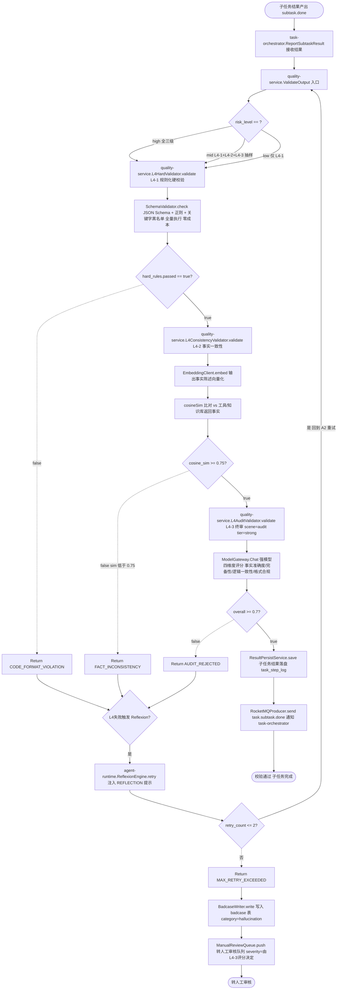
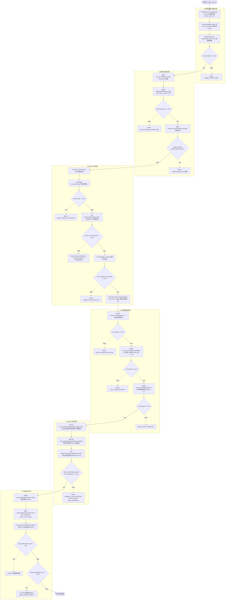
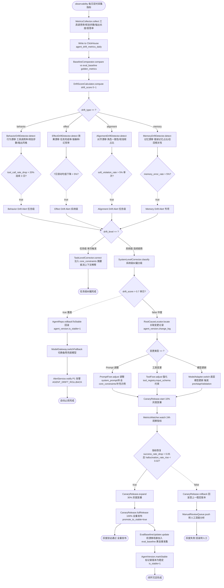
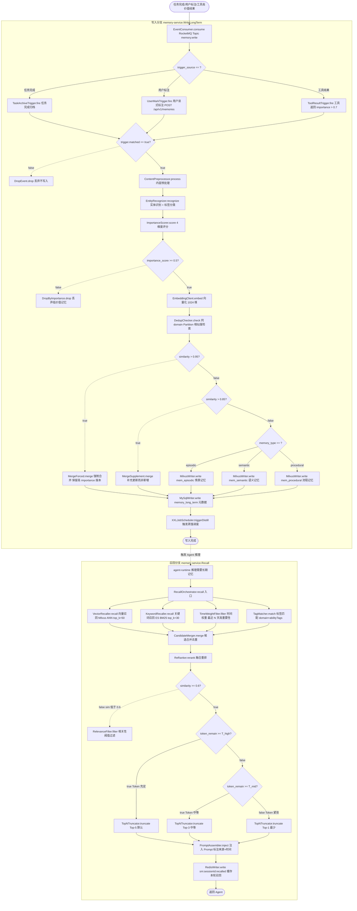

# 质量与记忆详细逻辑流程图

> 文档版本：v1.0  |  更新日期：2026-06-26  |  对应模块：quality-service(8100) / memory-service(8088) / risk-control / observability
> 文档定位：**决策逻辑层级**流程图，补充 [08-flow 行为契约级时序图](../08-flow/state-machines-and-sequences.md)，聚焦"判断节点 + 条件分支 + 决策树"
> 依赖文档：
> - [00-overview/tech-stack-and-architecture.md](../00-overview/tech-stack-and-architecture.md) — 微服务清单、ADR-004/ADR-005、§6 横向体系落地
> - [01-database/database-schema-design.md](../01-database/database-schema-design.md) — §3 记忆域（memory_long_term / memory_distill_log）、§8 治理域（badcase / eval_baseline / agent_version / agent_metrics_daily）、§10 Milvus Collections
> - [02-api/api-specification.md](../02-api/api-specification.md) — §0.5 错误码规范、§4 MemoryService gRPC、§5 ModelGateway、§9 质量治理 API、§11 RocketMQ Topic
> - [04-memory/memory-system-design.md](../04-memory/memory-system-design.md) — 三级记忆架构、多路召回、写入管道、Token 水位压缩
> - [08-flow/state-machines-and-sequences.md](../08-flow/state-machines-and-sequences.md) — 已有记忆写入/召回时序图、Token 压缩流程（本文不重复其时序，仅深化到决策层）
> - [09-governance-and-deployment/governance-and-middleware.md](../09-governance-and-deployment/governance-and-middleware.md) — §1 幻觉治理六层、§2 漂移四层管控、Badcase 归集

## 0. 文档导览

### 0.1 图索引

| 编号 | 名称 | 层级 | 决策节点数 | 对应模块 | 与 doc 08 的关系 |
|---|---|---|---|---|---|
| F9 | 三级质量校验决策流程 | 决策逻辑 | 6 | quality-service / agent-runtime / task-orchestrator | 深化 doc 08 §记忆写入时序图「L4 校验」环节的分级与打回逻辑 |
| F10 | 幻觉治理六层联动流程 | 决策逻辑 | 12 | model-gateway / agent-runtime / knowledge-service / tool-engine / quality-service / risk-control | 深化 doc 09 §1.2 六层架构的层间跳转与失败短路条件 |
| F11 | 漂移监测与纠偏决策流程 | 决策逻辑 | 9 | observability / quality-service / agent-repo / model-gateway | 深化 doc 09 §2 四层管控的判定阈值与灰度回滚决策 |
| F12 | 长期记忆写入与召回决策流程 | 决策逻辑 | 9 | memory-service / Milvus / ES / XXL-Job | 深化 doc 08 §记忆写入/召回时序图的去重合并与 Top-N 动态截断 |

### 0.2 与 doc 08 / doc 09 的层次差异

- **doc 08（行为契约级）**：回答"什么状态、什么时序、谁调用谁"，用 `sequenceDiagram` / `stateDiagram-v2`。
- **doc 09（治理体系架构级）**：回答"治理分几层、各层做什么、阈值是多少"，用架构图与配置表。
- **本文（决策逻辑级）**：回答"什么条件触发哪个分支、为什么、失败如何回退"，用 `flowchart TD` + 菱形判断节点 + 条件表达式 + 错误码。

### 0.3 Mermaid 约定

| 元素 | 语法 | 含义 |
|---|---|---|
| 起止 | `([开始])` / `([结束])` | 流程起止，stadium 样式 |
| 动作 | `[类.方法() 描述]` | 动作节点，标注归属类与方法 |
| 判断 | `{表达式 == true?}` | 菱形判断，条件须为可计算表达式 |
| 异常 | `-.->|错误码|` | 红色虚线 + 错误码，错误码对齐 doc 02 §0.5 |
| 子图 | `subgraph Lx 层名` ... `end` | F10 用 6 个子图分层，F12 用 2 个子图分写入/召回 |

```mermaid
%% 全局样式定义
flowchart TD
    classDef startEnd fill:#d4edda,stroke:#28a745,stroke-width:2px
    classDef action fill:#cce5ff,stroke:#007bff
    classDef decision fill:#fff3cd,stroke:#ffc107,stroke-width:2px
    classDef error fill:#f8d7da,stroke:#dc3545,stroke-dasharray:5 5
```

---

## 1. F9 三级质量校验决策流程

覆盖：子任务结果产出 → 进入 `quality-service.ValidateOutput` → L4-1 规则化硬校验 → L4-2 事实一致性校验 → L4-3 综合质量终审 → 通过则落盘通知 / 失败则触发 Reflexion 重试 → 重试上限转人工审核。

### 1.1 流程图



### 1.2 L4-1/L4-2/L4-3 三级校验规则表

| 级别 | 校验类型 | 实现类.方法 | 校验内容 | 成功条件 | 成本 | 适用场景 |
|---|---|---|---|---|---|---|
| L4-1 | 规则化硬校验 | `quality-service.L4HardValidator.validate()` | ① JSON Schema 结构校验 ② 正则 `[来源:.*]` 至少 1 处 ③ 关键字黑名单（保证/绝对/100%） | 全部规则 `passed=true` | 零成本（正则+Schema） | 全量输出，必执行 |
| L4-2 | 事实一致性校验 | `quality-service.L4ConsistencyValidator.validate()` | 输出事实陈述 vs 工具/知识库返回事实 embedding 比对 | `cosine_sim >= 0.75` | 中（embedding 计算） | 工具类任务必执行，闲聊跳过 |
| L4-3 | 综合质量终审 | `quality-service.L4AuditValidator.validate()` | 强模型 scene=audit tier=strong 四维度评分：事实准确度 / 完备性 / 逻辑一致性 / 格式合规 | `overall >= 0.7` | 高（强模型调用） | 高风险场景必执行 + 中风险抽样 |

### 1.3 分级执行策略矩阵

| 场景风险等级 | 适用业务 | L4-1 | L4-2 | L4-3 | 终审方式 | 抽样率 |
|---|---|---|---|---|---|---|
| 高风险 | 金融、法律、医疗、生产操作 | ✅ 全量 | ✅ 全量 | ✅ 全量 | 强模型 + 人工终审 | 100% |
| 中风险 | 调研、代码、数据分析 | ✅ 全量 | ✅ 全量 | ⚪ 抽样 10% | 自动治理 + 10% 抽样人工复核 | 10% |
| 低风险 | 文案、闲聊、信息整理 | ✅ 全量 | ⚪ 跳过 | ⚪ 跳过 | 基础规则校验 | 1% 抽样 |

> 分级标识在 `task_instance.task_schema.constraints.risk_level` 字段携带，由 `task-orchestrator` 在 DAG 分发时透传给 `agent-runtime` 与 `quality-service`。

### 1.4 Badcase 自动归集规则

L4 任一级失败并转人工审核时，由 `quality-service.BadcaseWriter` 自动写入 `badcase` 表：

| 字段 | 取值规则 |
|---|---|
| `category` | `hallucination` |
| `severity` | 由 L4-3 `overall` 评分决定（< 0.3 高 / 0.3~0.7 中 / >= 0.7 但未通过 低） |
| `description` | L4 失败级别 + 错误码 + 子任务 ID |
| `root_cause` | 初始留空，由 `POST /api/v1/badcases/{caseId}/analyze` 提交根因分析（doc 02 §9.2） |
| `fix_action` | 初始留空，由根因分析后人工补全 |
| `agent_id` / `tenant_id` | 从 `task_instance` 透传 |
| `task_id` / `trace_id` | 当前任务链路追溯信息 |

其他自动归集触发源（doc 09 §1.2.6）：

| 触发源 | category | severity |
|---|---|---|
| 用户反馈 `rating=negative` | 自动分类（fact/tool/format） | 默认中 |
| 漂移告警 | `drift` | 高 |
| 工具调用失败累计超阈值 | `tool_error` | 中 |
| 重规划触发 | `plan_error` | 中 |

### 1.5 异常分支与错误码

| 错误码 | 触发分支 | HTTP/gRPC 状态 | 处理动作 |
|---|---|---|---|
| `CODE_FORMAT_VIOLATION` | L4-1 失败（Schema/正则/黑名单不通过） | gRPC INVALID_ARGUMENT | 触发 Reflexion 重试 |
| `FACT_INCONSISTENCY` | L4-2 失败（`cosine_sim < 0.75`） | gRPC FAILED_PRECONDITION | 触发 Reflexion 重试 |
| `AUDIT_REJECTED` | L4-3 失败（`overall < 0.7`） | gRPC FAILED_PRECONDITION | 触发 Reflexion 重试 |
| `MAX_RETRY_EXCEEDED` | Reflexion 重试 > 2 次仍失败 | gRPC RESOURCE_EXHAUSTED | 写入 badcase + 转人工审核队列 |
| `NEED_MORE_INFO` | L4-1 命中拒答关键字 | gRPC FAILED_PRECONDITION | 短路终止，触发用户追问 |
| `RISK_BLOCKED` | 风控前置拦截（高 R3 工具） | gRPC PERMISSION_DENIED | 不进入 L4 链路 |

---

## 2. F10 幻觉治理六层联动流程

覆盖 L1 模型选型 → L2 推理自校验 → L3 知识工具锚定 → L4 多层级输出校验 → L5 Agent 专项治理 → L6 长效闭环，含 6 层间跳转条件、失败短路、分级治理策略矩阵、L6 闭环触发阈值。

### 2.1 流程图



### 2.2 6 层职责与跳转条件表

| 层级 | 职责 | 主要动作 | 跳转下一层条件 | 失败短路错误码 |
|---|---|---|---|---|
| L1 | 模型选型与前置约束 | model-gateway 路由 + 注入强约束 Prompt + 低温度 | `route.matched == true` | `MODEL_ROUTE_MISS` |
| L2 | 推理过程自校验 | Think 阶段 SELF_CHECK 三问 + 来源标注 + NEED_MORE_INFO 拒答 | `self_check.pass == true && output.notContains(NEED_MORE_INFO)` | `HALLUCINATION_SUSPECTED` / `NEED_MORE_INFO` |
| L3 | 知识与工具锚定 | RAG 强制召回 + 空召回拒答 + 工具网关 5 步校验 + 多源交叉 + FACT_BASE 注入 | `recall.notEmpty && tool.pre_check.passed && cross_validation.consistent` | `EMPTY_RECALL_REJECTED` / `TOOL_MISMATCH` / `PARAM_INVALID` / `FORBIDDEN` / `CROSS_VALIDATION_FAIL` |
| L4 | 多层级输出校验 | L4-1 规则 / L4-2 事实一致性 / L4-3 强模型终审 三级链路 | `L4-1.passed && L4-2.passed && L4-3.passed` | `CODE_FORMAT_VIOLATION` / `FACT_INCONSISTENCY` / `AUDIT_REJECTED` |
| L5 | Agent 专项治理 | 记忆幻觉治理 / 规划幻觉治理 / 工具幻觉治理 | `memory.valid && plan.valid && tool.aligned` | `MEMORY_HALLUCINATION` / `PLAN_INVALID` / `TOOL_MISMATCH` |
| L6 | 长效闭环优化 | Badcase 归集 + 指标追踪 + 规则迭代 + 阈值告警/暂停 | `daily_hallucination_rate <= 5%` | P2 告警（>5%）/ P1 告警+自动暂停 Agent（>10%） |

> 失败短路：任意层失败 → 直接返回对应错误码，不再进入下一层；L1~L5 失败均同步归集到 L6 的 Badcase 表（由 `quality-service.BadcaseCollector` 统一处理）。

### 2.3 分级治理策略矩阵

| 场景风险等级 | 适用业务 | L1 | L2 | L3 | L4 | L5 | L6 | 终审方式 | 抽样率 |
|---|---|---|---|---|---|---|---|---|---|
| 高风险 | 金融、法律、医疗、生产操作 | ✅ | ✅ | ✅ | ✅ 全三级 | ✅ 全专项 | ✅ | 强模型 + 人工终审 | 100% |
| 中风险 | 调研、代码、数据分析 | ✅ | ✅ | ✅ | ✅ L4-1+L4-2+L4-3 抽样 | ✅ 全专项 | ✅ | 自动治理 | 10% 抽样人工复核 |
| 低风险 | 文案、闲聊、信息整理 | ✅ | ⚪ 跳过 | ⚪ 跳过 | ✅ 仅 L4-1 | ⚪ 跳过 | ✅ | 基础规则校验 | 1% 抽样 |

> 分级标识在 `task_instance.task_schema.constraints` 中携带 `risk_level` 与 `governance.layers` 数组，由 `task-orchestrator` 在 DAG 分发时透传给 `agent-runtime`，运行时据此选择治理策略。

### 2.4 L6 闭环触发阈值

| 指标维度 | 计算公式 | 触发阈值 | 告警级别 | 处置动作 |
|---|---|---|---|---|
| 日幻觉率 | `hallucination_count / task_count`（按 tenant_id+agent_id+date 聚合，写入 ClickHouse `agent_metrics_daily`） | `> 5%` | P2 告警 | 通知运营人工分析根因 |
| 日幻觉率 | 同上 | `> 10%` | P1 告警 | 自动暂停 Agent（`agent_definition.status=3`），触发回滚稳定 `agent_version` |
| 单任务幻觉 | L4 终审 `overall < 0.3` | 单次触发 | - | 直接归集 Badcase（severity=高）+ Reflexion 重试 |
| 工具调用幻觉率 | `tool_select_error / tool_call_total`（ClickHouse `agent_metrics_daily`） | `> 3%` | P3 告警 | 触发工具语义对齐校准 |
| 规划幻觉率 | `replan_count / task_count` | `> 5%` | P3 告警 | 触发 `PlanningService.ValidatePlan` 规则补全 |

---

## 3. F11 漂移监测与纠偏决策流程

覆盖 observability 采集行为指标 → 与 `eval_baseline` 基准比对 → 4 类漂移分类判定 → 任务级 vs 系统级纠偏判定 → 系统级纠偏分支（自动止损 / 根因定位 / 优化修复 / 灰度验证 / 闭环沉淀）。

### 3.1 流程图



### 3.2 4 类漂移判定阈值表

| 漂移类型 | 监测主体 | 指标字段（ClickHouse `agent_drift_metrics_daily`） | 判定阈值 | 漂移级别 |
|---|---|---|---|---|
| ① 行为漂移 | 工具调用率 / 规划步数 / 输出风格长度 / 拒答率 | `tool_call_rate` / `avg_plan_steps` / `avg_output_length` / `refusal_rate` | 同向趋势连续 3 日偏离基准 ±15%（如工具调用率降幅 > 20%） | 任务级（单次触发纠偏） |
| ② 效果漂移 | 任务完成率 / 准确率 / 幻觉率 | `task_success_rate` / `accuracy_score` / `hallucination_rate` | 7 日滑动均值下降 > 5% | 系统级（连续趋势纠偏） |
| ③ 对齐漂移 | 角色一致性 / 软违规内容占比 | `role_consistency` / `soft_violation_rate` | 单次软违规 > 5%（任务级）/ 7 日滑动均值 > 3%（系统级） | 任务级或系统级 |
| ④ 记忆漂移 | 错误记忆占比 / 召回相关度 | `memory_error_rate` / `recall_relevance_avg` | `error_rate > 5%` | 记忆漂移专项 |

`drift_score` 综合计算（doc 09 §2.3）：

```
drift_score = 0.4 × (1 - task_success_rate / baseline.success_rate)
            + 0.3 × (hallucination_rate / baseline.hallucination_rate - 1)
            + 0.2 × |tool_call_rate - baseline.tool_call_rate| / baseline.tool_call_rate
            + 0.1 × memory_error_rate
```

告警阈值：`drift_score > 0.3` 持续 3 日 → P3 告警任务级；`> 0.5` 单日 → P2 系统级；`> 0.7` 单日 → P1 自动回滚。

### 3.3 任务级 vs 系统级纠偏判定规则

| 纠偏级别 | 触发条件 | 纠偏动作 | 实现组件 | 影响范围 |
|---|---|---|---|---|
| 会话级（轻度） | 单会话内行为偏差 | 每轮注入 `core_constraints` 摘要抵消上下文稀释 | `memory-service.LoadShortTerm` | 单次会话 |
| 任务级（中度） | L4 校验连续打回 / 行为指标单日偏离 > 30% / 单次软违规 > 5% | 切换更严格 Prompt 模板 + L4-3 强制终审 | `agent-runtime` + `quality-service` | 单次任务 |
| 系统级（重度） | 7 日滑动均值下降 > 5% / `drift_score > 0.5` 单日 / 模型版本更新失败 | 自动回滚 `agent_version.is_stable=1` + 切换备用模型 + 灰度验证 | `agent-repo` + `model-gateway` | 整个 Agent |
| 记忆漂移专项 | `memory_error_rate > 5%` | 错误记忆 `valid=0` 失效 + 过期记忆 `ttl_at` 归档 + 低相关记忆 `importance_score` 降权 | `memory-service` | 单 domain 记忆库 |

### 3.4 灰度发布与回滚决策

| 灰度阶段 | 流量占比 | 观察时长 | 回滚触发条件 | 通过条件 |
|---|---|---|---|---|
| 第 1 阶段 | 10% | 24h | `success_rate_drop > 0.05` 或 `hallucination_rate_rise > 0.02` | 24h 内指标恢复 |
| 第 2 阶段 | 30% | 48h | `success_rate_drop > 0.03` 或 `hallucination_rate_rise > 0.01` | 48h 内指标稳定 |
| 第 3 阶段 | 100% | - | - | 全量发布，`agent_version.is_stable=1` |

回滚动作链：
1. `AgentRepo.rollbackToStable(agentId, reason)` — 切换至上一稳定 `agent_version`
2. `ModelGateway.switchFallback(agentId)` — 切换备用兜底模型
3. `AlertService.notify(P1, "AGENT_DRIFT_ROLLBACK: " + agentId)` — P1 告警通知运营
4. 转人工深度分析 → 修复 → 重新灰度

### 3.5 闭环沉淀规则

漂移修复并灰度通过后，由 `quality-service.EvalBaselineUpdater` 自动将本次漂移场景加入 `eval_baseline` 黄金基准集，作为后续版本更新的强制校验项：

| 字段 | 取值规则 |
|---|---|
| `baseline_type` | 按漂移类型填 `behavior` / `effect` / `alignment` |
| `golden_metrics` | 漂移修复后的新指标基线（如 `success_rate` 恢复值） |
| `agent_version` | 修复后稳定版本号 |
| `sample_count` | 漂移期间采集的样本数 + 修复后回归样本数 |
| `updated_by` | `system`（自动）/ 运营人员 ID |

后续 `agent_version` 新版本发布前必须通过 `preAdaptValidation`（doc 09 §2.2.4 d）全量回归：

```
preAdaptValidation:
  success_rate >= 0.90
  hallucination_rate <= 0.05
```

不满足则禁止发布，触发 `MODEL_ADAPT_FAIL` 告警。

---

## 4. F12 长期记忆写入与召回决策流程

覆盖写入分支（触发条件 → 内容预处理 → 重要性评分 → 去重合并 → 分域隔离 → 落库 → 蒸馏调度）与召回分支（多路召回并行 → 融合重排 → 相关性阈值过滤 → Top-N 动态截断 → 注入 Prompt）。

### 4.1 流程图



### 4.2 写入触发条件与重要性评分公式

#### 4.2.1 写入触发条件 3 类

| 触发源 | 事件源 | 写入类型 | 触发条件 |
|---|---|---|---|
| ① 任务完成归档 | `agent-runtime` 发 RocketMQ `task.subtask.done` → `memory-service` 消费 | 情景记忆 / 语义记忆 | 任务状态 `status=done` 且 `task_instance.complexity >= L2` |
| ② 用户明确标注 | `POST /api/v1/memories`（doc 02 §4） | 三类均可 | 用户显式标记 `important=true` 或包含 `tags` |
| ③ 工具返回结果 | `agent-runtime` 解析 `tool_call_log.output_json` | 语义记忆 / 流程记忆 | `tool_registry.avg_importance > 0.7` 且输出包含结构化事实 |

不满足任一触发条件 → `DropEvent.drop()` 丢弃，不进入写入管道。

#### 4.2.2 重要性评分公式

```
importance_score = 0.3 × user_marked
                + 0.3 × task_core
                + 0.2 × access_freq
                + 0.2 × timeliness
```

| 维度 | 取值范围 | 来源 | 说明 |
|---|---|---|---|
| `user_marked` | 0 / 1 | 用户是否显式标注 | 用户标注优先级最高 |
| `task_core` | 0.0 ~ 1.0 | 任务核心度（与 `agent_definition.core_goal` 的相关性） | 由 `model-gateway` 轻量模型评分 |
| `access_freq` | 0.0 ~ 1.0 | 历史访问频次归一化（近 30 日召回次数） | 来自 `memory_long_term.access_count` |
| `timeliness` | 0.0 ~ 1.0 | 时效性（近 7 日 = 1.0 / 30 日 = 0.5 / 90 日 = 0.2） | 来自 `memory_long_term.created_at` |

阈值规则：
- `importance_score >= 0.7` → `tier=1`（热记忆，常驻召回优先级最高）
- `0.4 <= importance_score < 0.7` → `tier=2`（温记忆）
- `importance_score < 0.4` → `tier=3`（冷记忆），且 `ttl_at = now + 90d`
- `importance_score < 0.5` → **直接丢弃**，不写入（D3 判断）

### 4.3 去重合并策略

写入前在同 Collection 同 `domain` Partition 内做相似度检索（`DedupChecker.check`）：

| 相似度区间 | 处理动作 | 实现方法 |
|---|---|---|
| `similarity > 0.95` | **强制合并**：保留高 `importance_score` 版本，旧记忆 `valid=false`（逻辑删除） | `MergeForced.merge()` |
| `0.85 < similarity <= 0.95` | **补充更新**：在原记忆内容后追加新事实，更新 `importance_score` 取最大值 | `MergeSupplement.merge()` |
| `similarity <= 0.85` | **新增**：作为独立记忆写入 Milvus | `MilvusWriter.write()` |

合并后字段更新规则：
- `content`：拼接 + 去重（保留原时间戳最早的版本）
- `importance_score`：取 `max(old, new)`
- `updated_at`：当前时间
- `access_count`：累加
- `valid`：被合并的旧记忆置 `false`

### 4.4 多路召回融合重排规则

#### 4.4.1 4 路召回策略并行

| 召回策略 | 实现类 | 数据源 | Top-K | 适用场景 |
|---|---|---|---|---|
| ① 向量召回 | `VectorRecaller.recall()` | Milvus ANN（HNSW 索引） | top_k=50 | 语义相似召回，主路 |
| ② 关键词召回 | `KeywordRecaller.recall()` | Elasticsearch BM25 | top_k=30 | 精确符号/术语召回 |
| ③ 时间权重召回 | `TimeWeightFilter.filter()` | MySQL `memory_long_term`（最近 N 天 + tier=1） | top_k=20 | 高重要性 + 近期优先 |
| ④ 标签匹配召回 | `TagMatcher.match()` | MySQL `memory_long_term.tags` JSON + `domain` + `abilityTags` | top_k=20 | 业务域精准匹配 |

4 路并行执行（`CompletableFuture.supplyAsync`），结果汇入 `CandidateMerger.merge()` 去重合并。

#### 4.4.2 融合重排权重

```
final_score = 0.4 × semantic_relevance
            + 0.3 × importance_score
            + 0.2 × time_decay
            + 0.1 × tag_match_score
```

| 权重维度 | 系数 | 来源 | 说明 |
|---|---|---|---|
| `semantic_relevance` | 0.4 | Milvus 返回的 cosine 相似度 | 主权重，语义匹配度 |
| `importance_score` | 0.3 | `memory_long_term.importance_score` | 重要性优先 |
| `time_decay` | 0.2 | `exp(-Δt / 30d)`，30 日衰减一半 | 时效性加权 |
| `tag_match_score` | 0.1 | `domain` + `abilityTags` 匹配数 / 总标签数 | 业务域精准度 |

### 4.5 Top-N 动态调整与 Token 余量联动

召回结果相关性过滤后，按当前上下文剩余 Token 空间动态截断 Top-N：

| Token 余量区间 | 判定条件 | Top-N 截断 | 说明 |
|---|---|---|---|
| 充足 | `token_remain >= T_high`（默认 8000） | Top-5（默认） | Token 充足，召回完整 |
| 中等 | `T_mid <= token_remain < T_high`（默认 4000~8000） | Top-3 | Token 中等，截断保留高分 |
| 紧张 | `token_remain < T_mid`（默认 < 4000） | Top-1 | Token 紧张，仅保留最高分 |

阈值来源：`sm:{sessionId}:token_water` 与 `agent_definition.max_token × 0.2`（召回 Token 占比上限）联动计算。

注入规则（`PromptAssembler.inject`）：
- 每条记忆保留 `source_type` + `source_task_id` 溯源信息
- 标注 `[来源:知识库/工具名/任务输入]` + 时间戳
- 写入 `sm:{sessionId}:recalled` Redis Key（TTL 2h），避免本轮重复召回

### 4.6 蒸馏调度规则

由 XXL-Job 定时任务触发（`memory-service` 配置 `memory.distill.cron = "0 0 2 * * ?"`，每日 2:00 执行）：

| 蒸馏参数 | 取值 | 说明 |
|---|---|---|
| 触发方式 | XXL-Job `TriggerDistill` | 按 `domain` 分批触发 |
| 聚合维度 | `domain` + 时间窗口（默认 7 日） | 同主题记忆聚合 |
| 蒸馏级别 | `summary_level=2`（主题级） | 全局摘要 → 主题摘要 → 细节 |
| 批次大小 | `batch_size=1000` | 单批处理记忆数 |
| 压缩比目标 | `>= 80%` | 合并后 Token 数 / 合并前 Token 数 |
| 蒸馏日志 | `memory_distill_log` 表 | 记录 `source_ids` / `summary_id` / `before_tokens` / `after_tokens` / `compression_ratio` |

蒸馏后校验：
- 蒸馏后错误记忆占比仍 > 5% → 触发 P2 告警 `MEMORY_DISTILL_FAIL`
- 压缩比 < 80% → 标记蒸馏质量低，转人工抽检

每周一 3:00 全量蒸馏校验（`memory.distill.weekly-check-cron = "0 0 3 ? * MON"`），由 `weeklyDistillCheck()` 遍历所有 domain 触发蒸馏并校验。

---

## 5. 交叉引用

### 5.1 与 doc 04 记忆系统设计的章节锚点

| 本文章节 | doc 04 章节 | 关联内容 |
|---|---|---|
| §4.1 写入流程图 | [§2 长期记忆写入管道](../04-memory/memory-system-design.md#2-长期记忆写入管道) | doc 04 给出 5 步管道伪代码，本文深化为决策树（触发条件 / 重要性阈值 / 去重分支） |
| §4.4 融合重排规则 | [§3 多路召回与重排](../04-memory/memory-system-design.md) | doc 04 给出 4 路召回架构图，本文深化为权重公式 + Top-N 动态截断条件 |
| §4.6 蒸馏调度 | [§5 记忆蒸馏](../04-memory/memory-system-design.md) | doc 04 给出蒸馏机制，本文补充 XXL-Job 调度参数与压缩比校验 |

### 5.2 与 doc 08 行为契约级时序图的章节锚点

| 本文章节 | doc 08 章节 | 层次差异 |
|---|---|---|
| §1 F9 三级质量校验 | doc 08 §记忆写入时序图 L4 校验环节 | doc 08 回答"L4 何时调用谁"，本文回答"L4-1/L4-2/L4-3 各自的判定表达式与失败短路条件" |
| §2 F10 六层联动 | doc 08 §推理循环时序图 | doc 08 回答"Think/Act/Observe 状态流转"，本文回答"L1~L6 层间跳转条件与失败错误码" |
| §3 F11 漂移纠偏 | doc 08 §状态机 | doc 08 回答"任务/会话状态机"，本文回答"4 类漂移的判定阈值与回滚决策树" |
| §4 F12 记忆写入/召回 | doc 08 §记忆写入/召回时序图 | doc 08 回答"写入/召回谁调用谁"，本文回答"触发条件/去重合并/Top-N 动态调整的判断表达式" |

### 5.3 与 doc 09 治理体系的章节锚点

| 本文章节 | doc 09 章节 | 关联内容 |
|---|---|---|
| §1 F9 三级校验 | [§1.2.4 L4 多层级输出校验](../09-governance-and-deployment/governance-and-middleware.md#124-第四层多层级输出校验后置兜底) | doc 09 给出 L4-1/L4-2/L4-3 三级表与伪代码，本文深化为流程图 + Badcase 自动归集规则 |
| §2 F10 六层联动 | [§1.2 六层全链路治理架构](../09-governance-and-deployment/governance-and-middleware.md#12-六层全链路治理架构) | doc 09 给出 6 层架构图，本文深化为层间跳转条件 + 失败短路错误码 + 分级策略矩阵 |
| §2.4 L6 闭环阈值 | [§1.2.6 L6 长效闭环优化](../09-governance-and-deployment/governance-and-middleware.md#126-第六层长效闭环优化) | doc 09 给出 5%/10% 阈值，本文补充指标计算公式与告警处置动作链 |
| §3 F11 漂移纠偏 | [§2.2 四层管控闭环](../09-governance-and-deployment/governance-and-middleware.md#22-四层管控闭环) | doc 09 给出 4 层架构，本文深化为 4 类漂移判定阈值 + 灰度回滚决策树 |
| §1.4 Badcase 归集 | [§1.2.6 a Badcase 归集](../09-governance-and-deployment/governance-and-middleware.md#126-第六层长效闭环优化) | doc 09 给出触发源表，本文补充字段取值规则 |

### 5.4 与 doc 01 数据库表契约的锚点

| 本文章节 | doc 01 章节 | 表/Collection |
|---|---|---|
| §1.4 Badcase 自动归集 | [§8.3 badcase 表](../01-database/database-schema-design.md#83-mysqlbadcase-异常案例表) | `badcase` |
| §3.2 漂移判定阈值 | [§8.4 agent_metrics_daily 表](../01-database/database-schema-design.md#84-clickhouseagent_metrics_daily-agent-指标日表) | `agent_metrics_daily` / `agent_drift_metrics_daily` |
| §3.5 闭环沉淀 | [§8.2 eval_baseline 表](../01-database/database-schema-design.md#82-mysqleval_baseline-黄金基准集表) | `eval_baseline` |
| §3.4 灰度回滚 | [§6.2 agent_version 表](../01-database/database-schema-design.md#62-agent_version-agent-版本表) | `agent_version.is_stable` |
| §4.3 去重合并 | [§3.1 memory_long_term 表](../01-database/database-schema-design.md#31-memory_long_term-长期记忆元数据表) | `memory_long_term.valid` |
| §4.6 蒸馏调度 | [§3.2 memory_distill_log 表](../01-database/database-schema-design.md#32-memory_distill_log-记忆蒸馏日志表) | `memory_distill_log` |
| §4.1 写入分域 | [§10.1 Milvus Collections](../01-database/database-schema-design.md#101-collection-规划) | `mem_episodic` / `mem_semantic` / `mem_procedural` |

### 5.5 与 doc 02 API 规范的锚点

| 本文章节 | doc 02 章节 | 接口/错误码 |
|---|---|---|
| §1.5 异常错误码 | [§0.5 错误码规范](../02-api/api-specification.md) | `CODE_FORMAT_VIOLATION` / `FACT_INCONSISTENCY` / `AUDIT_REJECTED` / `MAX_RETRY_EXCEEDED` |
| §1.4 Badcase API | [§9.2 Badcase 管理](../02-api/api-specification.md) | `POST /api/v1/badcases` / `POST /api/v1/badcases/{caseId}/analyze` |
| §3 漂移治理 API | [§9.3 治理配置](../02-api/api-specification.md) | `GET/PUT /api/v1/governance/baselines` |
| §4 记忆 gRPC | [§4 MemoryService](../02-api/api-specification.md) | `WriteLongTerm` / `Recall` / `TriggerDistill` |
| §2.2 模型路由 | [§5 ModelGateway](../02-api/api-specification.md) | `ChatRequest.scene/tier` |
| §4 RocketMQ | [§11 Topic 清单](../02-api/api-specification.md) | `memory.write` / `quality.badcase` / `governance.drift.alert` |

---

## 6. 文档变更记录

| 版本 | 日期 | 变更内容 | 作者 |
|---|---|---|---|
| v1.0 | 2026-06-26 | 初始版本，新增 F9 三级质量校验 / F10 幻觉治理六层联动 / F11 漂移监测与纠偏 / F12 长期记忆写入与召回 共 4 张决策逻辑级流程图 | agent-platform-team |
