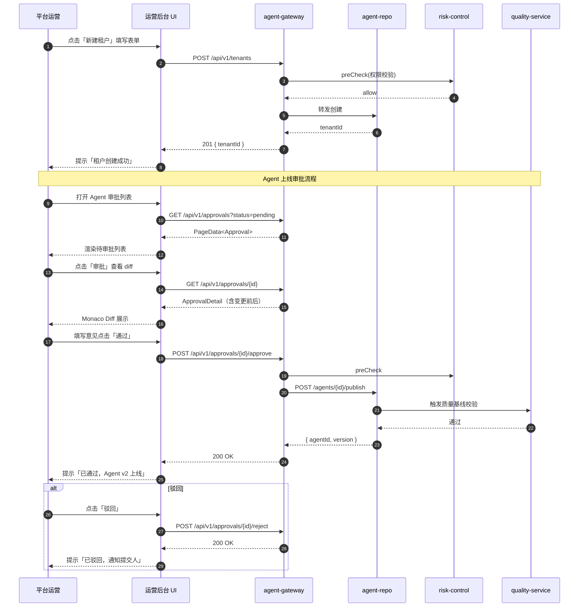
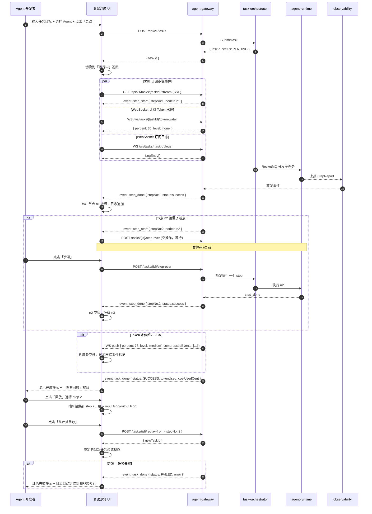
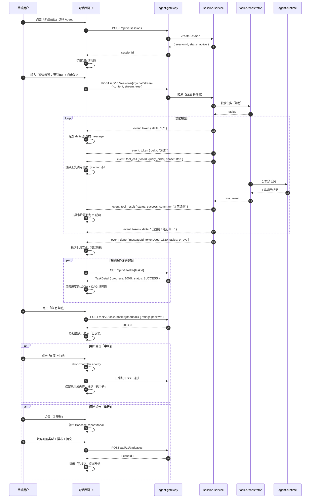
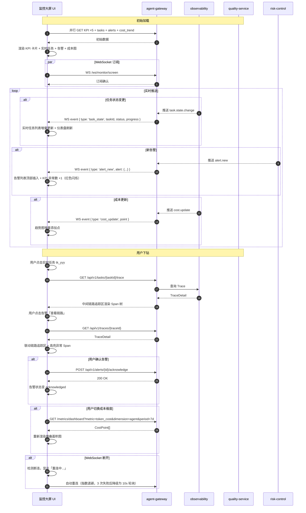

# 前端低代码控制台详细设计

> 文档版本：v1.0 | 更新日期：2026-06-27 | 对应模块：运营后台 / Agent 配置工作台 / 调试沙箱 / 终端对话界面 / 任务监控大屏
> 依赖文档：[02-api/api-specification.md](../02-api/api-specification.md) / [10-supplement/detail-mrd-gap-fill.md §6](../10-supplement/detail-mrd-gap-fill.md) / [00-overview/tech-stack-and-architecture.md](../00-overview/tech-stack-and-architecture.md)
> 技术栈：React 18 + TypeScript 5.4 + Vite 5.2 + Ant Design 5.16 + Zustand 4.5 + ReactFlow 12 + ECharts 5.5 + Monaco Editor 0.47

---

## 0. 文档导览

### 0.1 模块索引表

| 章节 | 模块 | 面向角色 | 子组件数 | 关键能力 | 后端依赖服务 |
|---|---|---|---|---|---|
| §2 | 运营后台 | 平台运营 | 12 | 租户/审批/配额/审计/报表 | agent-repo / risk-control / quality-service |
| §3 | Agent 配置工作台（低代码）| Agent 开发 | 11 | 9 大配置组件 + 预览调试 + 版本管理 | agent-repo / tool-engine / model-gateway |
| §4 | 调试沙箱 | Agent 开发 | 8 | DAG 可视化 + 断点 + 回放 + Token 水位 | task-orchestrator / agent-runtime / observability |
| §5 | 终端对话界面 | 终端用户 | 8 | 流式对话 + 文件上传 + 任务进度 + 反馈 | session / gateway |
| §6 | 任务监控大屏 | 运营/开发 | 8 | KPI + 链路追踪 + 告警 + 成本看板 | observability / quality-service |

### 0.2 技术栈说明

| 类别 | 技术 | 版本 | 用途 |
|---|---|---|---|
| 框架 | React | 18.3 | 视图层 |
| 语言 | TypeScript | 5.4 | 类型安全 |
| 构建 | Vite | 5.2 | 开发服务器与打包 |
| 包管理 | pnpm | 8.15 | Monorepo workspace |
| UI 库 | Ant Design | 5.16 | 企业级组件 |
| 状态管理 | Zustand | 4.5 | 全局/局部状态 |
| 路由 | React Router | 6.22 | SPA 路由 |
| HTTP | Axios | 1.6 | REST 调用 |
| 实时通信 | EventSource + WebSocket | 原生 | SSE / 推送 |
| 图表 | ECharts | 5.5 | 监控大屏 |
| DAG | ReactFlow | 12.0 | 调试沙箱 DAG |
| 编辑器 | Monaco Editor | 0.47 | Prompt 编辑 |
| 表单 | Ant Design Form | 5.16 | 低代码表单 |

### 0.3 与后端 API 对应关系（总览）

前端 5 大模块通过 REST + SSE + WebSocket 调用 [doc 02-api](../02-api/api-specification.md) 中定义的 22 个 REST 端点 + 1 个 SSE 端点 + 1 个 WebSocket 通道。REST 请求统一经 `agent-gateway`（端口 8080）转发至各微服务（8082–8104）。

---

## 1. 前端整体架构

### 1.1 Monorepo 结构（pnpm workspace）

```
agent-platform-fe/
├── pnpm-workspace.yaml
├── package.json
├── tsconfig.base.json
├── vite.config.base.ts
├── apps/
│   ├── ops-console/                 # 运营后台
│   │   └── src/
│   │       ├── pages/               # tenant / approval / quota / audit / report
│   │       ├── routes.tsx
│   │       └── main.tsx
│   ├── agent-studio/                # Agent 配置工作台（低代码）
│   │   └── src/
│   │       ├── pages/
│   │       │   ├── editor/          # 低代码编辑主页面
│   │       │   │   ├── components/  # 9 大配置子组件
│   │       │   │   └── index.tsx
│   │       │   ├── preview/         # Prompt 预览与试跑
│   │       │   └── version/         # 版本管理
│   │       └── main.tsx
│   ├── debug-sandbox/               # 调试沙箱
│   │   └── src/
│   │       ├── pages/
│   │       │   ├── dag/             # ReactFlow DAG
│   │       │   ├── replay/          # 步骤回放
│   │       │   └── logs/            # 执行日志
│   │       └── main.tsx
│   ├── chat-portal/                 # 终端对话界面
│   │   └── src/
│   │       ├── pages/
│   │       │   ├── sessions/        # 会话列表
│   │       │   ├── conversation/    # 消息流
│   │       │   └── task-detail/     # 任务详情
│   │       └── main.tsx
│   └── monitor-screen/              # 任务监控大屏
│       └── src/
│           ├── pages/
│           │   ├── kpi/
│           │   ├── trace/
│           │   ├── alerts/
│           │   └── cost/
│           └── main.tsx
├── packages/
│   ├── shared-types/                # 跨端共享 TS 类型（Agent / Task / Message）
│   ├── http-client/                 # Axios 封装 + 拦截器
│   ├── auth/                        # JWT 存储 + 路由守卫
│   ├── sse-client/                  # EventSource 封装
│   ├── ws-client/                   # WebSocket 封装
│   ├── error-handler/               # 全局异常处理
│   ├── ui-kit/                      # 公共组件库
│   ├── design-tokens/               # 颜色 / 字体 / 间距 Token
│   └── i18n/                        # 中英文资源
└── tools/
    └── mock-server/                 # 本地 Mock 服务
```

### 1.2 技术栈与依赖版本

**根 `package.json` 关键依赖**：

```json
{
  "devDependencies": {
    "typescript": "5.4.5",
    "vite": "5.2.8",
    "@vitejs/plugin-react": "4.3.0",
    "pnpm": "8.15.6"
  },
  "engines": { "node": ">=20.10.0" }
}
```

**业务依赖**（apps 共享）：

```json
{
  "dependencies": {
    "react": "18.3.1",
    "react-dom": "18.3.1",
    "react-router-dom": "6.22.3",
    "antd": "5.16.0",
    "@ant-design/icons": "5.3.6",
    "axios": "1.6.8",
    "zustand": "4.5.2",
    "echarts": "5.5.0",
    "echarts-for-react": "3.0.2",
    "reactflow": "12.0.0",
    "@monaco-editor/react": "4.6.0",
    "dayjs": "1.11.10",
    "lodash-es": "4.17.21"
  }
}
```

### 1.3 公共模块

#### 1.3.1 HTTP 客户端（packages/http-client）

```typescript
// packages/http-client/src/index.ts
import axios, { AxiosInstance, AxiosRequestConfig } from 'axios';

export interface ApiResponse<T = unknown> {
  code: string;            // 'OK' 或错误码
  message: string;
  data: T;
  traceId: string;
  timestamp: string;
}

export interface PageData<T> {
  items: T[];
  page: number;
  size: number;
  total: number;
}

export function createHttpClient(baseURL: string): AxiosInstance {
  const instance = axios.create({
    baseURL,
    timeout: 15000,
    headers: {
      'Content-Type': 'application/json; charset=utf-8',
      'Accept-Language': 'zh-CN',
    },
  });

  // 请求拦截：注入 JWT / X-Tenant-Id / X-Request-Id
  instance.interceptors.request.use((config) => {
    const token = localStorage.getItem('jwt');
    const tenantId = localStorage.getItem('tenantId');
    if (token) config.headers.Authorization = `Bearer ${token}`;
    if (tenantId) config.headers['X-Tenant-Id'] = tenantId;
    config.headers['X-Request-Id'] = crypto.randomUUID();
    return config;
  });

  // 响应拦截：统一拆 ApiResponse，处理 401/403/429/5xx
  instance.interceptors.response.use(
    (resp) => {
      const body = resp.data as ApiResponse;
      if (body.code !== 'OK') {
        return Promise.reject(new ApiError(body.code, body.message, body.details));
      }
      return body.data as any;
    },
    (error) => {
      if (error.response?.status === 401) redirectToLogin();
      if (error.response?.status === 429) showToast('请求过于频繁，请稍后再试');
      return Promise.reject(error);
    }
  );

  return instance;
}

export class ApiError extends Error {
  constructor(public code: string, message: string, public details?: unknown) {
    super(message);
  }
}
```

#### 1.3.2 SSE 客户端（packages/sse-client）

```typescript
// packages/sse-client/src/index.ts
export interface SseHandlers {
  onToken?: (delta: string) => void;
  onToolCall?: (data: { toolId: string; callId: string; phase: string }) => void;
  onToolResult?: (data: { callId: string; status: string; summary: string }) => void;
  onDone?: (data: { messageId: string; tokenUsed: number; taskId?: string }) => void;
  onError?: (err: Event) => void;
}

export function openSseStream(url: string, body: unknown, handlers: SseHandlers): AbortController {
  // 使用 fetch + ReadableStream 替代 EventSource，支持 POST + Header
  const controller = new AbortController();
  fetch(url, {
    method: 'POST',
    headers: {
      'Content-Type': 'application/json',
      Authorization: `Bearer ${localStorage.getItem('jwt')}`,
      Accept: 'text/event-stream',
    },
    body: JSON.stringify(body),
    signal: controller.signal,
  })
    .then(async (resp) => {
      const reader = resp.body!.getReader();
      const decoder = new TextDecoder();
      let buffer = '';
      while (true) {
        const { done, value } = await reader.read();
        if (done) break;
        buffer += decoder.decode(value, { stream: true });
        const events = buffer.split('\n\n');
        buffer = events.pop() || '';
        for (const evt of events) {
          const lines = evt.split('\n');
          const eventType = lines.find((l) => l.startsWith('event:'))?.slice(6).trim();
          const dataLine = lines.find((l) => l.startsWith('data:'))?.slice(5).trim();
          if (!eventType || !dataLine) continue;
          const data = JSON.parse(dataLine);
          dispatchByEventType(eventType, data, handlers);
        }
      }
    })
    .catch((err) => handlers.onError?.(err));
  return controller;
}

function dispatchByEventType(type: string, data: any, h: SseHandlers) {
  switch (type) {
    case 'token': h.onToken?.(data.delta); break;
    case 'tool_call': h.onToolCall?.(data); break;
    case 'tool_result': h.onToolResult?.(data); break;
    case 'done': h.onDone?.(data); break;
  }
}
```

#### 1.3.3 鉴权模块（packages/auth）

```typescript
// packages/auth/src/index.ts
export const useAuthStore = create<AuthState>((set) => ({
  jwt: localStorage.getItem('jwt'),
  user: null,
  roles: [],
  tenantId: localStorage.getItem('tenantId'),
  login: async (username, password) => { /* POST /api/v1/auth/login */ },
  logout: () => {
    localStorage.removeItem('jwt');
    set({ jwt: null, user: null, roles: [] });
  },
}));

// 路由守卫
export function RequireAuth({ children, roles }: { children: JSX.Element; roles?: string[] }) {
  const { jwt, roles: userRoles } = useAuthStore();
  if (!jwt) return <Navigate to="/login" />;
  if (roles && !roles.some((r) => userRoles.includes(r))) return <Forbidden />;
  return children;
}
```

#### 1.3.4 错误处理（packages/error-handler）

- **全局 ErrorBoundary**：捕获 React 渲染异常，展示降级 UI + 上报 traceId
- **Axios 拦截器**：401 自动跳登录、403 提示无权限、429 限流提示、5xx 显示「服务异常」+ traceId 复制按钮
- **SSE 异常**：网络中断自动重连（指数退避，最多 3 次），重连失败提示「连接已断开，点击重试」

#### 1.3.5 共享类型定义（packages/shared-types）

```typescript
export interface Agent {
  agentId: string;
  name: string;
  description: string;
  abilityTags: string[];
  sceneTags: string[];
  systemPrompt: string;
  coreConstraints: string;
  modelTier: 'light' | 'middle' | 'strong';
  maxSteps: number;
  maxToken: number;
  boundTools: string[];
  boundKnowledgeIds: string[];
  reflectionMode: 'none' | 'single' | 'multi';
  version: number;
  status: 'draft' | 'published' | 'gray' | 'stable' | 'deprecated';
}

export interface TaskDetail {
  taskId: string;
  status: 'PENDING' | 'RUNNING' | 'SUCCESS' | 'FAILED' | 'CANCELLED';
  complexity: number;
  dagVersion: number;
  progress: { totalNodes: number; finishedNodes: number; runningNodes: number; failedNodes: number };
  costUsedCent: number;
  tokenUsed: number;
  steps: StepReport[];
}

export interface AuditLog {
  auditId: string;
  subjectType: 'user' | 'role' | 'tenant';
  subjectId: string;
  action: string;          // 如 'tool.invoke'
  resourceType: string;
  resourceId: string;
  riskLevel: 1 | 2 | 3;
  result: 'allow' | 'deny';
  detail: Record<string, unknown>;
  traceId: string;
  createdAt: string;
}
```

### 1.4 路由规划

| URL | 模块 | 页面 | 路由守卫角色 |
|---|---|---|---|
| `/login` | 公共 | 登录 | - |
| `/ops/tenants` | 运营后台 | 租户管理 | `platform_ops` |
| `/ops/approvals` | 运营后台 | Agent 上下线审批 | `platform_ops` |
| `/ops/quotas` | 运营后台 | 配额配置 | `platform_ops` |
| `/ops/audit` | 运营后台 | 审计查询 | `platform_ops` |
| `/ops/reports` | 运营后台 | 运营报表 | `platform_ops` |
| `/studio/list` | 配置工作台 | Agent 列表 | `agent_dev` |
| `/studio/editor/:agentId` | 配置工作台 | 低代码编辑器 | `agent_dev` |
| `/studio/preview/:agentId` | 配置工作台 | Prompt 预览与试跑 | `agent_dev` |
| `/studio/version/:agentId` | 配置工作台 | 版本管理 | `agent_dev` |
| `/sandbox/start` | 调试沙箱 | 沙箱入口 | `agent_dev` |
| `/sandbox/run/:taskId` | 调试沙箱 | DAG + 日志 + 回放 | `agent_dev` |
| `/chat/sessions` | 终端对话 | 会话列表 | `end_user` |
| `/chat/:sessionId` | 终端对话 | 对话主界面 | `end_user` |
| `/monitor/screen` | 监控大屏 | 大屏主页 | `ops` / `dev` |

### 1.5 状态管理策略

| 层级 | 工具 | 用途 | 示例 |
|---|---|---|---|
| 全局 | Zustand | 用户信息、JWT、租户上下文、通知计数 | `useAuthStore` / `useAppStore` |
| 模块 | Zustand（分模块） | Agent 编辑表单、沙箱运行态、对话会话 | `useAgentEditorStore` / `useSandboxStore` |
| 局部 | React useState/useReducer | 单页面内组件态（弹窗开关、表格筛选） | 表格分页 state |
| 服务端 | Tanstack Query 5（可选） | 列表/详情数据缓存与失效 | `useAgentsQuery` / `useTaskQuery` |

策略：**全局最小化、模块就近、局部优先**。Zustand store 拆分到每个 app 的 `src/stores/`，避免巨型 store。

---

## 2. 运营后台详设

### 2.1 页面结构（左侧导航 + 顶部用户 + 主内容区）

**布局**：`ProLayout`（Ant Design Pro Components），三段式：

```
┌──────────────────────────────────────────────────────────────┐
│ [Logo] Agent 平台 · 运营后台          [搜索] [通知🔔] [用户▼] │  ← 顶栏 56px
├──────────┬───────────────────────────────────────────────────┤
│ 租户管理  │                                                   │
│ Agent审批│              主内容区                               │
│ 配额配置  │       （路由 outlet 渲染对应页面）                  │
│ 审计查询  │                                                   │
│ 运营报表  │                                                   │
│          │                                                   │
│ [折叠]   │                                                   │
└──────────┴───────────────────────────────────────────────────┘
   220px                           余下宽度
```

**组件**：`<OpsLayout>`（`apps/ops-console/src/layouts/OpsLayout.tsx`）
- props：`{ menu: MenuItem[]; user: UserInfo; onLogout: () => void }`
- state：`collapsed: boolean`（侧栏折叠态）
- 事件：菜单点击 → `navigate(route)`

### 2.2 租户管理页面（CRUD 表格 + 详情抽屉）

**页面**：`apps/ops-console/src/pages/tenant/TenantList.tsx`

**表格列**：

| 列名 | 字段 | 渲染 |
|---|---|---|
| 租户 ID | tenantId | 文本 |
| 租户名称 | name | 文本 |
| 状态 | status | Tag（active/disabled） |
| Agent 数 | agentCount | 数字 |
| 配额 | quota.tokenQuota | 文本（如 `500K Token/日`） |
| 创建时间 | createdAt | dayjs 格式化 |
| 操作 | - | [详情] [启用/禁用] [配额] |

**搜索栏**：租户名（模糊）+ 状态下拉 + 创建时间 RangePicker

**详情抽屉** `<TenantDetailDrawer>`：
- props：`{ open: boolean; tenantId: string | null; onClose: () => void }`
- state：`tenant: Tenant | null`、`loading: boolean`
- 内容：基本信息卡 + Agent 列表 Tab + 配额使用情况 Tab + 审计记录 Tab（最近 20 条）
- 事件：`onClose`、`onEditQuota(tenantId)`

**新增/编辑弹窗** `<TenantFormModal>`：
- 表单：name（必填）、adminEmail、industry、maxAgents、tokenQuotaDaily
- 校验：name 2-32 字符、adminEmail 邮箱格式、tokenQuotaDaily 1–10000000
- 事件：`onSubmit(values) → POST /api/v1/tenants`

### 2.3 Agent 上下线审批页面（审批流列表 + 详情弹窗）

**页面**：`apps/ops-console/src/pages/approval/ApprovalList.tsx`

**筛选**：审批类型（上线/下线/灰度/回滚）+ 状态（待审批/已通过/已驳回）+ 提交人 + 提交时间

**表格列**：审批 ID、Agent 名称、版本、类型、风险等级（R1/R2/R3 Tag）、提交人、提交时间、状态、操作（[审批]）

**审批弹窗** `<ApprovalDetailModal>`：
- props：`{ approvalId: string; open: boolean; onClose: () => void }`
- state：`detail: ApprovalDetail`、`comment: string`、`decision: 'approve' | 'reject' | null`
- 内容：
  - 左侧：变更摘要（变更前后 diff， Monaco Diff Editor 展示 systemPrompt / boundTools / modelTier 等字段）
  - 右侧：影响面评估（受众租户数、预估成本变化、灰度比例建议）
  - 底部：审批意见输入框 + [通过] [驳回] 按钮
- 事件：`onApprove(comment)` → `POST /api/v1/approvals/{id}/approve`、`onReject(comment)` → `POST /api/v1/approvals/{id}/reject`

### 2.4 配额配置页面（表单 + 工具/模型配额矩阵）

**页面**：`apps/ops-console/src/pages/quota/QuotaConfig.tsx`

**顶部**：租户选择下拉（支持搜索）

**配额矩阵表格**（行=资源，列=维度）：

| 资源类型 | 资源 ID/名称 | 日调用上限 | QPS 上限 | 当前用量 | 操作 |
|---|---|---|---|---|---|
| 模型 | `middle-tier` | 500K Token | 50 QPS | 320K | [编辑] |
| 模型 | `strong-tier` | 50K Token | 5 QPS | 12K | [编辑] |
| 工具 | `tl_query_order` | 10000 次 | 100 QPS | 6200 | [编辑] |
| 工具 | `tl_delete_user`(R3) | 50 次 | 1 QPS | 3 | [编辑] |

**编辑弹窗** `<QuotaEditModal>`：
- props：`{ open; resourceType; resourceId; onClose }`
- 表单字段：dailyLimit、qpsLimit、burstLimit（突发上限）
- 校验：dailyLimit ≥ 0、qpsLimit 1–1000、burstLimit ≤ qpsLimit × 2
- 事件：`onSave → PUT /api/v1/quotas/{resourceType}/{resourceId}`

### 2.5 审计查询页面（时间筛选 + 操作类型筛选 + 日志表格）

**页面**：`apps/ops-console/src/pages/audit/AuditQuery.tsx`

**筛选条件区**：
- 时间范围：RangePicker（默认近 7 天）
- 主体类型：下拉（user/role/tenant）
- 主体 ID：输入框（模糊）
- 操作类型：多选（tool.invoke / agent.publish / agent.rollback / quota.update 等）
- 资源类型：下拉（tool/agent/knowledge/quota）
- 风险等级：多选（R1/R2/R3）
- 结果：下拉（allow/deny）

**查询按钮** → `GET /api/v1/audit/logs?...`

**结果表格列**：审计 ID、时间、主体（类型+ID）、操作、资源、风险等级、结果（allow 绿色 Tag / deny 红色 Tag）、traceId、操作（[查看详情]）

**详情抽屉** `<AuditDetailDrawer>`：
- 展示完整 detail JSON（Monaco JSON Viewer）+ traceId 链路跳转（点击跳至监控大屏的链路追踪页面，预填 traceId）

### 2.6 运营报表页面（ECharts 图表 + 日期范围选择）

**页面**：`apps/ops-console/src/pages/report/OperationsReport.tsx`

**顶部**：日期范围（默认近 30 天）+ 租户筛选（可多选）

**图表布局**（2×3 网格）：

| 图表 | 类型 | 数据来源 |
|---|---|---|
| 任务总量趋势 | 折线图 | `GET /api/v1/metrics/dashboard?metric=task_count&period=30d` |
| 成功率分布 | 饼图 | `GET /api/v1/metrics/dashboard?metric=success_rate` |
| Agent 调用 Top10 | 横向柱状图 | `GET /api/v1/metrics/dashboard?metric=agent_ranking&top=10` |
| Token 成本趋势 | 面积图 | `GET /api/v1/metrics/dashboard?metric=token_cost&period=30d` |
| 工具使用 Top10 | 横向柱状图 | `GET /api/v1/metrics/dashboard?metric=tool_ranking&top=10` |
| 异常事件分布 | 堆叠柱状图 | `GET /api/v1/metrics/dashboard?metric=error_breakdown` |

**子组件** `<MetricChart>`：
- props：`{ title: string; type: 'line' | 'pie' | 'bar'; data: ChartData; loading: boolean }`
- state：内部维护 ECharts 实例，监听 data 变化重绘
- 事件：图例点击触发下钻（emit `onDrillDown(filter)`）

### 2.7 API 调用映射表

| 页面/组件 | 后端端点 | 方法 | 请求参数 | 响应类型 |
|---|---|---|---|---|
| 租户管理列表 | `/api/v1/tenants` | GET | `page, size, name?, status?` | `PageData<Tenant>` |
| 新增租户 | `/api/v1/tenants` | POST | `{ name, adminEmail, industry, maxAgents, tokenQuotaDaily }` | `Tenant` |
| 启用/禁用租户 | `/api/v1/tenants/{tenantId}/status` | PATCH | `{ status }` | `void` |
| 租户详情 | `/api/v1/tenants/{tenantId}` | GET | - | `Tenant` |
| 审批列表 | `/api/v1/approvals` | GET | `page, size, type?, status?` | `PageData<Approval>` |
| 审批详情 | `/api/v1/approvals/{approvalId}` | GET | - | `ApprovalDetail` |
| 通过审批 | `/api/v1/approvals/{approvalId}/approve` | POST | `{ comment }` | `void` |
| 驳回审批 | `/api/v1/approvals/{approvalId}/reject` | POST | `{ comment }` | `void` |
| 配额查询 | `/api/v1/quotas` | GET | `tenantId?` | `Quota[]` |
| 配额更新 | `/api/v1/quotas/{resourceType}/{resourceId}` | PUT | `{ dailyLimit, qpsLimit, burstLimit }` | `void` |
| 审计日志 | `/api/v1/audit/logs` | GET | `subjectId?, action?, resourceType?, riskLevel?, result?, from, to, page, size` | `PageData<AuditLog>` |
| 越权记录 | `/api/v1/audit/violations` | GET | `from, to, page, size` | `PageData<Violation>` |
| 报表指标 | `/api/v1/metrics/dashboard` | GET | `metric, period, tenantIds?` | `MetricSeries` |
| Agent 上下线发布 | `/api/v1/agents/{agentId}/publish` | POST | `{ changeLog }` | `{ agentId, version, publishedAt }` |
| Agent 回滚 | `/api/v1/agents/{agentId}/rollback` | POST | `{ targetVersion, reason }` | `void` |

### 2.8 关键交互流程图



---

## 3. Agent 配置工作台（低代码）详设

### 3.1 低代码编辑器整体布局（左侧组件树 + 中间预览 + 右侧属性面板）

**布局结构**（参考 VSCode 三栏）：

```
┌──────────────────────────────────────────────────────────────────────┐
│ [Agent 列表] [新建]  订单查询助手 v2 · 草稿       [保存草稿] [发布] │
├────────────┬──────────────────────────────────┬─────────────────────┤
│ 配置项      │  中间预览区                       │ 右侧属性面板         │
│            │                                   │                     │
│ ▼ 角色设定  │  ┌─当前选中：角色设定─────────┐  │ 字段：systemPrompt   │
│ ▼ 工具权限  │  │                              │  类型：Monaco         │
│ ▼ 记忆范围  │  │   Monaco Prompt 编辑器       │  校验：非空           │
│ ▼ 输出规则  │  │   (system_prompt)            │  占位：               │
│ ▼ 模型档位  │  │                              │   "你是订单查询助手"  │
│ ▼ 反思模式  │  │   [core_constraints 只读]    │  说明：               │
│            │  │                              │   支持 {{变量}} 插值   │
│ [试跑]      │  └─────────────────────────────┘  │                     │
│ [版本]      │  [组装后完整 Prompt 预览 ▼]        │ [应用到草稿]         │
└────────────┴──────────────────────────────────┴─────────────────────┘
    240px                    中间自适应                          320px
```

**容器组件** `<AgentStudioEditor>`：
- props：`{ agentId: string }`
- state（Zustand `useAgentEditorStore`）：
  ```typescript
  interface AgentEditorState {
    agent: Agent | null;
    activeSection: 'role' | 'tools' | 'memory' | 'output' | 'model' | 'reflection' | 'preview' | 'version';
    draftDirty: boolean;             // 是否有未保存改动
    lastSavedAt: string | null;
    errors: Record<string, string>; // 字段级校验错误
    // actions
    loadAgent: (agentId: string) => Promise<void>;
    updateField: <K extends keyof Agent>(field: K, value: Agent[K]) => void;
    saveDraft: () => Promise<void>;
    publish: (changeLog: string) => Promise<void>;
  }
  ```
- 事件：左侧导航点击切换 `activeSection`；顶部保存按钮触发 `saveDraft`；发布按钮弹出 changelog 弹窗

### 3.2 角色设定组件（system_prompt Monaco 编辑器 + core_constraints 只读保护）

**组件**：`<RoleSettingPanel>`

- props：`{ systemPrompt: string; coreConstraints: string; onChange: (prompt: string) => void }`
- 内部 state：`editorInstance: editor.IStandaloneCodeEditor | null`
- 子节点：
  1. `<MonacoEditor language="markdown" value={systemPrompt} onChange={onChange}>` —— 高度 320px，开启 minimap，主题 `vs-dark`
  2. `<Alert type="warning" message="核心约束（core_constraints）由治理流程保护，仅可只读查看" />`
  3. `<MonacoEditor language="markdown" value={coreConstraints} readOnly theme="vs" options={{ lineNumbers: 'on', minimap: { enabled: false } }}>` —— 高度 160px，浅色只读
- 事件：
  - `onChange(newValue)` → `updateField('systemPrompt', newValue)` → 置 `draftDirty = true`
  - 支持 `{{user_name}}` / `{{today}}` 变量插值提示（注册 Monaco CompletionItemProvider）
- 校验：`systemPrompt` 非空且长度 ≤ 8000 字符；超出显示行内警告

### 3.3 工具权限组件（R1/R2/R3 分组勾选 + R3 审批流程提示）

**组件**：`<ToolPermissionPanel>`

- props：`{ boundTools: string[]; onChange: (toolIds: string[]) => void }`
- state：`toolsByLevel: { R1: Tool[]; R2: Tool[]; R3: Tool[] }`、`loading: boolean`
- 数据加载：`useEffect` 调用 `GET /api/v1/tools?riskLevel=1,2,3` 分组渲染
- 子组件结构：
  ```
  <Tabs>
    <TabPane tab="R1 低危（可直接勾选）" key="R1">
      <Checkbox.Group>
        {R1Tools.map(t => <Checkbox value={t.toolId}>{t.displayName} · {t.description}</Checkbox>)}
      </Checkbox.Group>
    </TabPane>
    <TabPane tab="R2 中危（需二级审批）" key="R2">
      <Checkbox.Group>...</Checkbox.Group>
    </TabPane>
    <TabPane tab="R3 高危（需双人复核 + 沙箱执行）" key="R3">
      <Alert message="R3 工具勾选后将自动创建审批工单，审批通过后生效。" type="error" />
      <Checkbox.Group disabled={!canSelectR3}>
        {R3Tools.map(t => <Checkbox value={t.toolId}>{t.displayName} ⚠️</Checkbox>)}
      </Checkbox.Group>
    </TabPane>
  </Tabs>
  ```
- 事件：
  - 勾选 R1/R2 工具 → `onChange(newSelectedIds)` → `updateField('boundTools', ids)`
  - 勾选 R3 工具 → 弹出确认弹窗「该工具为 R3 高危，将创建审批工单，确认继续？」→ 用户确认后调用 `POST /api/v1/approvals`（type=`tool_r3_bind`），勾选状态置为「待审批」并禁用再次切换

### 3.4 记忆范围配置组件（domain 多选 + importance_score 滑块 + tier 生命周期）

**组件**：`<MemoryScopePanel>`

- props：`{ config: MemoryConfig; onChange: (cfg: MemoryConfig) => void }`
  ```typescript
  interface MemoryConfig {
    domains: string[];                  // 业务域
    importanceThreshold: number;        // 0.0–1.0
    tierStrategies: {
      tier: 'hot' | 'warm' | 'cold';
      ttlDays: number;
      recallStrategy: 'vector' | 'keyword' | 'time' | 'tag'[];
    }[];
    maxRecallCount: number;             // 单次召回上限
  }
  ```
- 子组件：
  1. `<Select mode="tags" placeholder="输入业务域，如 order / refund / shipping">` —— 多选，允许自定义
  2. `<Slider min={0} max={1} step={0.05} marks={{ 0: '0', 0.5: '0.5', 1: '1' }}>` —— importance_score 阈值
     - 旁注说明：「低于此阈值的新记忆将不被写入长期库」
  3. `<TierStrategyTable>` —— 三行表格，每行可选 tier / ttlDays（1–365）/ 召回策略多选
     | Tier | 含义 | TTL（天） | 召回策略 |
     |---|---|---|---|
     | hot | 热记忆 | 7 | vector + keyword |
     | warm | 温记忆 | 30 | vector + time |
     | cold | 冷记忆 | 365 | tag |
- 事件：每个字段 `onChange` → 合并 `config` → `updateField('businessConfig.memory', newCfg)`

### 3.5 输出规则配置组件（output_format 下拉 + max_token 数字输入 + temperature 滑块）

**组件**：`<OutputRulePanel>`

- props：`{ rules: OutputRules; onChange: (r: OutputRules) => void }`
  ```typescript
  interface OutputRules {
    outputFormat: 'text' | 'markdown' | 'json' | 'stream_json';
    maxToken: number;        // 1–32000
    temperature: number;     // 0.0–2.0
    topP: number;            // 0.0–1.0
    enableCot: boolean;      // 强制思维链
    requireSource: boolean;  // 来源标注
    stopSequences: string[];
  }
  ```
- 子组件：
  1. `<Select options={[{value:'text',label:'纯文本'}, {value:'markdown',label:'Markdown'}, {value:'json',label:'结构化 JSON'}, {value:'stream_json',label:'流式 JSON'}]}>`
  2. `<InputNumber min={1} max={32000} step={1000}>` + 旁注「推荐 4000–8000，超出会按档位计费」
  3. `<Slider min={0} max={2} step={0.1}>` + 实时数字显示
  4. `<Slider min={0} max={1} step={0.05}>`
  5. `<Switch>` ×2（enableCot / requireSource）
  6. `<Select mode="tags">` —— stop 序列
- 校验：maxToken 在 [1, 32000]；temperature 在 [0, 2]；stopSequences 每项长度 ≤ 20

### 3.6 模型档位选择组件（light/middle/strong 单选 + model_route_rule 绑定下拉）

**组件**：`<ModelTierPanel>`

- props：`{ modelTier: string; routeRuleId?: string; onChange: (t: string, ruleId?: string) => void }`
- state：`routeRules: RouteRule[]`、`tierCost: { inputCent: number; outputCent: number } | null`
- 子组件：
  ```
  <Radio.Group>
    <Radio value="light">  ⚡ Light · GPT-4o-mini / Qwen-Turbo  | ~$0.15/1M</Radio>
    <Radio value="middle"> ⚖️ Middle · GPT-4o / Qwen-Plus       | ~$2.5/1M</Radio>
    <Radio value="strong"> 🧠 Strong · GPT-4-Turbo / Qwen-Max    | ~$10/1M</Radio>
  </Radio.Group>
  <Divider />
  <Select
    placeholder="绑定模型路由规则（可选，留空使用默认）"
    options={routeRules.map(r => ({ value: r.id, label: `${r.name} · ${r.description}` }))}
  />
  <Statistic title="参考单价" value={tierCost} />
  ```
- 事件：档位切换时 → 调用 `GET /api/v1/model-gateway/tiers/{tier}/pricing` 获取参考单价刷新 `tierCost`
- 校验：必选一个档位

### 3.7 反思模式配置组件（none/single/multi 单选 + 最大反思次数）

**组件**：`<ReflectionModePanel>`

- props：`{ mode: 'none' | 'single' | 'multi'; maxReflections: number; onChange }`
- 子组件：
  ```
  <Radio.Group>
    <Radio value="none">  关闭反思（速度优先）</Radio>
    <Radio value="single"> 单次反思（默认，质量优先）</Radio>
    <Radio value="multi">  多次反思（高难度场景）</Radio>
  </Radio.Group>
  {mode === 'multi' && (
    <Form.Item label="最大反思次数" tooltip="建议 2–3 次，过多会显著增加 Token 成本">
      <InputNumber min={2} max={5} defaultValue={2} />
    </Form.Item>
  )}
  {mode !== 'none' && (
    <Alert message="开启反思模式后，每次反思会触发额外模型调用，预计增加 30%–80% Token 成本" type="info" />
  )}
  ```
- 事件：mode 切换 → 若切到 `multi` 自动展开 `maxReflections` 输入框

### 3.8 Prompt 预览与调试组件（组装后完整 Prompt 预览 + 沙箱试跑按钮）

**组件**：`<PromptPreviewAndDebugPanel>`

- props：`{ agent: Agent }`
- state：`assembledPrompt: string`、`testInput: string`、`testResult: string`、`running: boolean`
- 子组件：
  1. **组装预览区** `<MonacoEditor readOnly language="markdown" value={assembledPrompt}>`
     - 组装顺序：`[system_prompt]` + `\n\n[core_constraints]` + `\n\n[工具列表：boundTools 名称与描述]` + `\n\n[输出规则]`
     - 点击右上角「刷新预览」按钮 → `POST /api/v1/agents/{agentId}/preview-assemble` 拿到后端组装结果
     - 也可以本地组装（用于离线预览，可能与后端组装略有差异，标注「本地预览」Tag）
  2. **试跑输入区**：
     ```
     <Input.TextArea placeholder="输入测试用户消息，如「查询最近 7 天订单」" rows={3} />
     <Space>
       <Button type="primary" loading={running} onClick={onRun}>▶ 沙箱试跑</Button>
       <Button onClick={onReset}>重置</Button>
     </Space>
     ```
  3. **试跑结果区**（流式渲染，复用终端对话的 SSE 组件）：
     - 展示 token 增量打字效果
     - 展示 tool_call 卡片
     - 展示最终 messageId、tokenUsed、taskId（可点击跳至调试沙箱）
- 事件：`onRun` → `POST /api/v1/sessions` 创建临时会话 → `POST /api/v1/sessions/{sessionId}/chat/stream`（stream=true）→ 监听 SSE 渲染

### 3.9 版本管理组件（草稿 → 发布 → 灰度 → 全量 状态流转图）

**组件**：`<VersionManagementPanel>`

- props：`{ agentId: string }`
- state：`versions: AgentVersion[]`、`current: AgentVersion`
  ```typescript
  interface AgentVersion {
    version: number;
    status: 'draft' | 'published' | 'gray' | 'stable' | 'deprecated';
    changeLog: string;
    grayPercent?: number;       // 0–100，仅 gray 状态
    publishedAt: string;
    publisher: string;
    isStable: boolean;
  }
  ```
- 子组件：
  1. **状态流转图**（横向流程图）：
     ```
     [草稿] →发布→ [已发布] →灰度配置→ [灰度中] →全量→ [稳定] →新版本→ [已废弃]
                                                              ↑
                                                          回滚触发
     ```
     使用 ReactFlow 5 节点 + 4 边，节点颜色：draft=灰、published=蓝、gray=橙、stable=绿、deprecated=红
  2. **版本列表表格**：
     | 版本 | 状态 | 变更说明 | 灰度比例 | 发布时间 | 发布人 | 操作 |
     |---|---|---|---|---|---|---|
     | v3 | 草稿 | （当前编辑中） | - | - | - | [继续编辑] |
     | v2 | 灰度中 | 增加退款流程 | 20% | 06-26 10:00 | dev01 | [调整灰度] [全量] [回滚] |
     | v1 | 稳定 | 初版 | 100% | 06-20 15:00 | dev01 | [回滚] |
  3. **灰度调整弹窗** `<GrayAdjustModal>`：
     - props：`{ version: number; currentPercent: number; open; onClose }`
     - Slider 0–100，步长 5
     - 提交 → `POST /api/v1/agents/{agentId}/versions/{v}/gray` body `{ percent }`
  4. **回滚确认弹窗**：输入回滚原因 → `POST /api/v1/agents/{agentId}/rollback` body `{ targetVersion, reason }`
- 事件：列表行操作点击触发对应 API，完成后刷新列表

### 3.10 API 调用映射表

| 组件/动作 | 后端端点 | 方法 | 请求参数 | 响应 |
|---|---|---|---|---|
| 加载 Agent 详情 | `/api/v1/agents/{agentId}` | GET | - | `Agent` |
| 保存草稿 | `/api/v1/agents/{agentId}` | PUT | `Partial<Agent>` | `{ agentId, version }` |
| 发布版本 | `/api/v1/agents/{agentId}/publish` | POST | `{ changeLog }` | `{ agentId, version, publishedAt }` |
| 回滚版本 | `/api/v1/agents/{agentId}/rollback` | POST | `{ targetVersion, reason }` | `void` |
| 工具列表（按风险分组） | `/api/v1/tools` | GET | `riskLevel?, sceneTags?` | `PageData<Tool>` |
| 工具详情 | `/api/v1/tools/{toolId}` | GET | - | `Tool` |
| R3 工具审批提交 | `/api/v1/tools/{toolId}/approve` | POST | `{ agentId, reason }` | `{ approvalId }` |
| 审批提交（绑定 R3 工具） | `/api/v1/approvals` | POST | `{ type: 'tool_r3_bind', resourceId, reason }` | `{ approvalId }` |
| 模型档位参考价 | `/api/v1/model-gateway/tiers/{tier}/pricing` | GET | - | `{ inputCent, outputCent }` |
| 模型路由规则列表 | `/api/v1/model-gateway/route-rules` | GET | - | `RouteRule[]` |
| Prompt 组装预览 | `/api/v1/agents/{agentId}/preview-assemble` | POST | `{ variables? }` | `{ assembledPrompt }` |
| 沙箱试跑（创建临时会话） | `/api/v1/sessions` | POST | `{ agentId, title: '试跑', meta: { channel: 'studio' } }` | `{ sessionId }` |
| 沙箱试跑（流式） | `/api/v1/sessions/{sessionId}/chat/stream` | POST（SSE） | `{ content, contentType: 'text', stream: true }` | SSE 事件流 |
| 版本列表 | `/api/v1/agents/{agentId}/versions` | GET | - | `AgentVersion[]` |
| 调整灰度比例 | `/api/v1/agents/{agentId}/versions/{v}/gray` | POST | `{ percent }` | `void` |
| 全量发布 | `/api/v1/agents/{agentId}/versions/{v}/full-release` | POST | - | `void` |
| Agent 评分 | `/api/v1/agents/{agentId}/scores` | GET | - | `AgentScore` |

### 3.11 关键交互流程图

```mermaid
flowchart TD
    Start([开发者打开配置工作台]) --> LoadAgent[GET /api/v1/agents/{id}<br/>加载 Agent 草稿]
    LoadAgent --> RenderEditor[渲染 9 大配置组件]

    RenderEditor --> EditRole[编辑 system_prompt<br/>Monaco 编辑器]
    EditRole --> CheckDirty{是否有改动?}
    CheckDirty -->|是| MarkDirty[标记 draftDirty=true]
    CheckDirty -->|否| WaitUser[等待用户操作]

    MarkDirty --> WaitUser

    WaitUser -->|切换到工具权限| EditTools[加载工具列表<br/>GET /api/v1/tools]
    EditTools --> ToolSelect[R1/R2 直接勾选<br/>R3 弹出确认]
    ToolSelect --> HasR3{勾选了 R3?}
    HasR3 -->|是| SubmitApproval[POST /api/v1/approvals<br/>type=tool_r3_bind]
    SubmitApproval --> WaitApproval[等待审批通过]
    WaitApproval --> WaitUser
    HasR3 -->|否| WaitUser

    WaitUser -->|点击「保存草稿」| SaveDraft[PUT /api/v1/agents/{id}<br/>提交全部字段]
    SaveDraft --> SaveOK{保存成功?}
    SaveOK -->|否| ShowErr[显示字段错误<br/>高亮问题项]
    SaveOK -->|是| ClearDirty[清除 draftDirty]

    WaitUser -->|点击「Prompt 预览」| Assemble[POST /agents/{id}/preview-assemble]
    Assemble --> ShowPrompt[展示组装后完整 Prompt]

    ShowPrompt -->|点击「沙箱试跑」| CreateSession[POST /api/v1/sessions<br/>临时会话]
    CreateSession --> RunStream[POST /sessions/{id}/chat/stream<br/>SSE 监听]
    RunStream --> StreamRender[增量渲染 token / tool_call]
    StreamRender --> TaskDone{任务完成?}
    TaskDone -->|是| ShowResult[展示 messageId / tokenUsed / taskId]
    TaskDone -->|否| StreamRender

    WaitUser -->|点击「发布」| PublishDlg[弹出 changeLog 弹窗]
    PublishDlg --> Publish[POST /api/v1/agents/{id}/publish]
    Publish --> GrayChoice{选择灰度策略}
    GrayChoice -->|灰度| GrayCfg[配置灰度比例<br/>POST /versions/{v}/gray]
    GrayCfg --> MonitorGray[监控灰度指标]
    MonitorGray --> FullRelease[POST /versions/{v}/full-release<br/>全量发布]
    GrayChoice -->|直接全量| FullRelease
    FullRelease --> End([完成])

    ShowErr --> WaitUser
    ClearDirty --> WaitUser
    ShowResult --> WaitUser
```

---

## 4. 调试沙箱详设

### 4.1 沙箱整体布局（左：任务输入 + 中：DAG 可视化 + 右：执行日志）

**布局**：

```
┌──────────────────────────────────────────────────────────────────────────┐
│ 调试沙箱 · 任务 tk_yyy · 运行中 ▓▓▓▓░░ 60%   [停止] [重新开始]          │
├──────────────┬──────────────────────────────────┬───────────────────────┤
│ 任务输入      │  DAG 可视化（ReactFlow）           │ 执行日志（实时滚动）   │
│              │                                   │                       │
│ 自然语言目标  │   ┌──┐     ┌──┐     ┌──┐          │ [10:00:01] [INFO]     │
│ [文本框]      │   │n1│ ──▶ │n2│ ──▶ │n3│          │ step1 observe start  │
│              │   └──┘     └──┘     └──┘          │ [10:00:02] [DEBUG]    │
│ Agent 选择   │      │         │                  │ tool_call query_order │
│ [下拉]       │      ▼         ▼                  │ [10:00:03] [INFO]    │
│              │   ┌──┐     ┌──┐                  │ step1 success 1.2s   │
│ 参数配置     │   │n4│     │n5│ ●断点            │ ...                   │
│ [JSON 编辑]  │   └──┘     └──┘                  │                       │
│              │                                   │                       │
│ [▶ 启动]     │  [▶ 步进] [⏸ 暂停] [⟲ 回放]      │ [级别筛选] [搜索]      │
├──────────────┴──────────────────────────────────┴───────────────────────┤
│ Token 水位：▓▓▓▓▓▓▓▓░░░░ 65% · 中度压缩已触发                          │
└──────────────────────────────────────────────────────────────────────────┘
```

**容器**：`<SandboxLayout>`，三栏 + 底部状态栏
- props：`{ taskId?: string }`
- state（Zustand `useSandboxStore`）：
  ```typescript
  interface SandboxState {
    taskId: string | null;
    taskDetail: TaskDetail | null;
    dag: { nodes: DagNode[]; edges: DagEdge[] } | null;
    steps: StepReport[];
    logs: LogEntry[];
    breakpoints: Set<string>;          // nodeId 集合
    currentStepNo: number | null;
    paused: boolean;
    tokenWater: { percent: number; level: 'none'|'light'|'medium'|'heavy'; compressedEvents: {stepNo: number; time: string}[] };
    // actions
    startTask: (input: TaskInput) => Promise<void>;
    toggleBreakpoint: (nodeId: string) => void;
    stepOver: () => Promise<void>;
    pause: () => void;
    replayFrom: (stepNo: number) => Promise<void>;
  }
  ```

### 4.2 任务模拟输入组件（自然语言输入 + 任务参数配置 + 启动按钮）

**组件**：`<TaskInputPanel>`

- props：`{ onStart: (input: TaskInput) => void; loading: boolean }`
  ```typescript
  interface TaskInput {
    goal: string;
    agentId: string;
    sessionId?: string;
    priority?: number;            // 1–10
    costLimitCent?: number;       // 成本上限（分）
    constraints?: { deadline?: string; allowHumanFallback?: boolean };
    variables?: Record<string, unknown>;
  }
  ```
- 子组件：
  1. `<Select showSearch placeholder="选择 Agent">` —— 数据源 `GET /api/v1/agents?status=published,gray,stable`
  2. `<Input.TextArea rows={4} placeholder="描述任务目标，如「汇总本周销售数据生成周报」">`
  3. `<Collapse>`：
     - 高级参数：优先级 InputNumber、成本上限 InputNumber（分）、截止时间 DatePicker
     - 自定义变量：JSON 编辑器（Monaco，language=json）
- 事件：`onStart` → 校验必填（agentId、goal）→ 调用 `POST /api/v1/tasks` → 拿到 taskId 后启动 SSE 订阅

### 4.3 DAG 可视化组件（ReactFlow + 节点状态着色 + 依赖连线）

**组件**：`<DagVisualization>`

- props：`{ dag: { nodes: DagNode[]; edges: DagEdge[] }; steps: StepReport[]; currentStepNo: number | null; breakpoints: Set<string>; onNodeClick: (nodeId: string) => void }`
  ```typescript
  interface DagNode {
    nodeId: string;
    label: string;
    nodeType: 'planning' | 'tool' | 'model' | 'memory' | 'human';
    status: 'pending' | 'running' | 'success' | 'failed' | 'skipped';
  }
  interface DagEdge { from: string; to: string; label?: string; }
  ```
- ReactFlow 节点自定义渲染：
  - 颜色映射：pending=灰、running=蓝（带脉冲动画）、success=绿、failed=红、skipped=虚线灰
  - 节点上方显示 `nodeId · label · 状态 Tag`
  - 断点节点左上角显示红点图标 `🔴`
  - 当前执行节点（`currentStepNo` 匹配）外发光描边
- 边样式：
  - 默认灰色实线
  - 已执行（success→success）绿色实线
  - 重规划新增边：橙色虚线 + 标注 `replan`
- 布局算法：使用 `dagre` 自动布局，从左到右（LR）
- 事件：
  - 节点点击 → `onNodeClick(nodeId)` → 切换断点 / 展示节点详情抽屉
  - 节点双击 → 跳至该节点的执行日志（定位到对应 stepNo）

### 4.4 断点调试组件（节点点击设置断点 + 步进按钮 + 当前节点高亮）

**组件**：`<BreakpointControls>`

- props：`{ paused: boolean; currentStepNo: number | null; onStepOver: () => void; onResume: () => void; onToggleBreakpoint: (nodeId: string) => void }`
- 子组件：
  ```
  <Space>
    <Button icon={<StepForwardOutlined />} disabled={!paused} onClick={onStepOver}>步进（Step Over）</Button>
    <Button icon={<PlayCircleOutlined />} disabled={!paused} onClick={onResume}>继续执行</Button>
    <Button icon={<PauseCircleOutlined />} disabled={paused} onClick={onPause}>暂停</Button>
    <Tag color={paused ? 'orange' : 'green'}>{paused ? '已暂停' : '运行中'}</Tag>
    <Text>当前步骤：{currentStepNo ?? '-'}</Text>
  </Space>
  ```
- 行为说明：
  - 设置断点：DAG 节点点击时弹小菜单「[设置/取消断点] [查看详情]」
  - 任务执行到断点节点前自动暂停，state.paused=true，等待用户点击「步进」或「继续」
  - 步进 → `POST /api/v1/tasks/{taskId}/step-over` → 后端执行一个 step 后再次暂停
  - 继续 → `POST /api/v1/tasks/{taskId}/resume`

### 4.5 步骤回放组件（时间轴 + 回放控制 + 每步状态详情）

**组件**：`<StepReplayPanel>`

- props：`{ steps: StepReport[]; onReplayFrom: (stepNo: number) => void }`
- state：`currentReplayIdx: number`、`playing: boolean`、`speed: 1 | 2 | 4`
- 子组件：
  1. **时间轴**（垂直）：
     ```
     ● 10:00:01 step1 · observe · 1.2s · success
     │  tool_call: query_order
     ● 10:00:03 step2 · think · 0.8s · success
     │  model: gpt-4o
     ● 10:00:05 step3 · act · 2.5s · success  ← 当前回放位置
     │  tool_call: send_email
     ○ 10:00:08 step4 · reflect · - · pending
     ```
     点击任意 step 跳转 `currentReplayIdx`
  2. **回放控制条**：
     ```
     [⏮ 起点] [◀ 上一帧] [▶ 播放] [▶▶ 下一帧] [⏭ 终点]   速度: [1x][2x][4x]
     ```
  3. **当前步骤详情卡片**：
     - phase（think/act/observe/reflect）
     - actionType / actionTarget
     - inputJson（Monaco JSON Viewer）
     - outputJson（Monaco JSON Viewer）
     - tokenUsed / costCent / durationMs
- 事件：点击 step → `setCurrentReplayIdx`；「从此处重放」按钮 → `onReplayFrom(stepNo)` → `POST /api/v1/tasks/{taskId}/replay-from` body `{ stepNo }`

### 4.6 Token 水位实时展示组件（进度条 + 四级水位颜色 + 压缩事件标记）

**组件**：`<TokenWaterGauge>`

- props：`{ percent: number; level: 'none'|'light'|'medium'|'heavy'; compressedEvents: { stepNo: number; time: string; beforeToken: number; afterToken: number }[] }`
- 渲染：
  ```
  ┌─────────────────────────────────────────────────────────────┐
  │ Token 水位                                                  │
  │ ▓▓▓▓▓▓▓▓▓▓▓▓▓▓▓▓▓░░░░░░░░░░░░░ 65%  · 中度压缩 (medium)    │
  │ ──────────────▲────────────▲─────────────────────────      │
  │               │            │                                 │
  │            step3 压缩    step5 压缩                            │
  │           12K → 8K      15K → 10K                             │
  │                                                              │
  │ 阈值参考：none<60% · light 60-75% · medium 75-90% · heavy >90% │
  └─────────────────────────────────────────────────────────────┘
  ```
- 颜色映射：
  - none（<60%）：绿色 `#52c41a`
  - light（60–75%）：黄色 `#faad14`
  - medium（75–90%）：橙色 `#fa8c16`
  - heavy（>90%）：红色 `#f5222d`，进度条闪烁动画
- 压缩事件标记：进度条上方用小三角图标标记每次压缩发生位置，hover 显示 before/after token
- 数据来源：订阅 WebSocket `/ws/tasks/{taskId}/token-water` 推送

### 4.7 执行日志组件（实时滚动 + 级别筛选 + 搜索）

**组件**：`<ExecutionLogPanel>`

- props：`{ logs: LogEntry[]; loading: boolean }`
  ```typescript
  interface LogEntry {
    time: string;
    level: 'DEBUG' | 'INFO' | 'WARN' | 'ERROR';
    stepNo?: number;
    nodeId?: string;
    phase?: string;
    message: string;
    traceId?: string;
  }
  ```
- 子组件：
  - 顶部工具栏：级别多选 Checkbox（DEBUG/INFO/WARN/ERROR，默认全选）、搜索框（支持 `keyword`、`stepNo:3`、`nodeId:n1` 语法）、[自动滚动开关]、[导出]
  - 日志列表：使用 `react-window` 虚拟化（每条日志高度可变，使用 VariableSizeList）
  - 每行渲染：
    ```
    [10:00:01] [INFO]  [step1][n1][observe] tool_call: query_order success 1.2s
    ```
    级别染色：DEBUG 灰、INFO 蓝、WARN 橙、ERROR 红
- 事件：
  - 自动滚动：当 `logs` 更新且「自动滚动」开关开启时，滚动到底部
  - 点击 traceId → 跳转监控大屏链路追踪页面（带 traceId 参数）

### 4.8 API 调用映射表（含 SSE 订阅端点）

| 组件/动作 | 后端端点 | 协议 | 请求/参数 | 响应 |
|---|---|---|---|---|
| 启动任务 | `/api/v1/tasks` | POST | `{ goal, agentId, sessionId?, priority?, costLimitCent?, constraints? }` | `{ taskId, status }` |
| 查询任务详情 | `/api/v1/tasks/{taskId}` | GET | - | `TaskDetail` |
| 任务步骤列表 | `/api/v1/tasks/{taskId}/steps` | GET | `page, size` | `PageData<StepReport>` |
| 取消任务 | `/api/v1/tasks/{taskId}/cancel` | POST | `{ reason }` | `{ taskId, status, cancelledAt }` |
| 步进（断点） | `/api/v1/tasks/{taskId}/step-over` | POST | - | `{ paused: true, currentStepNo }` |
| 继续（断点） | `/api/v1/tasks/{taskId}/resume` | POST | - | `{ paused: false }` |
| 从某步重放 | `/api/v1/tasks/{taskId}/replay-from` | POST | `{ stepNo }` | `{ newTaskId }` |
| DAG 查询 | `/api/v1/tasks/{taskId}/dag` | GET | - | `{ nodes, edges, version }` |
| 任务步骤事件流 | `/api/v1/tasks/{taskId}/stream` | SSE | 订阅 | `event: step_start` / `step_done` / `task_done` |
| Token 水位推送 | `/ws/tasks/{taskId}/token-water` | WebSocket | 订阅 | `{ percent, level, compressedEvents }` |
| 日志推送 | `/ws/tasks/{taskId}/logs` | WebSocket | 订阅 | `LogEntry` |
| Agent 列表（输入面板用） | `/api/v1/agents` | GET | `status=published,gray,stable` | `PageData<Agent>` |
| 创建临时会话 | `/api/v1/sessions` | POST | `{ agentId, meta: { channel: 'sandbox' } }` | `{ sessionId }` |

### 4.9 关键交互流程图



---

## 5. 终端对话界面详设

### 5.1 对话界面整体布局（左：会话列表 + 中：消息流 + 右：任务详情）

**布局**：

```
┌──────────────────────────────────────────────────────────────────────────┐
│ [Logo] Agent 平台                                    [设置] [主题切换]     │
├──────────────┬──────────────────────────────────────┬───────────────────┤
│ + 新建会话    │  订单查询助手 · 会话 ss_xxx           │ 任务详情（可折叠）  │
│              │                                       │                   │
│ 📌 当前会话   │  ┌────────────────────────────────┐  │ 任务：tk_yyy       │
│  订单查询     │  │ 用户：帮我查最近 7 天订单         │  │ 状态：运行中 60%   │
│  退货咨询     │  │                                  │  │ ▓▓▓▓▓▓░░░░        │
│              │  │ Assistant：好的，正在为您查询...   │  │                   │
│ 历史会话      │  │  [工具调用: query_order ✅]      │  │ DAG 缩略图：       │
│  退款问题     │  │  已找到 3 笔订单                  │  │  ●─●─●            │
│  物流跟踪     │  │                                  │  │  └─●              │
│              │  │ 用户：第二笔订单状态？             │  │                   │
│ [搜索]       │  │                                  │  │ 子任务列表：       │
│              │  │ Assistant：正在为您查询... ▮      │  │ ✓ step1 查询       │
│              │  └────────────────────────────────┘  │  │ ▶ step2 详情      │
│              │  ┌─输入区─────────────────────────┐  │  │ ○ step3 总结      │
│              │  │ [📎上传] [输入框]      [发送▶]   │  │                   │
│              │  │ [流式中断] [清空]                │  │ Token: 6500       │
│              │  └─────────────────────────────────┘  │ 成本: ¥0.12       │
└──────────────┴──────────────────────────────────────┴───────────────────┘
    280px                       中间自适应                       320px
```

**容器**：`<ChatLayout>`
- props：`{ sessionId?: string }`
- state（Zustand `useChatStore`）：
  ```typescript
  interface ChatState {
    sessions: SessionSummary[];
    currentSessionId: string | null;
    messages: Message[];
    streaming: boolean;
    streamingMessageId: string | null;
    currentTask: TaskDetail | null;
    fileUploads: Map<string, UploadFile>;
    abortController: AbortController | null;
  }
  ```

### 5.2 消息流组件（用户消息 + Assistant 消息 + 工具调用卡片 + 流式打字效果）

**组件**：`<MessageList>` + `<MessageBubble>`

**`<MessageList>`**：
- props：`{ messages: Message[]; streaming: boolean }`
- 渲染：使用 `react-window` VariableSizeList 虚拟化，每条消息高度根据内容动态计算
- 自动滚动：流式输出时锁定滚动到底部；用户向上滚动时解除锁定并显示「↓ 新消息」悬浮按钮

**`<MessageBubble>`**：
- props：`{ message: Message; onToolCallClick: (callId: string) => void; onFeedback: (rating: 'positive'|'negative') => void }`
  ```typescript
  interface Message {
    messageId: string;
    role: 'user' | 'assistant' | 'system';
    content: string;
    contentType: 'text' | 'markdown' | 'json' | 'image' | 'file';
    toolCalls?: ToolCall[];
    taskId?: string;
    tokenUsed?: number;
    createdAt: string;
    feedback?: 'positive' | 'negative';
    streaming?: boolean;          // 是否正在流式生成
  }
  ```
- 子组件渲染规则：
  - **用户消息**：右对齐，蓝色背景气泡，内容左对齐
  - **Assistant 消息**：左对齐，灰色背景气泡，内容用 `react-markdown` 渲染（支持代码块、表格、图片）
  - **工具调用卡片** `<ToolCallCard>`：嵌入在 Assistant 消息内，折叠态显示「🔧 调用 query_order · ✅ 成功」，展开态显示入参 JSON + 出参 JSON
  - **流式光标**：streaming=true 时在内容末尾添加 `▮` 闪烁动画
  - **底部操作栏**（仅 assistant 消息）：[👍] [👎] [⭐ 收藏] [🚩 举报] [📋 复制] [🔄 重新生成]

### 5.3 流式输出组件（SSE EventSource + 增量渲染 + 中断按钮）

**组件**：`<StreamingController>`（Hook 形式 `useChatStream`）

```typescript
function useChatStream(sessionId: string) {
  const { addMessageDelta, finalizeMessage, setStreaming } = useChatStore();
  const controllerRef = useRef<AbortController | null>(null);

  const send = useCallback((content: string) => {
    const controller = openSseStream(
      `/api/v1/sessions/${sessionId}/chat/stream`,
      { content, contentType: 'text', stream: true },
      {
        onToken: (delta) => addMessageDelta(messageId, delta),
        onToolCall: (data) => addToolCallCard(messageId, data),
        onToolResult: (data) => updateToolCallCard(messageId, data),
        onDone: (data) => finalizeMessage(messageId, data),
        onError: (err) => showError('连接中断，点击重试'),
      }
    );
    controllerRef.current = controller;
  }, [sessionId]);

  const abort = useCallback(() => {
    controllerRef.current?.abort();
    setStreaming(false);
  }, []);

  return { send, abort };
}
```

**中断按钮**：流式输出中显示红色「⏹ 停止生成」按钮，点击触发 `abort()`，已生成内容保留并标记为「已中断」

### 5.4 文件上传组件（拖拽上传 + 进度条 + 文件类型校验）

**组件**：`<FileUploader>`

- props：`{ sessionId: string; onUploadComplete: (file: UploadedFile) => void }`
- 支持类型：`.pdf, .doc(x), .txt, .md, .csv, .xlsx, .json, .png, .jpg`（前端白名单 + 后端二次校验）
- 限制：单文件 ≤ 50MB，单次 ≤ 5 个
- 子组件：
  ```jsx
  <Upload.Dragger multiple accept=".pdf,.doc,.docx,.txt,.md,.csv,.xlsx,.json,.png,.jpg"
    beforeUpload={validateFile}
    customRequest={customUpload}>
    <p className="ant-upload-drag-icon"><InboxOutlined /></p>
    <p>点击或拖拽文件到此区域上传</p>
  </Upload.Dragger>
  ```
- 自定义上传：调用 `POST /api/v1/knowledge-bases/{kbId}/documents`（multipart/form-data）或 `POST /api/v1/sessions/{sessionId}/files`
- 进度展示：每个文件一个 Progress 条，上传完成后生成「📎 file.png」卡片插入消息流（用户消息侧）

### 5.5 任务进度展示组件（进度条 + 子任务状态 + DAG 缩略图）

**组件**：`<TaskProgressPanel>`

- props：`{ taskId: string }`
- state：`taskDetail: TaskDetail | null`、`dagMini: { nodes; edges } | null`
- 数据来源：轮询 `GET /api/v1/tasks/{taskId}`（每 2s）+ WebSocket `/ws/tasks/{taskId}/state`
- 子组件：
  1. **任务标题与状态**：
     ```
     任务：生成周报并邮件发送    [运行中 ▓▓▓▓░░ 60%]
     ```
     状态颜色映射：PENDING 灰、RUNNING 蓝（带动画）、SUCCESS 绿、FAILED 红、CANCELLED 黄
  2. **DAG 缩略图**：使用 ReactFlow 的 `<MiniMap>` 或自绘 SVG，节点小方块染色，点击放大跳至调试沙箱
  3. **子任务列表**：
     ```
     ✓ step1 · 查询数据   · 1.2s · ✅
     ▶ step2 · 生成报告   · 运行中
     ○ step3 · 邮件发送   · 等待
     ```
     每行点击展开 inputJson/outputJson
  4. **成本统计**：Token: 6500 / 30000 · 成本: ¥0.12 / ¥0.50（进度条形式）

### 5.6 结果反馈组件（评分 + 举报 Badcase + 收藏）

**组件**：`<MessageFeedback>`

- props：`{ messageId: string; taskId?: string; onFeedback: (rating) => void }`
- 子组件：
  1. **评分按钮组**：
     ```
     [👍 有帮助] [👎 无帮助] [⭐ 收藏] [🚩 举报]
     ```
  2. **点击「举报」**：弹出弹窗 `<BadcaseReportModal>`
     - props：`{ messageId; taskId; open; onClose }`
     - 表单字段：
       - 问题类型：多选（事实错误 / 工具调用错误 / 格式问题 / 安全问题 / 其他）
       - 严重程度：单选（低 / 中 / 高）
       - 描述：TextArea（必填，10–500 字）
       - 期望答案：TextArea（可选）
     - 提交 → `POST /api/v1/badcases` body `{ messageId, taskId, type, severity, description, expected }`
     - 提交成功后显示「已提交，感谢反馈」并禁用按钮
  3. **点击「收藏」**：调用 `POST /api/v1/sessions/{sessionId}/messages/{messageId}/favorite`
  4. **任务级反馈**：任务完成后弹卡片「请为本任务结果评分」 → 调用 `POST /api/v1/tasks/{taskId}/feedback` body `{ rating, tags, comment }`

### 5.7 API 调用映射表

| 组件/动作 | 后端端点 | 方法 | 请求 | 响应 |
|---|---|---|---|---|
| 会话列表 | `/api/v1/sessions` | GET | `page, size` | `PageData<SessionSummary>` |
| 创建会话 | `/api/v1/sessions` | POST | `{ agentId, title?, meta? }` | `{ sessionId, status }` |
| 查询会话 | `/api/v1/sessions/{sessionId}` | GET | - | `Session` |
| 关闭会话 | `/api/v1/sessions/{sessionId}` | DELETE | - | `void` |
| 历史消息 | `/api/v1/sessions/{sessionId}/messages` | GET | `page, size, sort` | `PageData<Message>` |
| 同步发送消息 | `/api/v1/sessions/{sessionId}/chat` | POST | `{ content, contentType, stream: false }` | `Message` |
| 流式发送消息 | `/api/v1/sessions/{sessionId}/chat/stream` | POST(SSE) | `{ content, contentType, stream: true }` | SSE 事件流 |
| 文件上传 | `/api/v1/sessions/{sessionId}/files` | POST | `multipart/form-data` | `{ fileId, url }` |
| 任务详情 | `/api/v1/tasks/{taskId}` | GET | - | `TaskDetail` |
| 任务状态推送 | `/ws/tasks/{taskId}/state` | WebSocket | 订阅 | `{ status, progress }` |
| 任务反馈 | `/api/v1/tasks/{taskId}/feedback` | POST | `{ rating, tags, comment }` | `void` |
| 消息收藏 | `/api/v1/sessions/{sessionId}/messages/{messageId}/favorite` | POST | - | `void` |
| 上报 Badcase | `/api/v1/badcases` | POST | `{ messageId, taskId, type, severity, description, expected? }` | `{ caseId }` |
| Agent 列表（新建会话时选择） | `/api/v1/agents` | GET | `status=published,stable` | `PageData<Agent>` |

### 5.8 关键交互流程图



---

## 6. 任务监控大屏详设

### 6.1 大屏整体布局（顶部 KPI + 左：实时任务 + 中：链路追踪 + 右：告警）

**布局**（适配 1920×1080 / 2K / 4K 大屏）：

```
┌──────────────────────────────────────────────────────────────────────────────┐
│                  🛰 Agent 平台 · 任务监控大屏  [时间] [刷新]                   │
├──────────────────────────────────────────────────────────────────────────────┤
│   [总任务数]    [成功率]     [平均耗时]     [Token 成本]      [异常数]        │  ← KPI 卡片区
├──────────────────┬──────────────────────────────────┬────────────────────────┤
│ 实时任务状态      │  链路追踪（Trace 视图）            │ 异常告警               │
│                  │                                   │                        │
│ [仪表盘]          │  Trace1: tk_yyy                   │ 🔴 R3 工具调用失败      │
│  ▓▓▓░ 78%        │  ├ span1 gateway 5ms              │ 🟠 模型超时            │
│                  │  ├ span2 orchestrator 120ms        │ 🟡 Token 水位 90%      │
│ [任务列表滚动]    │  ├ span3 agent-runtime 2.5s        │                        │
│  tk_yyy 运行中   │  │  ├ tool-call 800ms              │ [确认] [静默 1h]        │
│  tk_zzz 完成     │  │  └ model-call 1.2s             │                        │
│  tk_www 失败     │  └ span4 memory-write 50ms         │                        │
│                  │                                   │                        │
├──────────────────┴──────────────────────────────────┴────────────────────────┤
│ 成本看板（趋势图）  [租户/Agent/模型 维度切换]                                  │
│                                                                              │
│   ▁▂▃▄▅▆▇█▇▆▅▄▃▂▁  过去 7 天 Token 成本                                       │
└──────────────────────────────────────────────────────────────────────────────┘
```

**容器**：`<MonitorScreen>`（自适应缩放：使用 `transform: scale()` 适配不同分辨率）
- state（Zustand `useMonitorStore`）：
  ```typescript
  interface MonitorState {
    kpis: { totalTasks: number; successRate: number; avgDurationMs: number; tokenCostCent: number; alertCount: number };
    realtimeTasks: TaskBrief[];
    currentTrace: TraceDetail | null;
    alerts: AlertItem[];
    costTrend: CostPoint[];
    costDimension: 'tenant' | 'agent' | 'model';
    wsConnected: boolean;
  }
  ```
- 数据通道：WebSocket `/ws/monitor/screen` 全量推送 + REST 轮询兜底（每 10s）

### 6.2 KPI 指标卡片组件（总任务数 / 成功率 / 平均耗时 / Token 成本）

**组件**：`<KpiCard>`

- props：`{ title: string; value: number | string; unit?: string; trend?: 'up' | 'down' | 'flat'; trendValue?: string; color: string; icon: ReactNode }`
- 渲染：
  ```jsx
  <Card className="kpi-card">
    <div className="kpi-header">
      <Icon />
      <Text type="secondary">{title}</Text>
    </div>
    <div className="kpi-value" style={{ color }}>
      {value} <small>{unit}</small>
    </div>
    {trend && (
      <div className="kpi-trend">
        {trend === 'up' ? <ArrowUpOutlined style={{color: '#52c41a'}} /> : <ArrowDownOutlined style={{color: '#f5222d'}} />}
        <span>{trendValue}</span> 较昨日
      </div>
    )}
  </Card>
  ```
- 5 张卡片配置：
  | 卡片 | 数据源 | 颜色 | 单位 |
  |---|---|---|---|
  | 总任务数 | `metrics/dashboard?metric=task_count` | #1890ff | 个 |
  | 成功率 | `metrics/dashboard?metric=success_rate` | #52c41a | % |
  | 平均耗时 | `metrics/dashboard?metric=avg_duration` | #faad14 | ms |
  | Token 成本 | `metrics/dashboard?metric=token_cost` | #722ed1 | ¥ |
  | 异常告警数 | `metrics/dashboard?metric=alert_count` | #f5222d | 条 |

### 6.3 实时任务状态组件（ECharts 仪表盘 + 任务列表滚动）

**组件**：`<RealtimeTaskPanel>`

- props：`{ tasks: TaskBrief[]; onSelectTask: (taskId: string) => void }`
- 子组件：
  1. **ECharts 仪表盘**（成功率）：
     - 配置：`series.type='gauge'`，min:0 max:100，颜色分段（<60 红、60–85 橙、>85 绿）
     - 数据源：`successRate` 实时刷新（WebSocket 推送）
  2. **任务列表滚动**（使用 `react-slick` 或自实现 marquee）：
     ```
     🟢 tk_yyy · 运行中 · 60% · 订单查询
     ✅ tk_zzz · 已完成 · 1.2s · 周报生成
     🔴 tk_www · 失败 · 工具超时
     ```
     - 每行点击 → `onSelectTask(taskId)` → 联动中间链路追踪区
- 数据更新：WebSocket 推送 `task.state.change` 事件 → 增量更新列表

### 6.4 链路追踪组件（树形展开 + Span 耗时着色 + 点击下钻）

**组件**：`<TraceTreePanel>`

- props：`{ trace: TraceDetail | null; onSpanClick: (spanId: string) => void }`
  ```typescript
  interface TraceDetail {
    traceId: string;
    taskId: string;
    rootSpan: SpanNode;
    durationMs: number;
    spanCount: number;
  }
  interface SpanNode {
    spanId: string;
    serviceName: string;       // gateway / orchestrator / runtime / tool-engine / model-gateway
    operationName: string;
    startTime: number;
    durationMs: number;
    status: 'success' | 'error' | 'slow';
    tags: Record<string, string>;
    children: SpanNode[];
  }
  ```
- 渲染：使用 `<Tree>` 组件展示，每个节点：
  ```
  ├ gateway · POST /chat        5ms      ████████░░░░  success
  │  ├ orchestrator · submit    120ms    ████████████  success
  │  │  ├ runtime · react_loop   2500ms   ████████████████  success
  │  │  │  ├ tool-engine         800ms   ███████  success
  │  │  │  └ model-gateway      1200ms  ██████████  slow (>1s)
  │  │  └ memory-write          50ms    █  success
  ```
- Span 耗时着色：
  - success（<1s）：绿色
  - slow（1–3s）：橙色
  - error：红色
  - 耗时条形长度按 `durationMs / rootSpan.durationMs` 比例
- 事件：点击 Span → 右侧弹出抽屉展示 `tags`（traceId、http.method、error 等）

### 6.5 异常告警组件（告警列表 + 级别筛选 + 确认/静默操作）

**组件**：`<AlertListPanel>`

- props：`{ alerts: AlertItem[]; onAcknowledge: (alertId: string) => void; onSilence: (alertId: string, durationMin: number) => void }`
  ```typescript
  interface AlertItem {
    alertId: string;
    level: 'critical' | 'warning' | 'info';
    type: 'task_failed' | 'tool_error' | 'model_timeout' | 'token_water_high' | 'drift_detected' | 'cost_overrun';
    title: string;
    detail: string;
    taskId?: string;
    agentId?: string;
    traceId?: string;
    createdAt: string;
    status: 'open' | 'acknowledged' | 'silenced';
  }
  ```
- 子组件：
  1. **级别筛选**：Tabs（全部 / 🔴 Critical / 🟠 Warning / 🔵 Info）
  2. **告警列表**：
     ```
     🔴 [critical] R3 工具调用失败
        Agent: 订单助手 · Task: tk_yyy · Trace: a1b2c3...
        2026-06-27 10:05:23
        [确认] [静默 1h] [查看链路]
     ```
  3. **静默弹窗**：选择时长（30 分钟 / 1 小时 / 4 小时 / 24 小时）+ 备注
- 事件：
  - 确认 → `POST /api/v1/alerts/{alertId}/acknowledge`
  - 静默 → `POST /api/v1/alerts/{alertId}/silence` body `{ durationMin, comment }`
  - 查看链路 → `onSelectTask(taskId)` 联动链路追踪区

### 6.6 成本看板组件（ECharts 趋势图 + 按 tenant/agent/model 维度切换）

**组件**：`<CostDashboardPanel>`

- props：`{ data: CostPoint[]; dimension: 'tenant' | 'agent' | 'model'; onDimensionChange: (d) => void }`
  ```typescript
  interface CostPoint {
    date: string;
    dimensions: { key: string; label: string; tokenCost: number; centCost: number }[];
  }
  ```
- 子组件：
  1. **维度切换 Segmented**：
     ```
     [按租户] [按 Agent] [按模型]
     ```
  2. **ECharts 堆叠面积图**：
     - X 轴：日期（默认近 7 天，可切换 30 天）
     - Y 轴：Token 成本（左）+ 金额（右）
     - Series：按维度 Top 5 堆叠，其余合并为「其他」
     - Tooltip：hover 显示具体维度 + Token + 金额 + 占比
  3. **维度明细表**（图表下方）：
     | 维度 | Token 成本 | 金额 | 占比 | 趋势 |
     |---|---|---|---|---|
     | tenant_A | 1.2M | ¥32.5 | 35% | ↗ +12% |
     | tenant_B | 850K | ¥22.1 | 25% | ↘ -5% |
- 数据更新：维度切换 → `GET /api/v1/metrics/dashboard?metric=token_cost&dimension=${dimension}&period=7d`

### 6.7 API 调用映射表（含 WebSocket 实时推送）

| 组件/动作 | 后端端点 | 协议 | 请求 | 响应 |
|---|---|---|---|---|
| KPI 指标 | `/api/v1/metrics/dashboard` | GET | `metric=task_count\|success_rate\|avg_duration\|token_cost\|alert_count&period=1d` | `MetricSeries` |
| 实时任务列表 | `/api/v1/tasks` | GET | `status=RUNNING,PENDING&page=1&size=50` | `PageData<TaskBrief>` |
| 任务详情 | `/api/v1/tasks/{taskId}` | GET | - | `TaskDetail` |
| 链路追踪查询 | `/api/v1/traces/{traceId}` | GET | - | `TraceDetail` |
| 按任务查 Trace | `/api/v1/tasks/{taskId}/trace` | GET | - | `TraceDetail` |
| 告警列表 | `/api/v1/alerts` | GET | `level?, status?, page, size` | `PageData<AlertItem>` |
| 确认告警 | `/api/v1/alerts/{alertId}/acknowledge` | POST | - | `void` |
| 静默告警 | `/api/v1/alerts/{alertId}/silence` | POST | `{ durationMin, comment }` | `void` |
| 成本趋势 | `/api/v1/metrics/dashboard` | GET | `metric=token_cost&dimension=tenant\|agent\|model&period=7d` | `CostPoint[]` |
| Agent 评分 | `/api/v1/agents/{agentId}/scores` | GET | - | `AgentScore` |
| 大屏实时推送 | `/ws/monitor/screen` | WebSocket | 订阅 | `KpiUpdate` / `TaskStateChange` / `AlertNew` / `CostUpdate` 事件 |
| 任务状态推送 | `/ws/tasks/{taskId}/state` | WebSocket | 订阅 | `{ status, progress }` |
| 链路推送 | `/ws/monitor/traces` | WebSocket | 订阅 | `TraceUpdate` |

### 6.8 关键交互流程图



---

## 7. 公共组件与设计系统

### 7.1 设计 Token（颜色 / 字体 / 间距 / 阴影）

**颜色 Token**（`packages/design-tokens/src/colors.ts`）：

```typescript
export const colors = {
  // 主色
  primary: '#1890ff',
  primaryHover: '#40a9ff',
  primaryActive: '#096dd9',

  // 状态色
  success: '#52c41a',
  warning: '#faad14',
  error: '#f5222d',
  info: '#1890ff',

  // 风险等级
  riskR1: '#52c41a',   // 低危-绿
  riskR2: '#faad14',   // 中危-橙
  riskR3: '#f5222d',   // 高危-红

  // Token 水位
  waterNone: '#52c41a',
  waterLight: '#faad14',
  waterMedium: '#fa8c16',
  waterHeavy: '#f5222d',

  // 中性色
  textPrimary: 'rgba(0, 0, 0, 0.85)',
  textSecondary: 'rgba(0, 0, 0, 0.65)',
  textTertiary: 'rgba(0, 0, 0, 0.45)',
  border: '#d9d9d9',
  divider: '#f0f0f0',
  bgPage: '#f5f5f5',
  bgContainer: '#ffffff',

  // 大屏深色主题
  darkBg: '#0a1a2f',
  darkCard: '#13294b',
  darkBorder: '#1f3a5f',
  darkTextPrimary: '#e6f1ff',
  darkTextSecondary: '#8fa8c7',
};
```

**字体 Token**：

```typescript
export const typography = {
  fontFamily: `-apple-system, BlinkMacSystemFont, 'Segoe UI', 'PingFang SC', 'Hiragino Sans GB', 'Microsoft YaHei', sans-serif`,
  fontSizeXs: 12,
  fontSizeSm: 14,
  fontSizeMd: 16,
  fontSizeLg: 18,
  fontSizeXl: 20,
  fontSizeXxl: 24,
  fontSizeDisplay: 32,    // KPI 数字
  lineHeight: 1.5,
  codeFontFamily: `'JetBrains Mono', 'Fira Code', 'Cascadia Code', Consolas, monospace`,
};
```

**间距 Token**（4px 网格）：

```typescript
export const spacing = {
  xs: 4, sm: 8, md: 12, lg: 16, xl: 24, xxl: 32, xxxl: 48,
};
```

**阴影 Token**：

```typescript
export const shadows = {
  card: '0 2px 8px rgba(0, 0, 0, 0.08)',
  cardHover: '0 4px 16px rgba(0, 0, 0, 0.12)',
  drawer: '-2px 0 8px rgba(0, 0, 0, 0.15)',
  dropdown: '0 6px 16px rgba(0, 0, 0, 0.12)',
};
```

### 7.2 公共组件库

| 组件 | 文件路径 | 说明 |
|---|---|---|
| `<PageContainer>` | packages/ui-kit/src/PageContainer | 标题 + 面包屑 + 操作区 + 内容区 |
| `<SearchTable>` | packages/ui-kit/src/SearchTable | 搜索栏 + 表格 + 分页一体封装 |
| `<DetailDrawer>` | packages/ui-kit/src/DetailDrawer | 右侧详情抽屉，支持 Tab 切换 |
| `<FormModal>` | packages/ui-kit/src/FormModal | schema 驱动的新增/编辑弹窗 |
| `<StatusTag>` | packages/ui-kit/src/StatusTag | 统一状态 Tag（按枚举映射颜色） |
| `<RiskLevelTag>` | packages/ui-kit/src/RiskLevelTag | R1/R2/R3 Tag |
| `<JsonViewer>` | packages/ui-kit/src/JsonViewer | Monaco JSON 只读查看 |
| `<MetricChart>` | packages/ui-kit/src/MetricChart | ECharts 通用封装 |
| `<EmptyState>` | packages/ui-kit/src/EmptyState | 空状态占位 |
| `<ErrorBoundary>` | packages/ui-kit/src/ErrorBoundary | 错误边界 + 降级 UI |
| `<PermissionButton>` | packages/ui-kit/src/PermissionButton | 按钮级权限控制 |

### 7.3 错误处理与全局异常拦截

**全局错误处理链**：

```typescript
// packages/error-handler/src/index.ts

export function setupGlobalErrorHandler() {
  // 1. React 渲染异常
  window.addEventListener('error', (event) => {
    reportError({ type: 'render', message: event.message, stack: event.error?.stack });
    showFatalError(event.message);
  });

  // 2. Promise 未捕获异常
  window.addEventListener('unhandledrejection', (event) => {
    if (event.reason instanceof ApiError) {
      handleApiError(event.reason);
    } else {
      reportError({ type: 'promise', message: String(event.reason) });
    }
  });

  // 3. Axios 拦截器（见 §1.3.1）
  // 4. SSE 异常（见 packages/sse-client）
}

function handleApiError(err: ApiError) {
  switch (err.code) {
    case 'UNAUTHENTICATED':
      redirectToLogin();
      break;
    case 'FORBIDDEN':
    case 'TOOL_RISK_DENIED':
      notification.error({ message: '无权限', description: err.message });
      break;
    case 'RATE_LIMITED':
    case 'COST_BUDGET_EXCEEDED':
      notification.warning({ message: '已限流', description: err.message });
      break;
    case 'TASK_NOT_FOUND':
    case 'AGENT_NOT_FOUND':
      notification.error({ message: '资源不存在', description: err.message });
      break;
    case 'INTERNAL':
    case 'MODEL_GATEWAY_ERROR':
      notification.error({
        message: '服务异常',
        description: `${err.message}（traceId: ${err.traceId}）`,
        duration: 0,    // 不自动关闭
        action: <Button onClick={() => copyTraceId(err.traceId)}>复制 traceId</Button>,
      });
      break;
    default:
      notification.error({ message: '请求失败', description: err.message });
  }
}
```

### 7.4 鉴权与权限控制（JWT 存储 / 路由守卫 / 按钮级权限）

**JWT 存储**：
- `localStorage.jwt`（token）
- `localStorage.tenantId`（租户上下文）
- 刷新机制：Axios 拦截器检测到 401 时调用 `POST /api/v1/auth/refresh` 续期

**路由守卫**：
```tsx
<Route element={<RequireAuth roles={['platform_ops']} />}>
  <Route path="/ops/*" element={<OpsLayout />} />
</Route>
<Route element={<RequireAuth roles={['agent_dev']} />}>
  <Route path="/studio/*" element={<StudioLayout />} />
  <Route path="/sandbox/*" element={<SandboxLayout />} />
</Route>
<Route element={<RequireAuth roles={['end_user']} />}>
  <Route path="/chat/*" element={<ChatLayout />} />
</Route>
<Route element={<RequireAuth roles={['platform_ops', 'agent_dev']} />}>
  <Route path="/monitor/*" element={<MonitorLayout />} />
</Route>
```

**按钮级权限** `<PermissionButton>`：
```tsx
<PermissionButton
  permission="agent:publish"
  type="primary"
  onClick={handlePublish}
>
  发布
</PermissionButton>
// 内部检查 roles 是否包含 publish 权限，无则 disabled 或隐藏
```

### 7.5 国际化方案（中英文切换）

- 使用 `react-i18next`
- 资源文件位于 `packages/i18n/src/locales/zh-CN.json` 和 `en-US.json`
- 切换：顶栏语言切换按钮 → `i18n.changeLanguage('en-US')` → localStorage 持久化
- 文档约定：所有 UI 文案走 `t('key')`，禁止硬编码中文
- 后端切换：通过 `Accept-Language` Header 控制（`zh-CN` / `en-US`）

---

## 8. 性能与体验优化

### 8.1 代码分割与懒加载策略

**路由级懒加载**：
```tsx
const OpsLayout = lazy(() => import('./apps/ops-console/src/layouts/OpsLayout'));
const TenantList = lazy(() => import('./apps/ops-console/src/pages/tenant/TenantList'));
// <Suspense fallback={<PageLoading />}><Route path="/ops/tenants" element={<TenantList />} /></Suspense>
```

**Monaco / ECharts / ReactFlow 按需加载**：
- Monaco：通过 `@monaco-editor/react` 自动 worker 加载，按需引入 language
- ECharts：使用 `echarts/core` + 按需 import（仅 line/bar/pie/gauge）
- ReactFlow：仅在 `/sandbox` 路由下加载

**预加载策略**：用户 hover 菜单项时 `prefetch` 对应路由 chunk。

### 8.2 列表虚拟化（大表格性能）

- 使用 `react-window` 的 `VariableSizeList`（消息流）或 `FixedSizeList`（表格行高一致）
- 大数据表格（>500 行）：使用 Ant Design `<Table virtual>` 或自实现虚拟化
- 列宽拖拽：保留 Ant Design Table 的 `resizable` 能力

### 8.3 SSE 流式渲染优化

- **批量更新**：token delta 累积 16ms（一帧）后合并 setState，避免高频渲染
  ```typescript
  const bufferRef = useRef<string>('');
  const rafRef = useRef<number>();
  const flush = () => {
    updateMessage(messageId, bufferRef.current);
    bufferRef.current = '';
    rafRef.current = undefined;
  };
  const onToken = (delta: string) => {
    bufferRef.current += delta;
    if (!rafRef.current) rafRef.current = requestAnimationFrame(flush);
  };
  ```
- **Markdown 增量解析**：使用 `marked` + 防抖（200ms 重新渲染一次）
- **滚动锁定**：流式输出时若用户在底部，自动滚动；向上滚动则解除

### 8.4 ECharts 大屏性能优化

- `appendData` 增量追加数据点，避免全量 setOption
- 关闭动画（`animation: false`）在大数据量（>1000 点）场景
- `sampling: 'lttb'` 降采样
- 大屏使用 `renderer: 'canvas'`（默认），不切换 SVG
- 单图表销毁：组件 unmount 时调用 `echarts.dispose()` 防止内存泄漏

### 8.5 缓存策略

| 数据类型 | 缓存策略 | TTL |
|---|---|---|
| Agent 列表 | Tanstack Query | 5 分钟 |
| Agent 详情 | Tanstack Query（key 含 agentId + version） | 编辑期间不过期 |
| 工具列表 | Tanstack Query | 10 分钟 |
| 用户信息 | Zustand 全局 | 登录期间 |
| 静态枚举（riskLevel / modelTier） | 编译期打包 | 永久 |
| 会话列表 | Zustand + 手动失效 | 用户主动刷新 |
| KPI 指标 | 不缓存（实时拉取） | - |
| 图表数据 | Tanstack Query | 1 分钟 |

**HTTP 缓存**：对静态资源（JS/CSS/图片）启用 `Cache-Control: public, max-age=31536000, immutable` + 文件名 hash。

---

## 9. 交叉引用

### 9.1 前端模块 ↔ 后端服务对应表

| 前端模块 | 调用后端服务 | 主要端点 | 文档对应 |
|---|---|---|---|
| 运营后台 | agent-gateway (8080) | 全部 REST 转发 | [00-overview §3.1](../00-overview/tech-stack-and-architecture.md) |
| 运营后台 | agent-repo (8096) | `/agents`, `/agents/{id}/publish` | [02-api §2](../02-api/api-specification.md) |
| 运营后台 | risk-control (8102) | `/audit/logs`, `/audit/violations`, `/permissions/*` | [02-api §10](../02-api/api-specification.md) |
| 运营后台 | quality-service (8100) | `/metrics/dashboard`, `/evaluations` | [02-api §9](../02-api/api-specification.md) |
| 配置工作台 | agent-repo (8096) | `/agents`, `/agents/{id}` CRUD | [02-api §2](../02-api/api-specification.md) |
| 配置工作台 | tool-engine (8090) | `/tools` 列表与详情 | [02-api §3](../02-api/api-specification.md) |
| 配置工作台 | model-gateway (8094) | `/model-gateway/tiers`, `/route-rules` | [02-api §5](../02-api/api-specification.md) |
| 配置工作台 | session (8082) | `/sessions`（沙箱试跑） | [02-api §1](../02-api/api-specification.md) |
| 调试沙箱 | task-orchestrator (8084) | `/tasks`, `/tasks/{id}/*` | [02-api §1.3](../02-api/api-specification.md) |
| 调试沙箱 | agent-runtime (8092) | SSE `/tasks/{id}/stream`, WS `/ws/tasks/{id}/*` | [02-api §7](../02-api/api-specification.md) |
| 调试沙箱 | observability (8104) | Trace / 日志查询 | [02-api §6](../02-api/api-specification.md) |
| 终端对话 | session (8082) | `/sessions/*`, `/chat/stream` | [02-api §1](../02-api/api-specification.md) |
| 终端对话 | agent-gateway (8080) | 文件上传、鉴权 | [00-overview §3.1](../00-overview/tech-stack-and-architecture.md) |
| 监控大屏 | observability (8104) | `/metrics/dashboard`, `/traces/*`, `/alerts/*` | [02-api §9 §10](../02-api/api-specification.md) |
| 监控大屏 | quality-service (8100) | Agent 评分、成本统计 | [02-api §9](../02-api/api-specification.md) |

### 9.2 与补遗 §6 的对应关系

| 补遗 §6 能力 | 本文档章节 | 关键设计点 |
|---|---|---|
| 角色设定（system_prompt + core_constraints 只读保护） | §3.2 | Monaco 编辑器 + 只读核心约束 |
| 工具权限（R1/R2/R3 分组勾选 + R3 审批） | §3.3 | 三 Tab 分组 + R3 弹审批工单 |
| 记忆范围（domain / importance / tier） | §3.4 | 多选 + 滑块 + 生命周期表 |
| 输出规则（output_format / max_token / temperature） | §3.5 | 下拉 + 数字输入 + 滑块 |
| 模型档位（light/middle/strong + route_rule） | §3.6 | Radio + 路由规则下拉 + 参考价 |
| 反思模式（none/single/multi + 次数） | §3.7 | Radio + 条件展开输入 |
| Prompt 预览与调试 | §3.8 | 组装预览 + 沙箱试跑（SSE） |
| 版本管理（草稿→发布→灰度→全量） | §3.9 | ReactFlow 状态流转图 |
| 调试沙箱（DAG + 断点 + 回放 + Token 水位） | §4 | ReactFlow + 断点 + 时间轴 + WebSocket |
| 终端对话（流式 + 上传 + 进度 + 反馈） | §5 | SSE + 拖拽上传 + 任务卡片 + Badcase 举报 |
| 监控大屏（KPI + 链路 + 告警 + 成本） | §6 | ECharts + Trace 树 + 告警列表 |

### 9.3 与 doc 02-api 的字段对应

| 前端组件 | 后端请求/响应字段 | 来源端点 |
|---|---|---|
| Agent 配置表单 | `name, description, abilityTags, sceneTags, systemPrompt, coreConstraints, modelTier, maxSteps, maxToken, boundTools, boundKnowledgeIds, reflectionMode` | POST `/api/v1/agents` |
| 任务详情展示 | `taskId, status, complexity, dagVersion, progress{totalNodes,finishedNodes,runningNodes,failedNodes}, costUsedCent, tokenUsed, steps[]` | GET `/api/v1/tasks/{taskId}` |
| SSE 事件 | `event: token/tool_call/tool_result/done` + `data: { delta, toolId, callId, phase, status, summary, messageId, tokenUsed, taskId }` | POST `/api/v1/sessions/{sessionId}/chat/stream` |
| 审计日志项 | `auditId, subjectType, subjectId, action, resourceType, resourceId, riskLevel, result, detail, traceId, createdAt` | GET `/api/v1/audit/logs` |
| Agent 版本 | `agentId, version, status, changeLog, publishedAt, publisher, isStable` | GET `/api/v1/agents/{agentId}/versions` |
| 工具注册项 | `toolId, name, displayName, description, sceneTags, toolType, riskLevel, inputSchema, outputSchema, executorType, endpoint, timeoutMs` | GET `/api/v1/tools` |
| 任务反馈 | `rating: positive\|negative, tags[], comment` | POST `/api/v1/tasks/{taskId}/feedback` |
| 链路追踪 | `traceId, taskId, rootSpan{ spanId, serviceName, operationName, startTime, durationMs, status, tags, children[] }` | GET `/api/v1/traces/{traceId}` |
| 监控指标 | `metric, period, items[{ date, value, dimensions[] }]` | GET `/api/v1/metrics/dashboard` |

### 9.4 与 doc 00-overview 的端口对应

| 前端调用方 | 后端服务 | 端口 | 协议 |
|---|---|---|---|
| 所有前端 App | agent-gateway | 8080 | REST + SSE + WebSocket |
| （网关转发至）session-service | 8082 | REST + WS |
| （网关转发至）task-orchestrator | 8084 | REST |
| （网关转发至）tool-engine | 8090 | REST（管理面） |
| （网关转发至）agent-repo | 8096 | REST |
| （网关转发至）quality-service | 8100 | REST |
| （网关转发至）risk-control | 8102 | REST |
| （网关转发至）observability | 8104 | REST + WS |

> 前端仅直连 `agent-gateway:8080`，其余服务全部经网关转发，符合 [00-overview §3.1](../00-overview/tech-stack-and-architecture.md) 的接入拓扑约定。

---

**文档结束**

> 本文档为前端低代码控制台详设 v1.0，覆盖 5 大模块、47 个子组件、5 张 Mermaid 流程图（每模块至少 1 张）、72 条 API 映射条目（含 REST/SSE/WebSocket）。后续实现请基于本文档拆分 coding plan（建议每个 App 一个 plan，共 5 个）。
