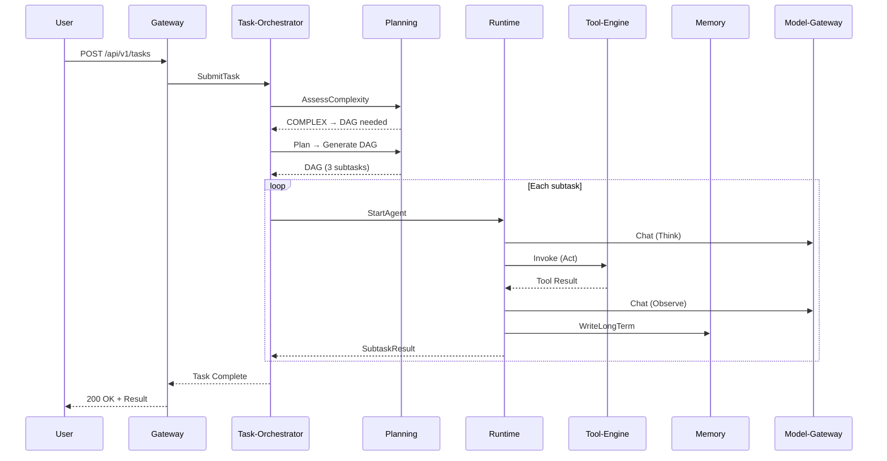

[English](./user-guide.md) | [中文](./user-guide.zh-CN.md)

# AgentForge User Guide

> Version: v1.0 | Updated: 2026-07-08 | Target Audience: Platform Operators / Agent Developers / End Users

---

## Table of Contents

1. [Platform Overview](#1-platform-overview)
2. [Roles & Permissions](#2-roles--permissions)
3. [Agent Management](#3-agent-management)
4. [Task Submission & Execution](#4-task-submission--execution)
5. [Sessions & Conversations](#5-sessions--conversations)
6. [Tool Management](#6-tool-management)
7. [Memory System](#7-memory-system)
8. [Knowledge Base Management](#8-knowledge-base-management)
9. [Quality & Hallucination Governance](#9-quality--hallucination-governance)
10. [REST API Quick Reference](#10-rest-api-quick-reference)
11. [gRPC API Quick Reference](#11-grpc-api-quick-reference)
12. [FAQ](#12-faq)

---

## 1. Platform Overview

AgentForge is an enterprise-grade multi-agent orchestration and governance platform. Core capabilities include:

- **DAG Task Orchestration**: Automatic complexity assessment → intelligent planning → parallel scheduling → dynamic replanning
- **Three-Tier Memory System**: Short-term / long-term / distilled memory, multi-path recall + fusion reranking
- **Tool Invocation Governance**: R1/R2/R3 risk classification + RBAC permissions + sandbox isolation
- **ReAct + Reflexion Runtime**: Think → Act → Observe → Reflect loop
- **Six-Layer Hallucination Governance**: Complete protection system from model selection to long-term closed-loop
- **Full-Link Observability**: Distributed tracing + metrics monitoring + log aggregation

### System Architecture Overview

```
┌──────────────────────────────────────────────────────────────────┐
│                     Access & Interaction Layer                    │
│  agent-gateway (8080)        agent-session (8082)                │
├──────────────────────────────────────────────────────────────────┤
│                        Core Engine Layer                          │
│  task-orchestrator (8084)  planning (8086)  runtime (8092)       │
│  memory (8088)  tool-engine (8090)  model-gateway (8094)         │
├──────────────────────────────────────────────────────────────────┤
│                    Capability Service Layer                       │
│  agent-repo (8096)  knowledge (8098)  quality (8100)             │
├──────────────────────────────────────────────────────────────────┤
│                       Cross-Cutting Concerns                     │
│  risk-control               observability                        │
└──────────────────────────────────────────────────────────────────┘
```

---

## 2. Roles & Permissions

### 2.1 Role Definitions

| Role | Responsibilities | Typical Operations |
|---|---|---|
| **Platform Admin** | System configuration, tenant management, global audit | Manage tool registration, approve R3 tools, view audit logs |
| **Agent Developer** | Create and configure Agents, debug and optimize | Create Agents, configure Prompts, register tools, debug runs |
| **End User** | Use Agents to complete business tasks | Submit tasks, conversational interaction, view results |
| **Operations Staff** | Monitor system health, quality analysis | View metrics dashboards, handle bad cases, process drift alerts |

### 2.2 Authentication

All requests must include the following headers:

```
X-Tenant-Id: <Tenant ID>
X-User-Id: <User ID>
Authorization: Bearer <JWT Token>
```

Permission checks are performed by the `risk-control` service's `CheckPermission` RPC, supporting both RBAC (role-based) and ABAC (attribute-based) modes.

---

## 3. Agent Management

The Agent repository service (`agent-repo`, port 8096) manages the full lifecycle of Agents.

### 3.1 Create Agent

```bash
# gRPC call (via agent-repo service)
curl -X POST http://localhost:8096/grpc \
  -H "Content-Type: application/json" \
  -d '{
    "name": "data-analyst",
    "description": "Data analysis agent that processes CSV files and generates reports",
    "scene_tags": ["DATA_ANALYSIS", "REPORT"],
    "model_tier": "STANDARD",
    "system_prompt": "You are a data analyst. Always explain your methodology before presenting results.",
    "tools": ["csv_reader", "chart_generator", "sql_executor"],
    "max_tokens_per_turn": 4096,
    "max_total_tokens": 65536
  }'
```

**Field Reference**:

| Field | Type | Required | Description |
|---|---|---|---|
| name | string | ✅ | Unique Agent name (unique within the same tenant) |
| description | string | ✅ | Agent capability description |
| scene_tags | string[] | — | Scene tags, e.g. `CODE_REVIEW`, `DATA_ANALYSIS` |
| model_tier | enum | ✅ | Model tier: `STANDARD` / `PREMIUM` / `REASONING` |
| system_prompt | string | ✅ | Agent system prompt |
| tools | string[] | — | Available tool list |
| max_tokens_per_turn | int | — | Max tokens per turn (default 4096) |
| max_total_tokens | int | — | Total token budget (default 32768) |

### 3.2 Query Agent

```bash
# Query by ID
curl http://localhost:8096/grpc -d '{"agent_id": "data-analyst"}'

# List all Agents (with filtering)
curl -X POST http://localhost:8096/grpc \
  -d '{"status": "PUBLISHED", "name_contains": "analyst", "page_size": 20}'
```

### 3.3 Update Agent

```bash
curl -X POST http://localhost:8096/grpc -d '{
  "agent_id": "data-analyst",
  "system_prompt": "Updated: You are a senior data analyst with expertise in statistical modeling.",
  "tools": ["csv_reader", "chart_generator", "sql_executor", "python_runner"]
}'
```

> ⚠️ Agents in PUBLISHED status cannot be modified directly; you must create a new version first.

### 3.4 Version Management

Agent version numbers auto-increment on updates. You can view historical versions and roll back:

```
Agent v1 → v2 → v3 (current)
         ↑ Can roll back to v1 or v2
```

---

## 4. Task Submission & Execution

### 4.1 Submit Task (REST API)

Submit tasks via the gateway (8080). The system automatically handles complexity assessment, planning, and execution:

```bash
curl -X POST http://localhost:8080/api/v1/tasks \
  -H "Content-Type: application/json" \
  -H "X-Tenant-Id: default" \
  -H "X-User-Id: user-001" \
  -d '{
    "agent_id": "data-analyst",
    "input": "Analyze the sales data in Q4 2025 and identify top 3 growth drivers",
    "priority": "HIGH",
    "metadata": {
      "context": "quarterly_review",
      "deadline": "2026-01-15"
    }
  }'
```

**Response**:

```json
{
  "code": "OK",
  "data": {
    "task_id": "tk_a1b2c3d4",
    "status": "PENDING",
    "created_at": "2026-07-08T10:30:00Z"
  }
}
```

### 4.2 Query Task Status

```bash
curl http://localhost:8080/api/v1/tasks/tk_a1b2c3d4 \
  -H "X-Tenant-Id: default"
```

**Task Status Transitions**:

```
PENDING → RUNNING → SUCCESS
                  → FAILED
                  → CANCELLED
         → PAUSED → RUNNING (resume)
```

### 4.3 Cancel Task

```bash
# gRPC call to task-orchestrator
curl -X POST http://localhost:8084/grpc -d '{"task_id": "tk_a1b2c3d4"}'
```

### 4.4 Task Execution Flow



### 4.5 Complexity Assessment

The planning engine automatically evaluates task complexity:

| Level | Criteria | Execution Strategy |
|---|---|---|
| **SIMPLE** | Completable in a single step | Direct ReAct loop |
| **MODERATE** | Requires 2-3 steps | Linear subtask sequence |
| **COMPLEX** | Multi-step with dependencies | DAG planning + parallel scheduling |

---

## 5. Sessions & Conversations

### 5.1 Create Session

Session management is handled by the `agent-session` (8082) service, supporting multi-turn conversations and context management.

### 5.2 Streaming Conversation (SSE)

```bash
# Subscribe to SSE streaming response
curl -N http://localhost:8080/api/v1/sessions/sess_x1y2z3/stream \
  -H "X-Tenant-Id: default" \
  -H "X-User-Id: user-001"
```

**SSE Event Types**:

| Event | Description | Example |
|---|---|---|
| `think` | Agent thinking process | `{"type":"think","content":"Analyzing data structure..."}` |
| `act` | Tool invocation | `{"type":"act","content":"Calling tool: csv_reader","tool":"csv_reader"}` |
| `observe` | Observation result | `{"type":"observe","content":"CSV loaded: 1000 rows x 15 columns"}` |
| `reflect` | Reflection and correction | `{"type":"reflect","content":"Initial analysis incomplete, expanding scope..."}` |
| `result` | Final result | `{"type":"result","content":"Top 3 growth drivers: 1. Mobile..."}` |
| `error` | Error information | `{"type":"error","code":"TOKEN_EXCEEDED","message":"Token budget exhausted"}` |

### 5.3 Multi-Turn Conversation

```
User: Analyze Q4 sales data
Agent: [Think] Need csv_reader tool
Agent: [Act] Call csv_reader("sales_q4.csv")
Agent: [Observe] Data loaded, 1000 rows
Agent: [Result] Q4 sales grew 23% YoY, main growth drivers...

User: Which region grew the fastest?
Agent: [Think] Analyze regional distribution based on loaded data
Agent: [Result] East China region grew the fastest, 35% YoY growth...
```

---

## 6. Tool Management

### 6.1 Tool Types

| Type | Description | Execution Method |
|---|---|---|
| `HTTP_API` | HTTP/REST interface | Gateway proxy call |
| `SHELL` | Shell command | Docker sandbox execution |
| `PYTHON` | Python script | Docker sandbox execution |
| `MCP` | Model Context Protocol | MCP protocol call |

### 6.2 Register Tool

```bash
# Register an HTTP_API type tool
curl -X POST http://localhost:8090/grpc \
  -H "Content-Type: application/json" \
  -d '{
    "tool_name": "weather_api",
    "description": "Get current weather for a location",
    "tool_type": "HTTP_API",
    "risk_level": "R1",
    "endpoint": "https://api.weather.com/v1/current",
    "params_schema": {
      "location": {"type": "string", "required": true, "description": "City name"},
      "units": {"type": "string", "enum": ["celsius", "fahrenheit"]}
    }
  }'
```

### 6.3 Risk Classification

| Level | Description | Approval Requirement | Execution Environment |
|---|---|---|---|
| **R1** | Low risk (read-only queries) | No approval needed | Direct execution |
| **R2** | Medium risk (external API calls) | Whitelist configuration required | Gateway proxy |
| **R3** | High risk (write operations / command execution) | Manual approval required | Docker sandbox |

### 6.4 Invoke Tool

```bash
# Invoke via tool gateway (typically called automatically by Runtime)
curl -X POST http://localhost:8090/grpc \
  -d '{
    "tool_name": "weather_api",
    "params": {"location": "Beijing", "units": "celsius"},
    "agent_id": "travel-planner",
    "context": {"session_id": "sess_abc"}
  }'
```

### 6.5 Result Sanitization

Tool return values are automatically processed through a sanitization pipeline:

1. **ANSI Control Code Stripping** — Remove terminal color codes
2. **PII Masking** — Mask phone numbers / emails / API keys / ID card numbers
3. **Truncation** — Truncate oversized results at UTF-8 character boundaries
4. **Trim** — Remove trailing whitespace

---

## 7. Memory System

### 7.1 Three-Tier Memory Architecture

```
┌─────────────┐
│  Short-Term  │ ← Redis (session-level, auto-expiry)
│  (SHORT_TERM)│
├─────────────┤
│  Long-Term   │ ← Milvus + MySQL (persistent, recallable)
│  (LONG_TERM) │
├─────────────┤
│  Distilled   │ ← Aggregated from multiple long-term memories (saves tokens)
│  (DISTILLED) │
└─────────────┘
```

### 7.2 Write Long-Term Memory

```bash
curl -X POST http://localhost:8088/grpc \
  -H "Content-Type: application/json" \
  -d '{
    "agent_id": "data-analyst",
    "content": "User prefers bar charts for comparison data and line charts for trends",
    "importance": 0.7,
    "tags": ["preference", "visualization"],
    "memory_type": "REFLECTIVE"
  }'
```

**Importance Values**:

| Range | Level | Description |
|---|---|---|
| ≥ 0.7 | HIGH | Core knowledge, priority recall |
| 0.4 ~ 0.7 | MEDIUM | General information, normal recall |
| < 0.4 | LOW | Minor information, may be distilled |

### 7.3 Recall Memory

```bash
curl -X POST http://localhost:8088/grpc \
  -H "Content-Type: application/json" \
  -d '{
    "agent_id": "data-analyst",
    "query": "What visualization style does the user prefer?",
    "top_k": 5,
    "min_importance": 0.4
  }'
```

**Recall Paths**:

1. Vector recall (Milvus HNSW COSINE similarity)
2. Keyword recall (Elasticsearch BM25)
3. Time decay (recent memories weighted higher)
4. Tag matching (exact tag filtering)
5. Fusion reranking (multi-path results RRF reranking)

### 7.4 Memory Distillation

When active long-term memories exceed the threshold (default 20 entries), distillation is automatically triggered:

1. Select active memories from the same Agent
2. Call model to generate a summary
3. Create a DISTILLED type memory (importance = average of source records)
4. Archive source memories (ARCHIVED)

```bash
# Manually trigger distillation
curl -X POST http://localhost:8088/grpc \
  -d '{"agent_id": "data-analyst", "force": true}'
```

---

## 8. Knowledge Base Management

### 8.1 Create Knowledge Base

```bash
curl -X POST http://localhost:8098/grpc \
  -d '{
    "name": "product-docs",
    "description": "Product documentation knowledge base",
    "embedding_model": "text-embedding-3-small"
  }'
```

### 8.2 Ingest Documents

```bash
# Ingest documents (auto-chunking + vectorization)
curl -X POST http://localhost:8098/grpc \
  -d '{
    "base_id": "product-docs",
    "documents": [
      {
        "doc_id": "api-guide-v2",
        "content": "Full text content of the API guide...",
        "metadata": {"source": "confluence", "author": "team-api"}
      }
    ],
    "chunk_size": 512,
    "overlap": 64
  }'
```

**Ingestion Pipeline**:

1. Document parsing → 2. Text chunking (512 tokens, 64 overlap) → 3. Vectorization (embedding) → 4. Store in Milvus + MySQL

### 8.3 Knowledge Retrieval

```bash
curl -X POST http://localhost:8098/grpc \
  -d '{
    "base_id": "product-docs",
    "query": "How to configure mTLS for gRPC?",
    "top_k": 10
  }'
```

### 8.4 Version Management

Knowledge bases support version management. You can create versions, roll back, and view version lists.

---

## 9. Quality & Hallucination Governance

### 9.1 Quality Validation

The quality service (`agent-quality`, port 8100) provides three levels of validation:

| Level | Validation Content | Trigger Condition |
|---|---|---|---|
| L1 | Format compliance, appropriate length | Every output |
| L2 | Logical consistency, no contradictions | Complex tasks |
| L3 | Manual review | High-risk scenarios |

### 9.2 Hallucination Detection

The hallucination governance service provides four layers of detection:

1. **SelfCheck** — Model self-verification ("Are you confident in your answer?")
2. **GuardToolCall** — Pre-tool-call check (prevents fabricated tool names)
3. **AnchorRag** — RAG anchoring (answers must be supported by knowledge base sources)
4. **RecordMetric** — Hallucination rate metric recording

### 9.3 Drift Detection

The drift monitoring service tracks Agent behavior changes:

| Drift Type | Description | Action |
|---|---|---|
| **Performance Drift** | Response time / success rate changes | Auto-alert |
| **Quality Drift** | Hallucination rate / user satisfaction changes | Trigger re-evaluation |
| **Cost Drift** | Abnormal token consumption | Auto-stop-loss |
| **Behavior Drift** | Output style / format changes | Grayscale rollback |

---

## 10. REST API Quick Reference

### agent-gateway (8080)

| Method | Path | Description | Request Body |
|---|---|---|---|
| POST | `/api/v1/tasks` | Submit task | `TaskCreateRequest` |
| GET | `/api/v1/tasks/{id}` | Query task status | — |
| GET | `/api/v1/sessions/{id}/stream` | SSE streaming conversation | — |
| GET | `/health` | Health check | — |

### Request Headers

All requests must include:

```
Content-Type: application/json
X-Tenant-Id: <Tenant ID>
X-User-Id: <User ID>
Authorization: Bearer <JWT>
```

### TaskCreateRequest

```json
{
  "agent_id": "string (required)",
  "input": "string (required)",
  "priority": "NORMAL | HIGH | URGENT",
  "metadata": {
    "key": "value"
  }
}
```

### Response Format

```json
{
  "code": "OK | ERROR",
  "message": "description",
  "data": { }
}
```

---

## 11. gRPC API Quick Reference

### 11.1 AgentRuntime (8092)

| RPC | Request | Response | Description |
|---|---|---|---|
| `StartAgent` | StartAgentRequest | StartAgentResponse | Start Agent instance |
| `Step` | StepRequest | StepResponse | Single-step execution |
| `GetState` | GetStateRequest | AgentState | Get runtime state |
| `Pause` | PauseRequest | PauseResponse | Pause execution |
| `Resume` | ResumeRequest | ResumeResponse | Resume execution |

### 11.2 ToolGateway (8090)

| RPC | Request | Response | Description |
|---|---|---|---|
| `Invoke` | ToolInvokeRequest | ToolInvokeResponse | Invoke tool |
| `RegisterTool` | RegisterToolRequest | RegisterToolAck | Register tool |
| `ListTools` | ListToolsRequest | ListToolsResponse | Tool list |
| `GetToolRegistry` | GetToolRegistryRequest | ToolRegistry | Tool details |

### 11.3 MemoryService (8088)

| RPC | Request | Response | Description |
|---|---|---|---|
| `WriteLongTerm` | WriteLongTermRequest | WriteAck | Write long-term memory |
| `Recall` | RecallRequest | RecallResponse | Multi-path recall |
| `TriggerDistill` | DistillRequest | DistillAck | Trigger distillation |
| `GetMemoryById` | GetMemoryByIdRequest | MemoryRecord | Query by ID |

### 11.4 PlanningService (8086)

| RPC | Request | Response | Description |
|---|---|---|---|
| `AssessComplexity` | AssessRequest | AssessResponse | Complexity assessment |
| `Plan` | PlanRequest | PlanResponse | Generate DAG plan |
| `ValidatePlan` | ValidateRequest | ValidateResponse | Plan self-check |
| `Replan` | ReplanRequest | PlanResponse | Dynamic replanning |

### 11.5 TaskService (8084)

| RPC | Request | Response | Description |
|---|---|---|---|
| `SubmitTask` | SubmitTaskRequest | SubmitTaskResponse | Submit task |
| `GetTaskStatus` | GetTaskStatusRequest | TaskInstance | Query task |
| `CancelTask` | CancelTaskRequest | CancelAck | Cancel task |
| `ReportSubtaskResult` | SubtaskResult | ReportAck | Subtask result report |

### 11.6 ModelService (8094)

| RPC | Request | Response | Description |
|---|---|---|---|
| `Chat` | ChatRequest | ChatResponse | Synchronous model call |
| `StreamChat` | ChatRequest | stream ChatChunk | Streaming model call |
| `CountTokens` | CountTokensRequest | CountTokensResponse | Token count |
| `ListModels` | ListModelsRequest | ListModelsResponse | Model list |

### 11.7 RepoService (8096)

| RPC | Request | Response | Description |
|---|---|---|---|
| `CreateAgent` | CreateAgentRequest | AgentResponse | Create Agent |
| `GetAgent` | GetAgentRequest | AgentResponse | Query Agent |
| `UpdateAgent` | UpdateAgentRequest | AgentResponse | Update Agent |
| `ListAgents` | ListAgentsRequest | ListAgentsResponse | List Agents |

### 11.8 KnowledgeService (8098)

| RPC | Request | Response | Description |
|---|---|---|---|
| `Retrieve` | KnowledgeQuery | KnowledgeResult | Knowledge retrieval |
| `Ingest` | IngestRequest | IngestResponse | Document ingestion |
| `VersionManage` | VersionManageRequest | VersionManageResponse | Version management |
| `IngestDocument` | IngestDocumentRequest | IngestDocumentResponse | Document ingestion (orchestration) |
| `SearchChunks` | SearchChunksRequest | SearchChunksResponse | Chunk retrieval |
| `ListBases` | ListBasesRequest | ListBasesResponse | List knowledge bases |
| `DeleteBase` | DeleteBaseRequest | DeleteBaseResponse | Delete knowledge base |

### 11.9 QualityService (8100)

| RPC | Request | Response | Description |
|---|---|---|---|
| `ValidateTask` | ValidateTaskRequest | ValidateTaskResponse | Task quality validation |
| `ReportBadcase` | ReportBadcaseRequest | ReportBadcaseAck | Report bad case |
| `GetReviewQueue` | GetReviewQueueRequest | GetReviewQueueResponse | Manual review queue |
| `GetQualityMetrics` | GetQualityMetricsRequest | GetQualityMetricsResponse | Quality metrics |

### 11.10 HallucinationService

| RPC | Request | Response | Description |
|---|---|---|---|
| `SelfCheck` | SelfCheckRequest | SelfCheckResponse | Model self-verification |
| `GuardToolCall` | GuardToolCallRequest | GuardToolCallResponse | Tool call guard |
| `AnchorRag` | AnchorRagRequest | AnchorRagResponse | RAG anchoring |
| `RecordMetric` | RecordMetricRequest | RecordMetricAck | Record metric |

### 11.11 DriftService

| RPC | Request | Response | Description |
|---|---|---|---|
| `DetectDrift` | DetectDriftRequest | DetectDriftResponse | Drift detection |
| `CorrectDrift` | CorrectDriftRequest | CorrectDriftResponse | Drift correction |
| `GetBaseline` | GetBaselineRequest | GetBaselineResponse | Get baseline |
| `RecordBehavior` | RecordBehaviorRequest | RecordBehaviorAck | Record behavior |

### 11.12 RiskControlService

| RPC | Request | Response | Description |
|---|---|---|---|
| `CheckContent` | CheckContentRequest | CheckContentResponse | Content safety check |
| `CheckPermission` | CheckPermissionRequest | CheckPermissionResponse | Permission check |
| `AuditLog` | AuditLogRequest | AuditLogAck | Audit log |

### 11.13 ObservabilityService

| RPC | Request | Response | Description |
|---|---|---|---|
| `GetTraces` | GetTracesRequest | GetTracesResponse | Query traces |
| `GetMetrics` | GetMetricsRequest | GetMetricsResponse | Query metrics |
| `GetHealth` | GetHealthRequest | GetHealthResponse | Health status |

---

## 12. FAQ

### Q1: Task stays in PENDING status after submission?

**A**: Check the following:
1. Is the `agent-task-orchestrator` service running normally
2. Is the RocketMQ message queue connected
3. Are the task orchestrator consumer threads at capacity (check the `task_queue_depth` metric)

### Q2: What to do when Agent execution exceeds token limits?

**A**: Token water level monitoring handles this automatically:
- **YELLOW**: Prompt the Agent to compress context
- **RED**: Force compression, retain key information
- **EXCEEDED**: Terminate execution, return existing results

You can adjust `max_tokens_per_turn` and `max_total_tokens` in the Agent configuration.

### Q3: Tool invocation returns PERMISSION_DENIED?

**A**: Check:
1. The tool's risk level — R2/R3 requires additional approval
2. Whether the Agent is authorized to use the tool
3. Whether the current tenant's tool quota is exhausted

### Q4: Memory recall results are irrelevant?

**A**: Optimize recall effectiveness:
1. Raise the `importance` threshold (default 0.4)
2. Use more specific tags (`tags`)
3. Adjust the `top_k` parameter (default 5)
4. Ensure memory content is sufficiently detailed (short content has poor vectorization quality)

### Q5: Hallucination detection false positive rate is high?

**A**: Adjust hallucination governance strategy:
1. Lower the `SelfCheck` confidence threshold
2. Configure a domain knowledge base for the Agent (`AnchorRag` effectiveness depends on knowledge base quality)
3. Explicitly require in the system prompt "If uncertain, please state so"

### Q6: How to view Agent execution logs?

**A**: Three methods:
1. **Distributed Tracing**: Query by trace_id via `ObservabilityService.GetTraces`
2. **Grafana**: Access the Loki log panel, filter by `agent_id`
3. **SkyWalking**: View service topology and call chains

### Q7: How to handle drift alerts?

**A**: Drift handling process:
1. Confirm drift type (performance / quality / cost / behavior)
2. View drift detection details (`DriftService.GetBaseline`)
3. Minor drift: Log observation, continue running
4. Severe drift: Trigger `CorrectDrift` (auto-rollback to baseline version)
5. Update Agent configuration after root cause analysis

### Q8: How to configure the Docker sandbox?

**A**: The tool engine sandbox configuration is in `application.yml`:

```yaml
tool-engine:
  sandbox:
    enabled: true
    docker-image: agentplatform/sandbox:latest
    cap-drop: ALL
    user: nobody
    no-new-privileges: true
    memory-limit: 512m
    cpu-limit: 0.5
    timeout-seconds: 60
```

---

> 📖 For more technical details, see the [Design Document Index](./README.md) | For operations and deployment, see the [Operations Guide](./ops-guide.md)
