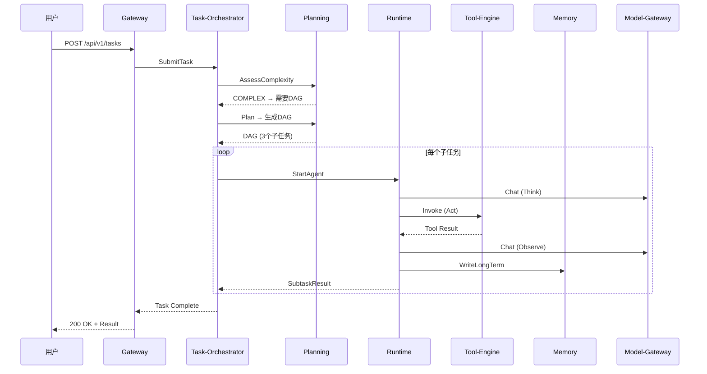

# AgentForge 使用手册

> 版本：v1.0 | 更新日期：2026-07-08 | 面向角色：平台运营 / Agent 开发者 / 终端用户

---

## 目录

1. [平台概述](#1-平台概述)
2. [角色与权限](#2-角色与权限)
3. [Agent 管理](#3-agent-管理)
4. [任务提交与执行](#4-任务提交与执行)
5. [会话与对话](#5-会话与对话)
6. [工具管理](#6-工具管理)
7. [记忆系统](#7-记忆系统)
8. [知识库管理](#8-知识库管理)
9. [质量与幻觉治理](#9-质量与幻觉治理)
10. [REST API 速查表](#10-rest-api-速查表)
11. [gRPC API 速查表](#11-grpc-api-速查表)
12. [常见问题 FAQ](#12-常见问题-faq)

---

## 1. 平台概述

AgentForge 是一个企业级多智能体编排与治理平台，核心能力包括：

- **DAG 任务编排**：自动复杂度识别 → 智能规划 → 并行调度 → 动态重规划
- **三级记忆系统**：短期 / 长期 / 蒸馏记忆，多路召回 + 融合重排
- **工具调用治理**：R1/R2/R3 风险分级 + RBAC 权限 + 沙箱隔离
- **ReAct + Reflexion 运行时**：Think → Act → Observe → Reflect 循环
- **幻觉六层治理**：从模型选型到长效闭环的完整防护体系
- **全链路可观测**：链路追踪 + 指标监控 + 日志聚合

### 系统架构概览

```
┌──────────────────────────────────────────────────────────────────┐
│                        接入交互层                                  │
│  agent-gateway (8080)        agent-session (8082)                │
├──────────────────────────────────────────────────────────────────┤
│                        核心引擎层                                  │
│  task-orchestrator (8084)  planning (8086)  runtime (8092)       │
│  memory (8088)  tool-engine (8090)  model-gateway (8094)         │
├──────────────────────────────────────────────────────────────────┤
│                        能力服务层                                  │
│  agent-repo (8096)  knowledge (8098)  quality (8100)             │
├──────────────────────────────────────────────────────────────────┤
│                        横向体系                                    │
│  risk-control               observability                        │
└──────────────────────────────────────────────────────────────────┘
```

---

## 2. 角色与权限

### 2.1 角色定义

| 角色 | 职责 | 典型操作 |
|---|---|---|
| **平台管理员** | 系统配置、租户管理、全局审计 | 管理工具注册、审批 R3 工具、查看审计日志 |
| **Agent 开发者** | 创建和配置 Agent、调试优化 | 创建 Agent、配置 Prompt、注册工具、调试运行 |
| **终端用户** | 使用 Agent 完成业务任务 | 提交任务、对话交互、查看结果 |
| **运营人员** | 监控系统运行、质量分析 | 查看指标大屏、处理 Badcase、漂移告警处理 |

### 2.2 鉴权方式

所有请求需携带以下 Header：

```
X-Tenant-Id: <租户ID>
X-User-Id: <用户ID>
Authorization: Bearer <JWT Token>
```

权限检查由 `risk-control` 服务的 `CheckPermission` RPC 执行，支持 RBAC（角色）和 ABAC（属性）两种模式。

---

## 3. Agent 管理

Agent 仓库服务（`agent-repo`, 端口 8096）管理 Agent 的完整生命周期。

### 3.1 创建 Agent

```bash
# gRPC 调用（通过 agent-repo 服务）
curl -X POST http://localhost:8096/grpc \
  -H "Content-Type: application/json" \
  -d '{
    "name": "data-analyst",
    "description": "Data analysis agent that processes CSV files and generates reports",
    "scene_tags": ["DATA_ANALYSIS", "REPORT"],
    "model_tier": "STANDARD",
    "system_prompt": "You are a data analyst. Always explain your methodology before presenting results.",
    "tools": ["csv_reader", "chart_generator", "sql_executor"],
    "max_tokens_per_turn": 4096,
    "max_total_tokens": 65536
  }'
```

**字段说明**：

| 字段 | 类型 | 必填 | 说明 |
|---|---|---|---|
| name | string | ✅ | Agent 唯一名称（同一租户下唯一） |
| description | string | ✅ | Agent 功能描述 |
| scene_tags | string[] | — | 场景标签，如 `CODE_REVIEW`, `DATA_ANALYSIS` |
| model_tier | enum | ✅ | 模型层级：`STANDARD` / `PREMIUM` / `REASONING` |
| system_prompt | string | ✅ | Agent 系统提示词 |
| tools | string[] | — | 可用工具列表 |
| max_tokens_per_turn | int | — | 单轮最大 Token 数（默认 4096） |
| max_total_tokens | int | — | 总 Token 上限（默认 32768） |

### 3.2 查询 Agent

```bash
# 按 ID 查询
curl http://localhost:8096/grpc -d '{"agent_id": "data-analyst"}'

# 列出所有 Agent（支持过滤）
curl -X POST http://localhost:8096/grpc \
  -d '{"status": "PUBLISHED", "name_contains": "analyst", "page_size": 20}'
```

### 3.3 更新 Agent

```bash
curl -X POST http://localhost:8096/grpc -d '{
  "agent_id": "data-analyst",
  "system_prompt": "Updated: You are a senior data analyst with expertise in statistical modeling.",
  "tools": ["csv_reader", "chart_generator", "sql_executor", "python_runner"]
}'
```

> ⚠️ 已发布（PUBLISHED）状态的 Agent 不能直接修改，需先创建新版本。

### 3.4 版本管理

Agent 更新时版本号自动递增。可查看历史版本并回滚：

```
Agent v1 → v2 → v3 (current)
         ↑ 可回滚到 v1 或 v2
```

---

## 4. 任务提交与执行

### 4.1 提交任务（REST API）

通过网关（8080）提交任务，系统自动完成复杂度识别、规划、执行全流程：

```bash
curl -X POST http://localhost:8080/api/v1/tasks \
  -H "Content-Type: application/json" \
  -H "X-Tenant-Id: default" \
  -H "X-User-Id: user-001" \
  -d '{
    "agent_id": "data-analyst",
    "input": "Analyze the sales data in Q4 2025 and identify top 3 growth drivers",
    "priority": "HIGH",
    "metadata": {
      "context": "quarterly_review",
      "deadline": "2026-01-15"
    }
  }'
```

**响应**：

```json
{
  "code": "OK",
  "data": {
    "task_id": "tk_a1b2c3d4",
    "status": "PENDING",
    "created_at": "2026-07-08T10:30:00Z"
  }
}
```

### 4.2 查询任务状态

```bash
curl http://localhost:8080/api/v1/tasks/tk_a1b2c3d4 \
  -H "X-Tenant-Id: default"
```

**任务状态流转**：

```
PENDING → RUNNING → SUCCESS
                  → FAILED
                  → CANCELLED
         → PAUSED → RUNNING (resume)
```

### 4.3 取消任务

```bash
# gRPC 调用 task-orchestrator
curl -X POST http://localhost:8084/grpc -d '{"task_id": "tk_a1b2c3d4"}'
```

### 4.4 任务执行全流程



### 4.5 复杂度识别

规划引擎自动评估任务复杂度：

| 级别 | 判定 | 执行策略 |
|---|---|---|
| **SIMPLE** | 单步可完成 | 直接 ReAct 循环 |
| **MODERATE** | 需要 2-3 步 | 线性子任务序列 |
| **COMPLEX** | 多步骤+依赖 | DAG 规划 + 并行调度 |

---

## 5. 会话与对话

### 5.1 创建会话

会话管理由 `agent-session`（8082）服务负责，支持多轮对话和上下文管理。

### 5.2 流式对话（SSE）

```bash
# 订阅 SSE 流式响应
curl -N http://localhost:8080/api/v1/sessions/sess_x1y2z3/stream \
  -H "X-Tenant-Id: default" \
  -H "X-User-Id: user-001"
```

**SSE 事件类型**：

| 事件 | 说明 | 示例 |
|---|---|---|
| `think` | Agent 思考过程 | `{"type":"think","content":"Analyzing data structure..."}` |
| `act` | 工具调用 | `{"type":"act","content":"Calling tool: csv_reader","tool":"csv_reader"}` |
| `observe` | 观察结果 | `{"type":"observe","content":"CSV loaded: 1000 rows x 15 columns"}` |
| `reflect` | 反思修正 | `{"type":"reflect","content":"Initial analysis incomplete, expanding scope..."}` |
| `result` | 最终结果 | `{"type":"result","content":"Top 3 growth drivers: 1. Mobile..."}` |
| `error` | 错误信息 | `{"type":"error","code":"TOKEN_EXCEEDED","message":"Token budget exhausted"}` |

### 5.3 多轮对话

```
用户: 分析 Q4 销售数据
Agent: [Think] 需要 csv_reader 工具
Agent: [Act] 调用 csv_reader("sales_q4.csv")
Agent: [Observe] 数据已加载，1000 行
Agent: [Result] Q4 销售额同比增长 23%，主要增长点...

用户: 哪个区域增长最快？
Agent: [Think] 基于已加载数据分析区域分布
Agent: [Result] 华东区域增长最快，同比增长 35%...
```

---

## 6. 工具管理

### 6.1 工具类型

| 类型 | 说明 | 执行方式 |
|---|---|---|
| `HTTP_API` | HTTP/REST 接口 | 网关代理调用 |
| `SHELL` | Shell 命令 | Docker 沙箱执行 |
| `PYTHON` | Python 脚本 | Docker 沙箱执行 |
| `MCP` | Model Context Protocol | MCP 协议调用 |

### 6.2 注册工具

```bash
# 注册 HTTP_API 类型工具
curl -X POST http://localhost:8090/grpc \
  -H "Content-Type: application/json" \
  -d '{
    "tool_name": "weather_api",
    "description": "Get current weather for a location",
    "tool_type": "HTTP_API",
    "risk_level": "R1",
    "endpoint": "https://api.weather.com/v1/current",
    "params_schema": {
      "location": {"type": "string", "required": true, "description": "City name"},
      "units": {"type": "string", "enum": ["celsius", "fahrenheit"]}
    }
  }'
```

### 6.3 风险分级

| 级别 | 说明 | 审批要求 | 执行环境 |
|---|---|---|---|
| **R1** | 低风险（只读查询） | 无需审批 | 直接执行 |
| **R2** | 中风险（外部 API 调用） | 需配置白名单 | 网关代理 |
| **R3** | 高风险（写操作/命令执行） | 需人工审批 | Docker 沙箱 |

### 6.4 调用工具

```bash
# 通过工具网关调用（通常由 Runtime 自动调用）
curl -X POST http://localhost:8090/grpc \
  -d '{
    "tool_name": "weather_api",
    "params": {"location": "Beijing", "units": "celsius"},
    "agent_id": "travel-planner",
    "context": {"session_id": "sess_abc"}
  }'
```

### 6.5 结果清洗

工具返回结果自动经过清洗管道：

1. **ANSI 控制符剥离** — 去除终端颜色码
2. **PII 脱敏** — 手机号/邮箱/API Key/身份证号掩码
3. **截断** — 超长结果按 UTF-8 字符边界截断
4. **Trim** — 去除尾部空白

---

## 7. 记忆系统

### 7.1 三级记忆架构

```
┌─────────────┐
│  短期记忆    │ ← Redis（会话级，自动过期）
│  (SHORT_TERM)│
├─────────────┤
│  长期记忆    │ ← Milvus + MySQL（持久化，可召回）
│  (LONG_TERM) │
├─────────────┤
│  蒸馏记忆    │ ← 聚合多条长期记忆生成（节省 Token）
│  (DISTILLED) │
└─────────────┘
```

### 7.2 写入长期记忆

```bash
curl -X POST http://localhost:8088/grpc \
  -H "Content-Type: application/json" \
  -d '{
    "agent_id": "data-analyst",
    "content": "User prefers bar charts for comparison data and line charts for trends",
    "importance": 0.7,
    "tags": ["preference", "visualization"],
    "memory_type": "REFLECTIVE"
  }'
```

**importance 取值**：

| 范围 | 级别 | 说明 |
|---|---|---|
| ≥ 0.7 | HIGH | 核心知识，优先召回 |
| 0.4 ~ 0.7 | MEDIUM | 一般信息，正常召回 |
| < 0.4 | LOW | 次要信息，可能被蒸馏 |

### 7.3 召回记忆

```bash
curl -X POST http://localhost:8088/grpc \
  -H "Content-Type: application/json" \
  -d '{
    "agent_id": "data-analyst",
    "query": "What visualization style does the user prefer?",
    "top_k": 5,
    "min_importance": 0.4
  }'
```

**召回路径**：

1. 向量召回（Milvus HNSW COSINE 相似度）
2. 关键词召回（Elasticsearch BM25）
3. 时间衰减（近期记忆权重更高）
4. 标签匹配（精确标签过滤）
5. 融合重排（多路结果 RRF 重排）

### 7.4 记忆蒸馏

当活跃长期记忆超过阈值（默认 20 条）时，自动触发蒸馏：

1. 选取同一 Agent 的活跃记忆
2. 调用模型生成摘要
3. 创建 DISTILLED 类型记忆（importance = 源记录均值）
4. 源记忆归档（ARCHIVED）

```bash
# 手动触发蒸馏
curl -X POST http://localhost:8088/grpc \
  -d '{"agent_id": "data-analyst", "force": true}'
```

---

## 8. 知识库管理

### 8.1 创建知识库

```bash
curl -X POST http://localhost:8098/grpc \
  -d '{
    "name": "product-docs",
    "description": "Product documentation knowledge base",
    "embedding_model": "text-embedding-3-small"
  }'
```

### 8.2 文档入库

```bash
# 入库文档（自动切片+向量化）
curl -X POST http://localhost:8098/grpc \
  -d '{
    "base_id": "product-docs",
    "documents": [
      {
        "doc_id": "api-guide-v2",
        "content": "Full text content of the API guide...",
        "metadata": {"source": "confluence", "author": "team-api"}
      }
    ],
    "chunk_size": 512,
    "overlap": 64
  }'
```

**入库流程**：

1. 文档解析 → 2. 文本切片（512 tokens，64 overlap）→ 3. 向量化（embedding）→ 4. 存入 Milvus + MySQL

### 8.3 知识检索

```bash
curl -X POST http://localhost:8098/grpc \
  -d '{
    "base_id": "product-docs",
    "query": "How to configure mTLS for gRPC?",
    "top_k": 10
  }'
```

### 8.4 版本管理

知识库支持版本管理，可创建版本、回滚、查看版本列表。

---

## 9. 质量与幻觉治理

### 9.1 质量校验

质量服务（`agent-quality`, 端口 8100）提供三级校验：

| 级别 | 校验内容 | 触发时机 |
|---|---|---|---|
| L1 | 格式合规、长度适中 | 每次输出 |
| L2 | 逻辑一致性、无矛盾 | 复杂任务 |
| L3 | 人工审核 | 高风险场景 |

### 9.2 幻觉检测

幻觉治理服务提供四层检测：

1. **SelfCheck** — 模型自校验（"你的回答有把握吗？"）
2. **GuardToolCall** — 工具调用前检查（防止虚构工具名）
3. **AnchorRag** — RAG 锚定（回答必须有知识库来源支撑）
4. **RecordMetric** — 幻觉率指标记录

### 9.3 漂移检测

漂移监控服务追踪 Agent 行为变化：

| 漂移类型 | 说明 | 处置 |
|---|---|---|
| **性能漂移** | 响应时间/成功率变化 | 自动告警 |
| **质量漂移** | 幻觉率/用户满意度变化 | 触发重新评估 |
| **成本漂移** | Token 消耗异常 | 自动止损 |
| **行为漂移** | 输出风格/格式变化 | 灰度回滚 |

---

## 10. REST API 速查表

### agent-gateway (8080)

| 方法 | 路径 | 说明 | 请求体 |
|---|---|---|---|
| POST | `/api/v1/tasks` | 提交任务 | `TaskCreateRequest` |
| GET | `/api/v1/tasks/{id}` | 查询任务状态 | — |
| GET | `/api/v1/sessions/{id}/stream` | SSE 流式对话 | — |
| GET | `/health` | 健康检查 | — |

### 请求头

所有请求需携带：

```
Content-Type: application/json
X-Tenant-Id: <租户ID>
X-User-Id: <用户ID>
Authorization: Bearer <JWT>
```

### TaskCreateRequest

```json
{
  "agent_id": "string (required)",
  "input": "string (required)",
  "priority": "NORMAL | HIGH | URGENT",
  "metadata": {
    "key": "value"
  }
}
```

### 响应格式

```json
{
  "code": "OK | ERROR",
  "message": "description",
  "data": { }
}
```

---

## 11. gRPC API 速查表

### 11.1 AgentRuntime (8092)

| RPC | 请求 | 响应 | 说明 |
|---|---|---|---|
| `StartAgent` | StartAgentRequest | StartAgentResponse | 启动 Agent 实例 |
| `Step` | StepRequest | StepResponse | 单步执行 |
| `GetState` | GetStateRequest | AgentState | 获取运行状态 |
| `Pause` | PauseRequest | PauseResponse | 暂停执行 |
| `Resume` | ResumeRequest | ResumeResponse | 恢复执行 |

### 11.2 ToolGateway (8090)

| RPC | 请求 | 响应 | 说明 |
|---|---|---|---|
| `Invoke` | ToolInvokeRequest | ToolInvokeResponse | 调用工具 |
| `RegisterTool` | RegisterToolRequest | RegisterToolAck | 注册工具 |
| `ListTools` | ListToolsRequest | ListToolsResponse | 工具列表 |
| `GetToolRegistry` | GetToolRegistryRequest | ToolRegistry | 工具详情 |

### 11.3 MemoryService (8088)

| RPC | 请求 | 响应 | 说明 |
|---|---|---|---|
| `WriteLongTerm` | WriteLongTermRequest | WriteAck | 写入长期记忆 |
| `Recall` | RecallRequest | RecallResponse | 多路召回 |
| `TriggerDistill` | DistillRequest | DistillAck | 触发蒸馏 |
| `GetMemoryById` | GetMemoryByIdRequest | MemoryRecord | 按 ID 查询 |

### 11.4 PlanningService (8086)

| RPC | 请求 | 响应 | 说明 |
|---|---|---|---|
| `AssessComplexity` | AssessRequest | AssessResponse | 复杂度评估 |
| `Plan` | PlanRequest | PlanResponse | 生成 DAG 规划 |
| `ValidatePlan` | ValidateRequest | ValidateResponse | 规划自检 |
| `Replan` | ReplanRequest | PlanResponse | 动态重规划 |

### 11.5 TaskService (8084)

| RPC | 请求 | 响应 | 说明 |
|---|---|---|---|
| `SubmitTask` | SubmitTaskRequest | SubmitTaskResponse | 提交任务 |
| `GetTaskStatus` | GetTaskStatusRequest | TaskInstance | 查询任务 |
| `CancelTask` | CancelTaskRequest | CancelAck | 取消任务 |
| `ReportSubtaskResult` | SubtaskResult | ReportAck | 子任务结果上报 |

### 11.6 ModelService (8094)

| RPC | 请求 | 响应 | 说明 |
|---|---|---|---|
| `Chat` | ChatRequest | ChatResponse | 同步调用模型 |
| `StreamChat` | ChatRequest | stream ChatChunk | 流式调用 |
| `CountTokens` | CountTokensRequest | CountTokensResponse | Token 计数 |
| `ListModels` | ListModelsRequest | ListModelsResponse | 模型列表 |

### 11.7 RepoService (8096)

| RPC | 请求 | 响应 | 说明 |
|---|---|---|---|
| `CreateAgent` | CreateAgentRequest | AgentResponse | 创建 Agent |
| `GetAgent` | GetAgentRequest | AgentResponse | 查询 Agent |
| `UpdateAgent` | UpdateAgentRequest | AgentResponse | 更新 Agent |
| `ListAgents` | ListAgentsRequest | ListAgentsResponse | 列出 Agent |

### 11.8 KnowledgeService (8098)

| RPC | 请求 | 响应 | 说明 |
|---|---|---|---|
| `Retrieve` | KnowledgeQuery | KnowledgeResult | 知识检索 |
| `Ingest` | IngestRequest | IngestResponse | 文档入库 |
| `VersionManage` | VersionManageRequest | VersionManageResponse | 版本管理 |
| `IngestDocument` | IngestDocumentRequest | IngestDocumentResponse | 文档入库（编排） |
| `SearchChunks` | SearchChunksRequest | SearchChunksResponse | Chunk 检索 |
| `ListBases` | ListBasesRequest | ListBasesResponse | 列出知识库 |
| `DeleteBase` | DeleteBaseRequest | DeleteBaseResponse | 删除知识库 |

### 11.9 QualityService (8100)

| RPC | 请求 | 响应 | 说明 |
|---|---|---|---|
| `ValidateTask` | ValidateTaskRequest | ValidateTaskResponse | 任务质量校验 |
| `ReportBadcase` | ReportBadcaseRequest | ReportBadcaseAck | 上报 Badcase |
| `GetReviewQueue` | GetReviewQueueRequest | GetReviewQueueResponse | 人工审核队列 |
| `GetQualityMetrics` | GetQualityMetricsRequest | GetQualityMetricsResponse | 质量指标 |

### 11.10 HallucinationService

| RPC | 请求 | 响应 | 说明 |
|---|---|---|---|
| `SelfCheck` | SelfCheckRequest | SelfCheckResponse | 模型自校验 |
| `GuardToolCall` | GuardToolCallRequest | GuardToolCallResponse | 工具调用守卫 |
| `AnchorRag` | AnchorRagRequest | AnchorRagResponse | RAG 锚定 |
| `RecordMetric` | RecordMetricRequest | RecordMetricAck | 记录指标 |

### 11.11 DriftService

| RPC | 请求 | 响应 | 说明 |
|---|---|---|---|
| `DetectDrift` | DetectDriftRequest | DetectDriftResponse | 漂移检测 |
| `CorrectDrift` | CorrectDriftRequest | CorrectDriftResponse | 漂移修正 |
| `GetBaseline` | GetBaselineRequest | GetBaselineResponse | 获取基线 |
| `RecordBehavior` | RecordBehaviorRequest | RecordBehaviorAck | 记录行为 |

### 11.12 RiskControlService

| RPC | 请求 | 响应 | 说明 |
|---|---|---|---|
| `CheckContent` | CheckContentRequest | CheckContentResponse | 内容安全检查 |
| `CheckPermission` | CheckPermissionRequest | CheckPermissionResponse | 权限检查 |
| `AuditLog` | AuditLogRequest | AuditLogAck | 审计日志 |

### 11.13 ObservabilityService

| RPC | 请求 | 响应 | 说明 |
|---|---|---|---|
| `GetTraces` | GetTracesRequest | GetTracesResponse | 查询链路 |
| `GetMetrics` | GetMetricsRequest | GetMetricsResponse | 查询指标 |
| `GetHealth` | GetHealthRequest | GetHealthResponse | 健康状态 |

---

## 12. 常见问题 FAQ

### Q1: 任务提交后一直是 PENDING 状态？

**A**: 检查以下几点：
1. `agent-task-orchestrator` 服务是否正常运行
2. RocketMQ 消息队列是否连通
3. 任务编排器的消费者线程是否已满（查看 `task_queue_depth` 指标）

### Q2: Agent 执行 Token 超限怎么办？

**A**: Token 水位监控会自动处理：
- **YELLOW**：提示 Agent 压缩上下文
- **RED**：强制压缩，保留关键信息
- **EXCEEDED**：终止执行，返回已有结果

可在 Agent 配置中调整 `max_tokens_per_turn` 和 `max_total_tokens`。

### Q3: 工具调用返回 PERMISSION_DENIED？

**A**: 检查：
1. 工具的风险级别 — R2/R3 需要额外审批
2. Agent 是否被授权使用该工具
3. 当前租户的工具配额是否已用完

### Q4: 记忆召回结果不相关？

**A**: 优化召回效果：
1. 提高 `importance` 门槛（默认 0.4）
2. 使用更精确的标签（`tags`）
3. 调整 `top_k` 参数（默认 5）
4. 确保记忆内容足够详细（短内容向量化效果差）

### Q5: 幻觉检测误报率高？

**A**: 调整幻觉治理策略：
1. 降低 `SelfCheck` 的置信度阈值
2. 为 Agent 配置领域知识库（`AnchorRag` 效果依赖知识库质量）
3. 在 system prompt 中明确要求"如果不确定，请说明"

### Q6: 如何查看 Agent 的执行日志？

**A**: 三种方式：
1. **链路追踪**：通过 `ObservabilityService.GetTraces` 按 trace_id 查询
2. **Grafana**：访问 Loki 日志面板，按 `agent_id` 过滤
3. **SkyWalking**：查看服务拓扑和调用链

### Q7: 如何处理漂移告警？

**A**: 漂移处理流程：
1. 确认漂移类型（性能/质量/成本/行为）
2. 查看漂移检测详情（`DriftService.GetBaseline`）
3. 轻微漂移：记录观察，继续运行
4. 严重漂移：触发 `CorrectDrift`（自动回滚到基线版本）
5. 根因分析后更新 Agent 配置

### Q8: 如何配置 Docker 沙箱？

**A**: 工具引擎的沙箱配置在 `application.yml` 中：

```yaml
tool-engine:
  sandbox:
    enabled: true
    docker-image: agentplatform/sandbox:latest
    cap-drop: ALL
    user: nobody
    no-new-privileges: true
    memory-limit: 512m
    cpu-limit: 0.5
    timeout-seconds: 60
```

---

> 📖 更多技术细节请参考 [设计文档索引](./README.md) | 运维部署请参考 [运维手册](./ops-guide.md)
